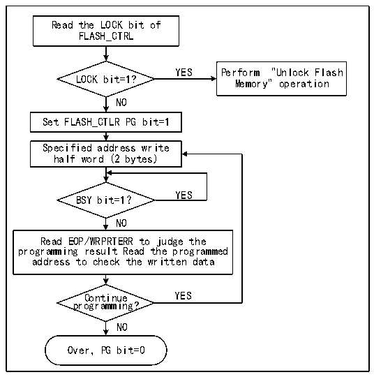

<!-- source-page: 303 -->

[← p.302](0302.md) · [index](../README.md) · [PDF p.303](https://ch32-riscv-ug.github.io/CH32X315/datasheet_zh/CH32X315RM.PDF#page=303) · [p.304 →](0304.md)

<!-- header: CH32X315、X305应用手册 https://wch.cn -->
1） 向FLASH_KEYR寄存器写入KEY1 = 0x45670123（第1步必须是KEY1）；  
2） 向FLASH_KEYR寄存器写入KEY2 = 0xCDEF89AB（第2步必须是KEY2）。  
上述操作必须按序并连续执行，否则属于错误操作，会锁死FPEC模块和FLASH_CTLR寄存器并  
产生总线错误，直到下次系统复位。  
闪存控制器（FPEC）和 FLASH_CTLR 寄存器可以通过将 FLASH_CTLR寄存器的“LOCK”位，置 1  
来再次锁定。  

### 23.5.3 主存储器标准编程

标准编程每次可以写入2字节。当FLASH_CTLR寄存器的PG位为‘1’时，每次向闪存地址写入  
半字（2字节）将启动一次编程，写入任何非半字数据，FPEC都会产生总线错误。编程过程中，BSY  
位为‘1’，编程结束，BSY位为‘0’，EOP位为‘1’。  
注：当BSY位为‘1’时，将禁止对任何寄存器执行写操作。  

图23-1 FLASH编程  
 <!-- rendered from the PDF; verify at https://ch32-riscv-ug.github.io/CH32X315/datasheet_zh/CH32X315RM.PDF#page=303 -->

🖼 Text parsed from the figure above

Read the LOCK bit of  
FLASH_CTRL  
YES Perform &quot;Unlock Flash  
LOCK bit=1?  
Memory&quot; operation  
NO  
Set FLASH_CTLR PG bit=1  
Specified address write  
half word (2 bytes)  
YES  
BSY bit=1？  
NO  
Read EOP/WRPRTERR to judge the  
programming result Read the programmed  
address to check the written data  
Continue YES  
programming?  
NO  
Over，PG bit=0  

1）检查FLASH_CTLR寄存器LOCK，如果为1，需要执行“解除闪存锁”操作。  
2）设置FLASH_CTLR寄存器的PG位为‘1’，开启标准编程模式。  
3）向指定闪存地址（偶地址）写入要编程的半字。  
4）等待BSY位变为‘0’或FLASH_STATR寄存器的EOP位为‘1’表示编程结束，将EOP位清0。  
5）查询FLASH_STATR寄存器看是否有错误，或者读编程地址数据校验。  
6）继续编程可以重复3-5步骤，结束编程将PG位清0。  

### 23.5.4 主存储器标准擦除

闪存可以按扇区（4K字节）擦除，也可以整片擦除。  
<!-- image: p303-draw-image-00001 bbox=[507.84, 786.36, 527.28, 796.68] -->
<!-- footer: V1.2 301 -->
