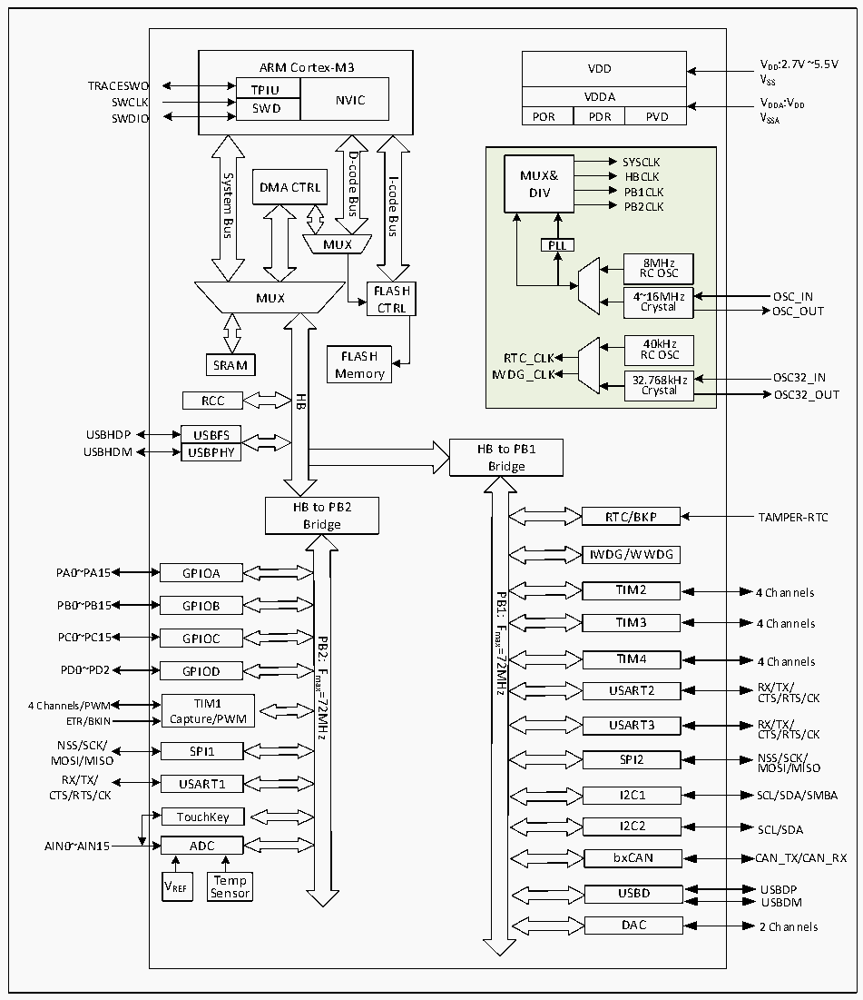

<!-- source-page: 4 -->

[← p.3](0003.md) · [index](../README.md) · [PDF p.4](https://ch32-riscv-ug.github.io/CH32V103/datasheet_en/CH32xRM.PDF#page=4) · [p.5 →](0005.md)

<!-- header: CH32x103 Reference Manual https://wch-ic.com -->

Figure 1-1 CH32F103 system architecture  
 <!-- rendered from the PDF; verify at https://ch32-riscv-ug.github.io/CH32V103/datasheet_en/CH32xRM.PDF#page=4 -->

🖼 Text parsed from the figure above

VDD  VDDA  POR  VDDAPDR  PVD  
VDD VDD:2.7V ~5.5V  
ARM Cortex-M3  
VSS  
TPIUSWD  NVIC  SWD  
TRACESWO  
VDDA VDDA:VDD  
SWCLK NVIC  
SWDIO  
D-code  
SYSCLK MUX&amp; HBCLK DIV PB1CLKPB2CLKPLL8MHz RC OSC4~16MHz Crystal 40kHz RTC_CLK RC OSCIWDG_CLK32.768kHz Crystal  
System  
I-code  
DMA CTRL  
Bus  
Bus  
Bus  
MUX  
8MHz RC OSC  4~16MHz Crystal  
FLASH  
MUX  
Crystal OSC_OUT  
CTRL  
FLASH  
SRAM  
Memory  
Crystal OSC32_OUT  
HB  
RCC  
USBFS  USBPHY  
USBHDP  
HB to PB1  
USBHDM  
Bridge  
HB to PB2  
RTC/BKP  
TAMPER-RTC  
Bridge  
IWDG/WWDG  
PA0~PA15 GPIOA  
TIM2  
4 Channels  
PB1:  
PB0~PB15 GPIOB  
TIM3  
4 Channels  
Fmax=72MHz  
PC0~PC15 GPIOC  
PB2:  
TIM4  
4 Channels  
PD0~PD2 GPIOD  
Fmax=72MHz  
RX/TX/  
USART2  
CTS/RTS/CK  
4 Channels/PWM TIM1  
ETR/BKIN Capture/PWM  
RX/TX/  
USART3  
CTS/RTS/CK  
NSS/SCK/  
SPI1  
NSS/SCK/  
SPI2  
MOSI/MISO  
MOSI/MISO  
RX/TX/ USART1  
I2C1  
CTS/RTS/CK  
SCL/SDA/SMBA  
TouchKey  
I2C2  
SCL/SDA  
AIN0~AIN15 ADC  
bxCAN CAN_TX/CAN_RX  
VREF S T e e n m so p r  
USBD USBDP  
USBDM  
DAC 2 Channels  

<!-- image: p4-draw-image-00001 bbox=[509.76, 780.48, 529.2, 791.16] -->
<!-- footer: V1.9 2 -->
