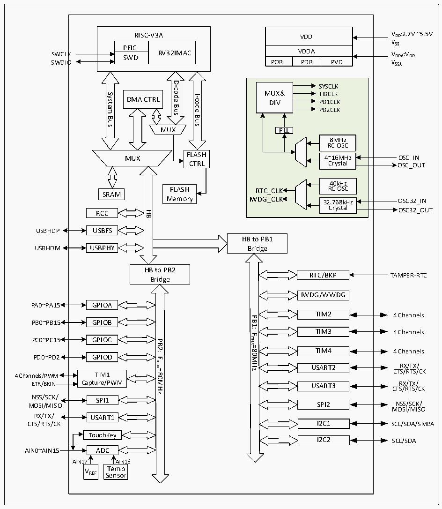

<!-- source-page: 5 -->

[← p.4](0004.md) · [index](../README.md) · [PDF p.5](https://ch32-riscv-ug.github.io/CH32V103/datasheet_en/CH32xRM.PDF#page=5) · [p.6 →](0006.md)

<!-- header: CH32x103 Reference Manual https://wch-ic.com -->

Figure 1-2 CH32V103 system architecture  
 <!-- rendered from the PDF; verify at https://ch32-riscv-ug.github.io/CH32V103/datasheet_en/CH32xRM.PDF#page=5 -->

🖼 Text parsed from the figure above

VDD  VDDA  POR  VDDAPDR  PVD  
VDD VDD:2.7V ~5.5V  
RISC-V3A  
VSS  
PFICSWD  RV32IMAC  SWD  
VDDA VDDA:VDD  
SWDIO  
D-code  
SYSCLK MUX&amp; HBCLK DIV PB1CLKPB2CLKPLL8MHz RC OSC4~16MHz Crystal 40kHz RTC_CLK RC OSCIWDG_CLK32.768kHz Crystal  
System  
I-code  
DMA CTRL  
Bus  
Bus  
Bus  
MUX  
8MHz RC OSC  4~16MHz Crystal  
FLASH  
MUX  
Crystal OSC_OUT  
CTRL  
FLASH  
SRAM  
Memory  
Crystal OSC32_OUT  
HB  
RCC  
USBFS  
USBHDP  
HB to PB1  
USBPHY  
USBHDM  
Bridge  
HB to PB2  
RTC/BKP  
TAMPER-RTC  
Bridge  
IWDG/WWDG  
PA0~PA15 GPIOA  
TIM2  
4 Channels  
PB1:  
PB0~PB15 GPIOB  
TIM3  
4 Channels  
Fmax=80MHz  
PC0~PC15 GPIOC  
PB2:  
TIM4  
4 Channels  
PD0~PD2 GPIOD  
Fmax=80MHz  
RX/TX/  
USART2  
CTS/RTS/CK  
4 Channels/PWM TIM1  
ETR/BKIN Capture/PWM  
RX/TX/  
USART3  
CTS/RTS/CK  
NSS/SCK/ SPI1  
NSS/SCK/  
SPI2  
MOSI/MISO  
MOSI/MISO  
RX/TX/ USART1  
I2C1  
SCL/SDA/SMBA  
CTS/RTS/CK  
TouchKey  
I2C2  
SCL/SDA  
AIN0~AIN15 ADC  
AIN17 AIN16  
T  
e  
m  
p  
VREF  
S  
e  
n  
so  
r  

The system is equipped with: Flash access prefetch mechanism to speed up code execution; general DMA  
controller to reduce CPU burden and improve efficiency; clock tree hierarchical management to reduce the total  
operating power consumption of peripherals, while being also provided with actions such as data protection  
mechanism and clock security system protection mechanism to increase system stability.  
● The command bus (I-Code) connects the core and the FLASH command interface, and the prefetch is  
completed on this bus.  
● The data bus (D-Code) connects the core and the FLASH data interface for constant load and debug.  
● The system bus connects the core and the bus matrix for coordinating the access of the core, DMA, SRAM  
and peripherals.  
● The DMA bus connects the DMA HB master control interface and the bus matrix, and the bus access  
objects include FLASH data, SRAM and peripherals.  
<!-- image: p5-draw-image-00001 bbox=[509.76, 780.48, 529.2, 791.16] -->
<!-- footer: V1.9 3 -->
