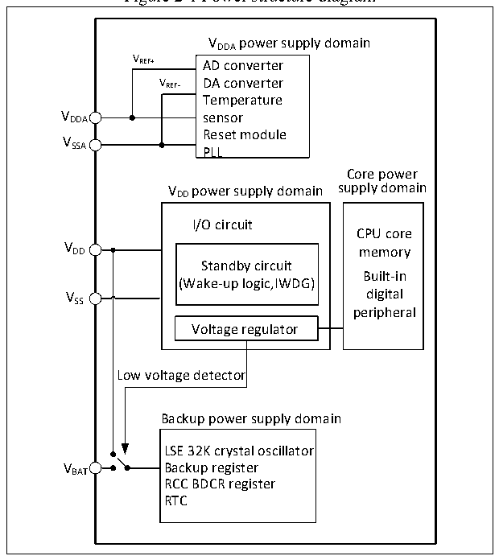

<!-- source-page: 9 -->

[← p.8](0008.md) · [index](../README.md) · [PDF p.9](https://ch32-riscv-ug.github.io/CH32V103/datasheet_en/CH32xRM.PDF#page=9) · [p.10 →](0010.md)

<!-- header: CH32x103 Reference Manual https://wch-ic.com -->

# Chapter 2 Power Control (PWR)

<strong><em>This chapter applies to the whole family of CH32F103 and CH32V103.</em></strong>  

## 2.1 Overivew

The operating voltage of the system ranges from 2.7V to 5.5V, and the built-in voltage regulator provides the  
working power needed by the core. When the main power VDD is off, backup power such as battery can provide  
power to the real-time clock (RTC) and backup registers through the VBAT pin. If the backup power is not  
required, it is recommended to connect VDD directly to the VBAT pin.  
The VDDA and VSSA pins are dedicated to supply power to the analog related circuits in the system, including  
ADC, DAC, temperature sensors, etc. VREF+ and VREF- are used as reference points for some analog circuits and  
are equal to VDDA and VSSA inside the chip. In actual applications, VDDA and VSSA must be connected to VDD and  
VSS terminals.  

Figure 2-1 Power structure diagram  
 <!-- rendered from the PDF; verify at https://ch32-riscv-ug.github.io/CH32V103/datasheet_en/CH32xRM.PDF#page=9 -->

🖼 Text parsed from the figure above

VDDA power supply domain  
VREF+  
AD converter  
VREF-  
VREF- DA converter  
Temperature  
Reset module  
V  
SSA PLL  
Core power  
VDD power supply domain supply domain  
I/O circuit  
CPU core  
V DD memory  
Standby circuit  
Built-in  
(Wake-up logic,IWDG)  
VSS digital  
peripheral  
Voltage regulator  
Low voltage detector  
Backup power supply domain  
LSE 32K crystal oscillator  
VBAT Backup register  
RCC BDCR register  
RTC  

After the main power VDD is off, the analog switch will be turned to VBAT, and the backup area will be powered  
by the VBAT pin. At this time, the PC13 to PC15 IOs cannot be used as GPIOs, and only the following functions  
are available:  
● PC13 can be used as TAMPER pin, RTC alarm or second output.  
● PC14 and PC15 can be only used as LSE pins.  
When the main power VDD is stable, the system will automatically switch the backup area to be powered by VDD,  
and the PC13 to PC15 IOs can be used as GPIO functions.  
When the PC13 to PC15 pins are used as GPIO output, the speed must be limited below 2MHz, the maximum  
<!-- image: p9-draw-image-00001 bbox=[509.76, 779.16, 529.2, 789.84] -->
<!-- footer: V1.9 7 -->
