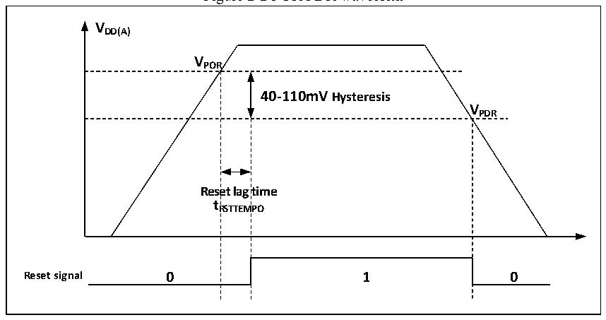

<!-- source-page: 10 -->

[← p.9](0009.md) · [index](../README.md) · [PDF p.10](https://ch32-riscv-ug.github.io/CH32V103/datasheet_en/CH32xRM.PDF#page=10) · [p.11 →](0011.md)

<!-- header: CH32x103 Reference Manual https://wch-ic.com -->
load capacitance is 30pF, and it is forbidden to use it in the occasions of continuous output and draw current,  
such as LED drive.  
Note: During the restoration of the main power VDD, the internal VBAT power is still connected to the external  
backup power through the corresponding VBAT pin. If VDD is less than the reset delay time tRSTTEMPO, it will be  
stabilized and be higher than the value of VBAT by more than 0.6V, and the current may be injected into VBAT  
through the diode between VDD and VBAT in a very short moment. Then, the backup power such as the battery  
will be injected through the VBAT pin. If the backup power cannot withstand such instantaneously injected  
current, it is recommended to add a forward conducting low-dropout diode between the backup power and VBAT  
pin.  

## 2.2 PowerSupply Supervisor

### 2.2.1 Power-on Reset and Power-down Reset

The power-on reset (POR) and power-down reset (PDR) circuits are integrated inside the system. When  
VDD/VDDA is below the corresponding threshold, the system will be reset by the relevant circuits, without the  
need for an external reset circuit. Please refer to the corresponding data sheet for more details concerning the  
power-on threshold (VPOR) and the power-down threshold (VPDR).  

Figure 2-2 POR/PDR waveform  
 <!-- rendered from the PDF; verify at https://ch32-riscv-ug.github.io/CH32V103/datasheet_en/CH32xRM.PDF#page=10 -->

🖼 Text parsed from the figure above

<strong>VDD(A)</strong>  
<strong>VPOR</strong>  
40-110mV Hysteresis  Rese t R  et lag RSTTEM  time MPO  V  
<strong>VPDR</strong>  

### 2.2.2 Programmable Voltage Detector

The programmable voltage detector (PVD) is mainly used to monitor the main power of the system by  
comparing it to a threshold selected by the PLS[2:0] bits in the power control register (PWR_CTLR).  
Coordinated with the external interrupt register (EXTI) setting, it can generate related interrupt to notify the  
system in time to perform operations before power failure such as data storage.  
The specific configuration is as follows:  
1） Set the PLS[2:0] bits in the PWR_CTLR register and select the voltage threshold to be monitored.  
2） Optional interrupt processing. The PVD function is internally connected to the line16 of the EXTI module  
to trigger the setting of rising/falling edges. Enable this interrupt (with EXTI configured). When VDD drops  
below the PVD threshold or rises above the PVD threshold, a PVD interrupt can be generated.  
3） Set the PVDE bit in the PWR_CTLR register to enable PVD.  
4） Read the PVD0 bit in the PWR_CSR status register to obtain the relationship between the main power of  
<!-- image: p10-draw-image-00001 bbox=[509.76, 779.16, 529.2, 789.84] -->
<!-- footer: V1.9 8 -->
