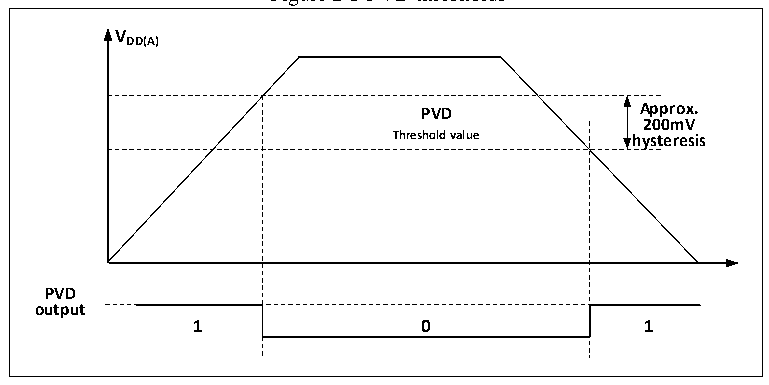

<!-- source-page: 11 -->

[← p.10](0010.md) · [index](../README.md) · [PDF p.11](https://ch32-riscv-ug.github.io/CH32V103/datasheet_en/CH32xRM.PDF#page=11) · [p.12 →](0012.md)

<!-- header: CH32x103 Reference Manual https://wch-ic.com -->
the current system and the threshold set by PLS[2:0] bits, and perform the corresponding soft processing. When  
the VDD voltage is higher than PLS [2:0], set the threshold, PVD0 position 0; when the VDD voltage is lower  
than PLS [2:0], set the threshold, PVD0 position 1.  

Figure 2-3 PVD thresholds  
 <!-- rendered from the PDF; verify at https://ch32-riscv-ug.github.io/CH32V103/datasheet_en/CH32xRM.PDF#page=11 -->

🖼 Text parsed from the figure above

<strong>VDD(A)</strong>  
PVD Threshold value  0  
<strong>200mV</strong>  
<strong>PVD</strong>  
<strong>output</strong>  

## 2.3 Low-power Mode

After the system is reset, the microcontroller is at a normal working status (Run mode). At this time, the system  
power can be saved by reducing the system clock frequency or disabling the peripheral clock or reducing the  
working peripheral clock. If the system does not need to work, the user can set the system to enter low-power  
mode, and let the system jump out of this status through specific event.  
The microcontroller currently provides three low-power modes, which are divided into the following according  
to the working differences of processors, peripherals and voltage regulators, etc.:  
● Sleep mode: The core stops running, and all peripherals (including the core private peripherals) are still  
running.  
● Stop mode: Stop all clocks, and the system will continue to run after awakening.  
● Standby mode: Stop all clocks, and reset the microcontroller after awakening (power reset).  

<!-- p11-table-002 (table-2-1@1) -->
<table><caption>Table 2-1 Low-power modes</caption><tr><th>Mode</th><th>Entry</th><th>Wake-up source</th><th>Effect on clock</th><th>Voltage regulator</th></tr><tr><td rowspan="2">Sleep</td><td>WFI</td><td>Any interrupt</td><td rowspan="2" style="text-align:left">Core clock OFF, no effect on other clocks</td><td rowspan="2">ON</td></tr><tr><td>WFE</td><td>Wake-up event</td></tr><tr><td>Stop</td><td style="text-align:left">Set SLEEPDEEP to 1 Clear PDDS to 0 WFI or WFE</td><td style="text-align:left">Any external interrupt/event (set in the external interrupt register)</td><td style="text-align:left">HSE, HSI, PLL and peripheral clock OFF</td><td style="text-align:left">ON: LPDS=0 or Low power: LPDS=1</td></tr><tr><td>Standby</td><td style="text-align:left">Set SLEEPDEEP to 1 Set PDDS to 1 WFI or WFE</td><td style="text-align:left"><em>WKUP pin rising edge, RTC alarm event, NRST pin reset, IWDG reset. Note: Any external interrupt/event can also wake up the system, but the system will be reset after wake-up.</em></td><td style="text-align:left">HSE, HSI, PLL and peripheral clock OFF</td><td>OFF</td></tr></table>

<em>Note: The SLEEPDEEP bit belongs to the core private peripheral control bit. For CH32F103 products, refer to</em>  
<em>the Cortex-M3 core manual, and for CH32V103 products, refer to the PFIC_SCTLR register.</em>  
<!-- image: p11-draw-image-00001 bbox=[509.76, 779.16, 529.2, 789.84] -->
<!-- footer: V1.9 9 -->
