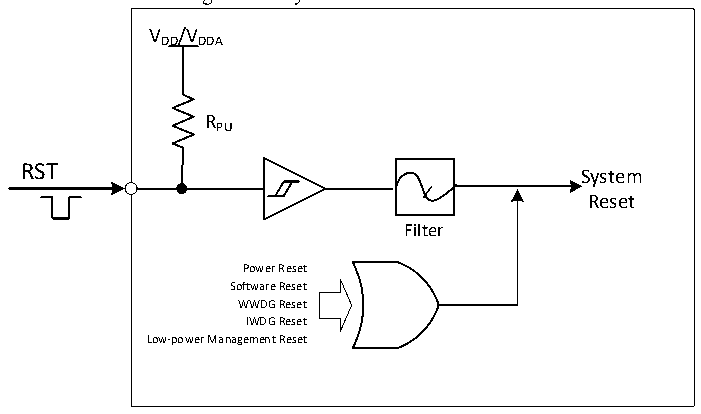

<!-- source-page: 17 -->

[← p.16](0016.md) · [index](../README.md) · [PDF p.17](https://ch32-riscv-ug.github.io/CH32V103/datasheet_en/CH32xRM.PDF#page=17) · [p.18 →](0018.md)

<!-- header: CH32x103 Reference Manual https://wch-ic.com -->
Low-power management reset: By setting the STANDYRST bit in User Option Bytes to 1, the standby mode  
reset will be enabled. After the process of entering the standby mode is executed at this time, a system reset will  
be performed instead of entering the standby mode. By setting the STOP_RST bit in User Option Bytes to 1, the  
stop mode reset is enabled. After the process of entering the stop mode is executed, a system reset will be  
executed instead of entering the stop mode.  

Figure 3-1 System Reset Structure  
 <!-- rendered from the PDF; verify at https://ch32-riscv-ug.github.io/CH32V103/datasheet_en/CH32xRM.PDF#page=17 -->

🖼 Text parsed from the figure above

VDD/VDDA  
RPU  
RST  
System  
Reset  
Filter  
Power Reset  
Software Reset  
WWDG Reset  
IWDG Reset  
Low-power Management Reset  

### 3.2.3 Backup Domain Reset

When the backup domian reset occurs, only the backup domain register will be reset, including the backup  
register, RCC_BDCTLR register (RTC enable and LSE oscillator). A backup domian reset is generated when  
one of the following events occurs:  
● On the premise that both VDD and VBAT are powered off, it is caused by power-on of VDD or VBAT  
● Set the BDRST bit in the RCC_BDCTLR register to 1  
<!-- image: p17-draw-image-00001 bbox=[514.44, 783.36, 533.88, 794.04] -->
<!-- footer: V1.9 15 -->
