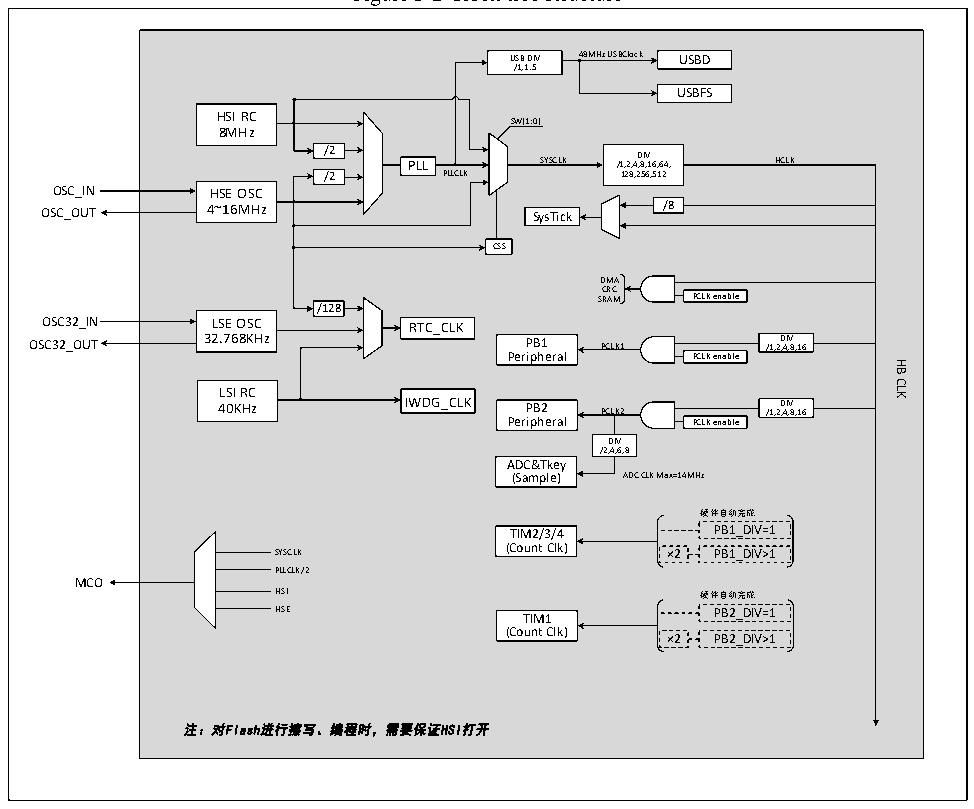

<!-- source-page: 18 -->

[← p.17](0017.md) · [index](../README.md) · [PDF p.18](https://ch32-riscv-ug.github.io/CH32V103/datasheet_en/CH32xRM.PDF#page=18) · [p.19 →](0019.md)

<!-- header: CH32x103 Reference Manual https://wch-ic.com -->

## 3.3 Clock

### 3.3.1 System Clock Structure

Figure 3-2 Clock tree structure  
 <!-- rendered from the PDF; verify at https://ch32-riscv-ug.github.io/CH32V103/datasheet_en/CH32xRM.PDF#page=18 -->

🖼 Text parsed from the figure above

USB DIV 48MHz USBClock USBD  
/1,1.5  
USBFS  
HSI RC  
SW[1:0]  
8MHz  
/2  
PLL SYSCLK /1,2,4 D ,8 IV ,16,64,  
HCLK  
/2 PLLCLK 128,256,512  
HSE OSC4~16MHz  
OSC_OUT 4~16MHz SysTick /8  
CSS  
DMA  
CRC  
SRAM PCLK enable  
/128  
LSE OSC32.768KHz  
OSC32_OUT 32.768KHz PB1 PCLK1 /1,2 D ,4 IV ,8,16  
Peripheral PCLK enable  
HB  
CLK  
LSI RC  
40KHz IWDG_CLK PB2 PCLK2 /1,2 D ,4 IV ,8,16  
Peripheral PCLK enable  
DIV  
/2,4,6,8  
ADC&amp;Tkey  
(Sample) ADC CLK Max=14MHz  
硬件自动完成  
TIM2/3/4 PB1_DIV=1  
(Count Clk)  
SYSCLK ×2 PB1_DIV&gt;1  
PLLCLK/2  
MCO  
HSI 硬件自动完成  
HSE TIM1 PB2_DIV=1  
(Count Clk) ×2 PB2_DIV&gt;1  
注：对Flash进行擦写、编程时，需要保证HSI打开  

### 3.3.2 High-speed Clock (HSI/HSE)

HSI is a high-speed clock signal generated by an 8MHz RC oscillator in the system. The HSI RC oscillator can  
provide the system clock without depending on any external device. Its startup time is very short but the clock  
frequency accuracy is poor. HSI is enabled/disabled by setting the HSION bit in the RCC_CTLR register. The  
HSIRDY bit indicates whether the HSI RC oscillator is stable. By default, HSION and HSIRDY are set to 1  
(recommended not to disable). If the HSIRDYIE bit in the RCC_INTR register is set, a corresponding interrupt  
can be generated.  
● Factory calibration: The difference in manufacturing process may cause the RC oscillation frequency of  
each chip to be different, so HSI calibration will be performed for each chip before the chip is delivered  
out of the factory. After the system is reset, the factory calibration value will be loaded into HSICAL[7:0]  
of the RCC_CTLR register.  
● User adjustment: Based on different voltages or ambient temperatures, the application program can adjust  
the HSI frequency through the HSITRIM[4:0] bits in the RCC_CTLR register.  
<em>Note: If the HSE crystal oscillator fails, the HSI clock will be used as a backup clock source (clock security</em>  
<em>system).</em>  
<!-- image: p18-draw-image-00001 bbox=[514.44, 783.36, 533.88, 794.04] -->
<!-- footer: V1.9 16 -->
