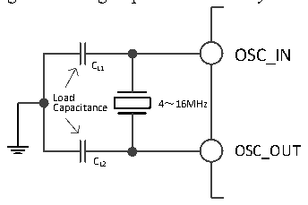
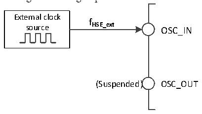

<!-- source-page: 19 -->

[← p.18](0018.md) · [index](../README.md) · [PDF p.19](https://ch32-riscv-ug.github.io/CH32V103/datasheet_en/CH32xRM.PDF#page=19) · [p.20 →](0020.md)

<!-- header: CH32x103 Reference Manual https://wch-ic.com -->
HSE is an external high-speed clock signal, including external crystal/ceramic resonator generation or external  
high-speed clock input.  
● External crystal/ceramic resonator (HSE crystal): A 4-16MHz external oscillator provides a more accurate  
clock source for the system. For further information, please refer to the electrical characteristics of the  
datasheet. The HSE crystal can be enabled and disabled by setting the HSEON bit in the RCC_CTLR  
register. The HSERDY bit indicates whether the HSE crystal oscillation is stable. The clock is not released  
until the HSERDY bit is set to 1 by hardware. If the HSERDYIE bit in the RCC_INTR register is set, a  
corresponding interrupt can be generated.  

Figure 3-3 High-speed external crystal circuit  
 <!-- rendered from the PDF; verify at https://ch32-riscv-ug.github.io/CH32V103/datasheet_en/CH32xRM.PDF#page=19 -->

🖼 Text parsed from the figure above

OSC_IN  
CL1  
L C o a a p d a citance 4～16MHz  
OSC_OUT  
CL2  

<em>Note: The load capacitor needs to be as close as possible to the oscillator pin, and the capacitance value shall</em>  
<em>be selected according to the crystal manufacturer&#x27;s parameters.</em>  
● External high-speed clock source (HSE bypass): In this mode, an external clock source is directly provided  
to the OSC_IN pin, and the OSC_OUT pin is suspended. It can have a frequency of up to 25MHz. The  
application program needs to set the HSEBYP bit when the HSEON bit is 0, to enable HSE bypass, and  
then set the HSEON bit.  

Figure 3-4 High-speed clock source circuit  
 <!-- rendered from the PDF; verify at https://ch32-riscv-ug.github.io/CH32V103/datasheet_en/CH32xRM.PDF#page=19 -->

🖼 Text parsed from the figure above

External clock  
<strong>f</strong>  
source HSE_ext OSC_IN  
(Suspended) OSC_OUT  

### 3.3.3 Low-speed Clock (LSI/LSE)

LSI is a low-speed clock signal generated by a RC oscillator of approximately 40KHz in the system. It can keep  
running in stop and standby modes, and provide a clock reference for the RTC clock, independent watchdog,  
and wake-up unit. For further information, please refer to the electrical characteristics of the datasheet. LSI can  
be enabled/disabled by setting the LSION bit in the RCC_RSTSCKR register, and then it checks whether the  
LSI RC oscillation is stable by querying the LSIRDY bit. The clock is not released until the LSIRDY bit is set  
to 1 by hardware. If the LSIRDYIE bit in the RCC_INTR register is set, a corresponding interrupt can be  
generated.  
LSE is an external low-speed clock signal, including external crystal/ceramic resonator generation or external  
low-speed clock input. It provides a low-power and accurate clock source for RTC clock or other timing  
functions.  
● External crystal/ceramic resonator (LSE crystal): External low-speed oscillator of 32.768KHz. LSE can be  
<!-- image: p19-draw-image-00001 bbox=[514.32, 783.36, 533.76, 794.04] -->
<!-- footer: V1.9 17 -->
