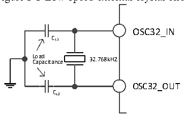
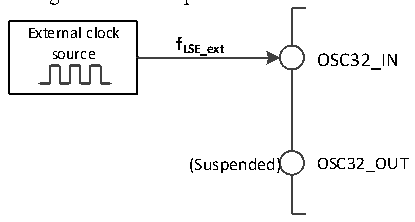

<!-- source-page: 20 -->

[← p.19](0019.md) · [index](../README.md) · [PDF p.20](https://ch32-riscv-ug.github.io/CH32V103/datasheet_en/CH32xRM.PDF#page=20) · [p.21 →](0021.md)

<!-- header: CH32x103 Reference Manual https://wch-ic.com -->
enabled and disabled by setting the LSEON bit in the RCC_BDCTLR register. The LSERDY bit indicates  
whether the LSE crystal oscillation is stable. The clock is not released until the LSERDY bit is set to 1 by  
hardware. If the LSERDYIE bit in the RCC_INTR register is set, a corresponding interrupt can be  
generated.  

Figure 3-5 Low-speed external crystal circuit  
 <!-- rendered from the PDF; verify at https://ch32-riscv-ug.github.io/CH32V103/datasheet_en/CH32xRM.PDF#page=20 -->

🖼 Text parsed from the figure above

OSC32_IN  
CL1  
L C o a a p d a citance 32.768kHZ  
OSC32_OUT  
CL2  

● External low-speed clock source (LSE bypass): In this mode, an external clock source is directly provided  
to the OSC32_IN pin, and the OSC32_OUT pin is suspended. The application program needs to set the  
LSEBYP bit when the LSEON bit is 0, to enable the LSE bypass, and then set the LSEON bit.  

Figure 3-6 Low-speed clock source circuit  
 <!-- rendered from the PDF; verify at https://ch32-riscv-ug.github.io/CH32V103/datasheet_en/CH32xRM.PDF#page=20 -->

🖼 Text parsed from the figure above

External clock  
<strong>f</strong>  
source LSE_ext OSC32_IN  
(Suspended) OSC32_OUT  

### 3.3.4 PLL Clock

By configuring the RCC_CFGR0 register and the extension register EXTEND_CTR, 4 clock sources and  
multiplication factors can be selected for the internal PLL clock. These settings must be completed before the  
PLL is enabled. Once the PLL is enabled, these parameters cannot be changed. PLL can be enabled and disabled  
by setting the PLLON bit in the RCC_CTLR register. The PLLRDY bit indicates whether the PLL clock is  
stable. The clock is not released until the PLLRDY bit is set to 1 by hardware. If the PLLRDYIE bit in the  
RCC_INTR register is set, a corresponding interrupt can be generated.  
If you need to use the USBD or USB FS module function in your application, the PLL must be set to output a  
48MHz or 72MHz clock to provide a 48MHz USBCLK clock. Because the analog transceiving clock of the  
USBD or USB FS module is based on the PLL clock.  
PLL clock sources:  
● HSI clock  
● HSI clock divided by 2  
● HSE clock  
● HSE clock divided by 2  

### 3.3.5 Bus/Peripheral Clock

#### 3.3.5.1 System Clock (SYSCLK)

Configure the system clock source by configuring the SW[1:0] bits in the RCC_CFGR0 register. The SWS[1:0]  
bits indicate the current system clock source status.  
<!-- image: p20-draw-image-00001 bbox=[514.44, 783.36, 533.88, 794.04] -->
<!-- footer: V1.9 18 -->
