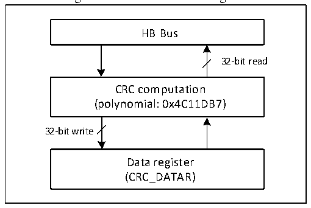

<!-- source-page: 42 -->

[← p.41](0041.md) · [index](../README.md) · [PDF p.42](https://ch32-riscv-ug.github.io/CH32V103/datasheet_en/CH32xRM.PDF#page=42) · [p.43 →](0043.md)

<!-- header: CH32x103 Reference Manual https://wch-ic.com -->

# Chapter 5 Cyclic Redundancy Check (CRC)

<strong><em>This chapter applies to the whole family of CH32F103 and CH32V103.</em></strong>  
The cyclic redundancy check (CRC) calculation unit is used to get a CRC code from a 32-bit data word and a  
fixed generator polynomial. It is generally used to verify data transmission or storage integrity. The hardware  
CRC calculation unit provided by the system can greatly save CPU and RAM resources and improve efficiency.  

Figure 5-1 CRC structure diagram  
 <!-- rendered from the PDF; verify at https://ch32-riscv-ug.github.io/CH32V103/datasheet_en/CH32xRM.PDF#page=42 -->

🖼 Text parsed from the figure above

HB Bus  
32-bit read  
CRC computation  
(polynomial: 0x4C11DB7)  
32-bit write  
Data register  
(CRC_DATAR)  

## 5.1 Main Features

● CRC32 polynomial (0x4C11DB7) is used:  
X32+X26+X23+X22+X16+X12+X11+X10+X8+X7+X5+X4+X2+X+1;  
● Single input/output 32-bit data register  
● CRC computation done in 4 HB clock cycles (HCLK)  

## 5.2 Functional Description

● CRC unit reset  
To start a new CRC calculation, it is needed to reset the CRC calculation unit. Write 1 to the RST bit in the  
CRC_CTLR register, to reset the data register by hardware, and it restores the initial value 0xFFFFFFFF.  
● CRC calculation  
The calculation of the CRC unit is a combination of the previous CRC calculation value and the new CRC  
calculation value. When writing into the CRC_DATAR register, new data is input to the hardware calculation  
unit. When reading the register, the latest CRC calculation value can be obtained. The hardware calculation  
interrupts the write operation of the system, so new values can be written continuously.  
<em>Note: The CRC unit calculates the whole 32-bit data word, rather than byte per byte.</em>  
● Independent data buffer  
The CRC unit provides an 8-bit independent data register (CRC_IDATAR), which is used to temporarily store 1  
byte of data for the application code and is not affected by the reset of the CRC unit.  
<!-- image: p42-draw-image-00001 bbox=[514.44, 779.16, 533.88, 789.84] -->
<!-- footer: V1.9 40 -->
