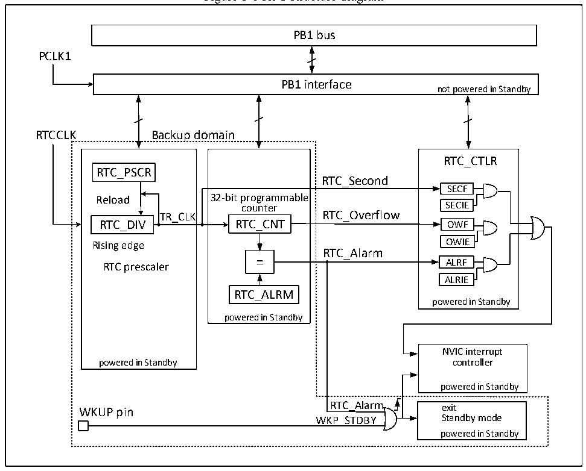

<!-- source-page: 45 -->

[← p.44](0044.md) · [index](../README.md) · [PDF p.45](https://ch32-riscv-ug.github.io/CH32V103/datasheet_en/CH32xRM.PDF#page=45) · [p.46 →](0046.md)

<!-- header: CH32x103 Reference Manual https://wch-ic.com -->

# Chapter 6 Real-time Clock (RTC)

<strong><em>This chapter applies to the whole family of CH32F103 and CH32V103.</em></strong>  
The real-time clock (RTC) is an independent timer module. It supports up to 32-bit programmable counter. With  
software, the real-time clock function can be implemented, and the counter value can be modified to  
re-configure the current time and date of the system. The RTC module is in the backup power supply area, and  
is not affected by the system reset and standby mode wake-up.  

## 6.1 Main Features

● Prescale factor: up to 220  
● 32-bit programmable counter  
● Multiple types of clock sources, interrupt  
● Independent reset  

## 6.2 Functional Description

### 6.2.1 Overview

Figure 6-1 RTC structure diagram  
 <!-- rendered from the PDF; verify at https://ch32-riscv-ug.github.io/CH32V103/datasheet_en/CH32xRM.PDF#page=45 -->

🖼 Text parsed from the figure above

PB1 bus  
PCLK1  
PB1 interface  
not powered in Standby  
RTCCLK Backup domain  
32-bit programmable counter RTC_CNTRTC_ALRM powered in Standby  
RTC_CTLR  
RTC_PSCR  
RTC_Second  
SECF  
Reload 32-bit programmable  
SECIE  OWF  
counter SECIE  
TR_CLK RTC_Overflow  
Rising edge OWIE  
RTC_Alarm  
ALRF  
RTC prescaler  
ALRIE  
powered in Standby  
NVIC interrupt  
powered in Standby controller  
powered in Standby  
WKUP pin RTC_Alarm exit  
WKP_STDBY Standby mode  
powered in Standby  

<!-- image: p45-draw-image-00001 bbox=[514.44, 779.16, 533.88, 789.84] -->
<!-- footer: V1.9 43 -->
