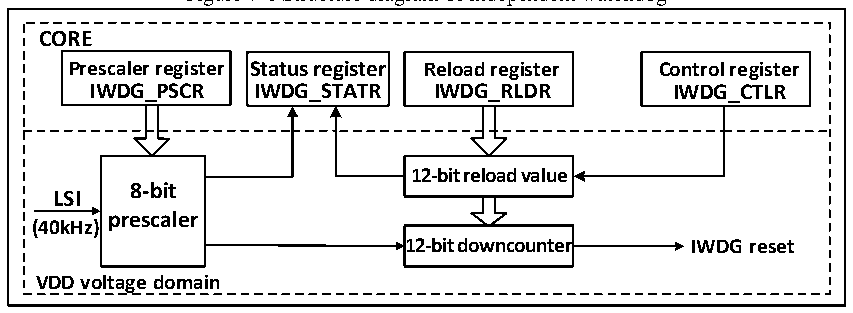

<!-- source-page: 51 -->

[← p.50](0050.md) · [index](../README.md) · [PDF p.51](https://ch32-riscv-ug.github.io/CH32V103/datasheet_en/CH32xRM.PDF#page=51) · [p.52 →](0052.md)

<!-- header: CH32x103 Reference Manual https://wch-ic.com -->

# Chaper 7 Independent Watchdog (IWDG)

<strong><em>This chapter applies to the whole family of CH32F103 and CH32V103.</em></strong>  
The system is equipped with an independent watchdog (IWDG) to detect logic errors and software faults caused  
by external environmental interference. The IWDG clock source comes from LSI, can run independently of the  
main program, and is suited for applications with low precision requirements.  

## 7.1 Main Features

● 12-bit free-running downcounter  
● Clocked from LSI clock divided, can run in low-power mode  
● Reset condition: The downcounter value reaches 0  

## 7.2 Functional Specification

### 7.2.1 Principle and Application

Different from the window watchdog, the clock of the independent watchdog originates from LSI clock  
frequency division, and its function can still work normally in the stop and standby mode. When the watchdog  
counter decreases to 0, a system reset will be generated, so the timeout period is (reload value + 1) clocks, with  
a maximum of 26.2s and a minimum of 100us.  

Figure 7-1 Structure diagram of independent watchdog  
 <!-- rendered from the PDF; verify at https://ch32-riscv-ug.github.io/CH32V103/datasheet_en/CH32xRM.PDF#page=51 -->

🖼 Text parsed from the figure above

<strong>CORE</strong>  
<strong>Prescaler register Status register Reload register Control register</strong>  
<strong>IWDG_PSCR IWDG_STATR IWDG_RLDR IWDG_CTLR</strong>  
<strong>12-bit reload value</strong>  
<strong>8-bit</strong>  
<strong>LSI</strong>  
<strong>prescaler</strong>  
<strong>(40kHz)</strong>  
<strong>12-bit downcounter IWDG reset</strong>  
<strong>VDD voltage domain</strong>  

● Enable independent watchdog  
After the system is reset, the watchdog is OFF. Write 0xCCCC to the IWDG_CTLR register to enable the  
watchdog, and then it can no longer be disabled unless a reset occurs.  
If the hardware independent watchdog enable bit (IWDG_SW) is enabled in User Option Bytes, the IWDG is  
permanently enabled after the microcontroller is reset.  
● Watchdog configuration  
A 12-bit downcounter is in the watchdog. When the value of downcounter is reduced to 0, the system reset  
occurs. To enable IWDG, the following operations are needed:  
1) Counter time base: IWDG clock source is LSI. Set the LSI divider factor clock as IWDG counter time base  
through IWDG_PSCR register. Firstly write 0x5555 to the IWDG_CTLR register, and then modify the  
divider factor in the IWDG_PSCR register. The PVU bit in the IWDG_STATR register indicates the update  
<!-- image: p51-draw-image-00001 bbox=[514.44, 779.16, 533.88, 789.84] -->
<!-- footer: V1.9 49 -->
