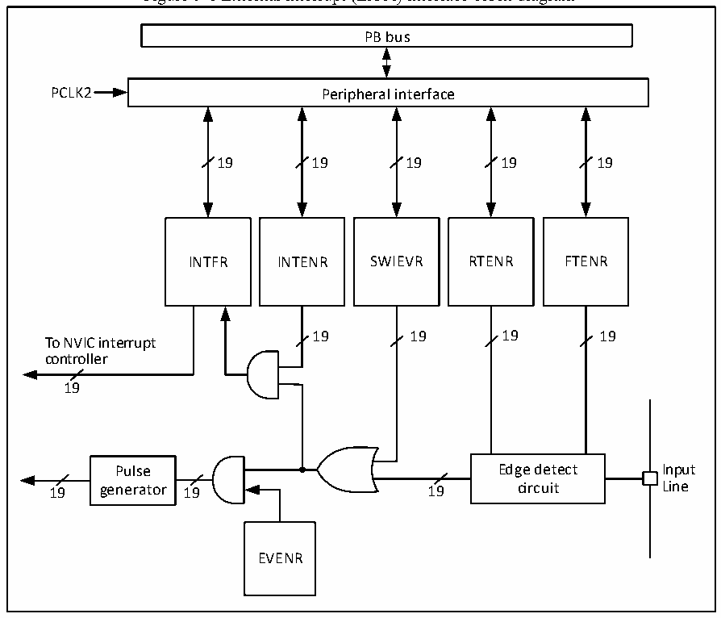

<!-- source-page: 63 -->

[← p.62](0062.md) · [index](../README.md) · [PDF p.63](https://ch32-riscv-ug.github.io/CH32V103/datasheet_en/CH32xRM.PDF#page=63) · [p.64 →](0064.md)

<!-- header: CH32x103 Reference Manual https://wch-ic.com -->

> ⬆ **Table continued** — rendered in full at [page 61](0061.md). <!-- p63-table-001 -->

## 9.4 External Interrupt/Event Controller (EXTI)

### 9.4.1 Overview

Figure 9-1 External interrupt (EXTI) interface block diagram  
 <!-- rendered from the PDF; verify at https://ch32-riscv-ug.github.io/CH32V103/datasheet_en/CH32xRM.PDF#page=63 -->

🖼 Text parsed from the figure above

PB bus  
PCLK2 Peripheral interface  
19 19 19 19 19  
INTFR INTENR SWIEVR RTENR FTENR  
19 19 19 19  
To NVIC interrupt  
controller  
19  
Pulse Edge detect Input  
19 generator 19 19 circuit Line  
EVENR  

As shown in Figure 9-1, the trigger source of an external interrupt can be either a software interrupt (SWIEVR)  
or an actual external interrupt channel. The signal of the external interrupt channel is firstly filtered by the edge  
detect circuit. As long as either soft interrupt or external interrupt signal is generated, it is output to dual AND  
gate circuits of event enable and interrupt enable through the OR circuit in the figure. As long as the interrupt or  
the event is enabled, an interrupt or event is generated. Six registers of EXTI are accessed by the processer  
through PB2 interface.  

### 9.4.2 Wake-up Event Description

The system can wake up from sleep mode caused by WFE command via wake-up event. The wake-up event is  
generated through the following two types of configuration:  
● Enable an interrupt in the peripheral register, but do not enable the interrupt in the NVIC of the core, and  
enable the SEVONPEND bit in the core at the same time. Reflected in EXTI, EXTI interrupt is enabled,  
but EXTI interrupt in NVIC is not enabled, while enabling SEVONPEND bit. When the CPU is woken up  
from WFE, the interrupt flag bit of EXTI and suspension bit of NVIC need to be cleared.  
● Enable an EXTI channel as an event channel. It is not necessary to clear the interrupt flag bit and the NVIC  
<!-- image: p63-draw-image-00001 bbox=[514.44, 779.16, 533.88, 789.84] -->
<!-- footer: V1.9 61 -->
