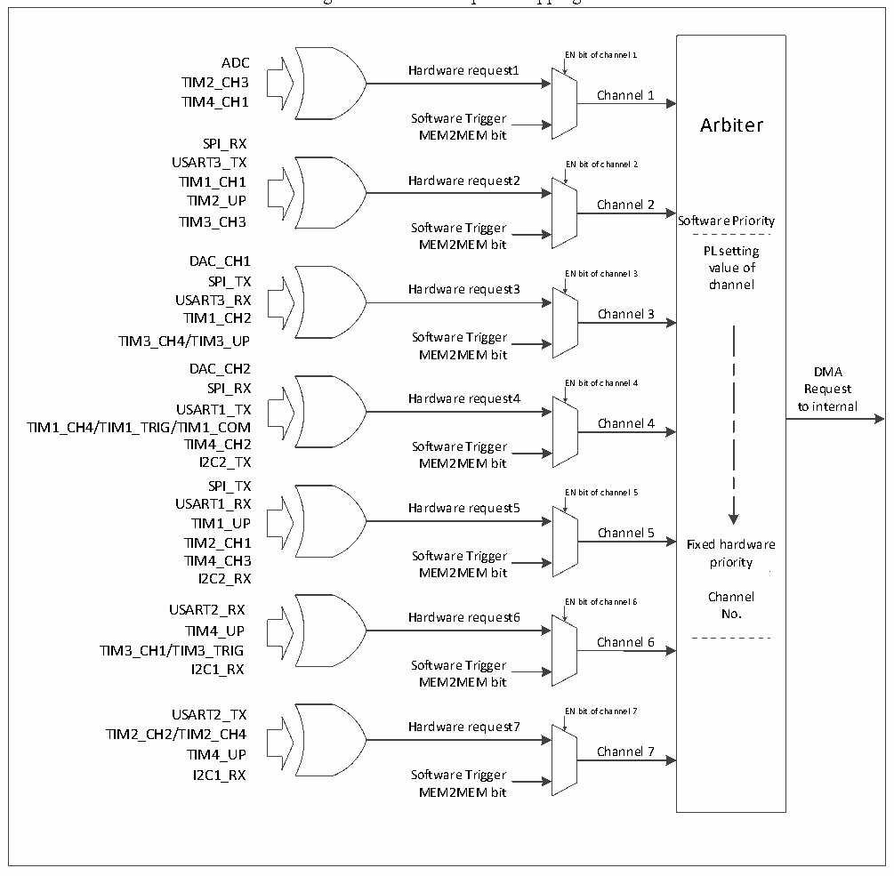

<!-- source-page: 104 -->

[← p.103](0103.md) · [index](../README.md) · [PDF p.104](https://ch32-riscv-ug.github.io/CH32V103/datasheet_en/CH32xRM.PDF#page=104) · [p.105 →](0105.md)

<!-- header: CH32x103 Reference Manual https://wch-ic.com -->

Figure 11-2 DMA request mapping  
 <!-- rendered from the PDF; verify at https://ch32-riscv-ug.github.io/CH32V103/datasheet_en/CH32xRM.PDF#page=104 -->

🖼 Text parsed from the figure above

<!-- image: p104-draw-image-00015 inside the figure -->
ADC EN bit of channel 1  
<!-- image: p104-draw-image-00016 inside the figure -->
Hardware request1  
<!-- image: p104-draw-image-00008 inside the figure -->
TIM2_CH3  
TIM4_CH1 Channel 1  
Software Trigger Arbiter  
MEM2MEM bit  
SPI_RX  
USART3_TX EN bit of channel 2  
<!-- image: p104-draw-image-00002 inside the figure -->
TIM1_CH1 Hardware request2  
<!-- image: p104-draw-image-00009 inside the figure -->
TIM2_UP Channel 2  
TIM3_CH3 Software Priority  
Software Trigger  
MEM2MEM bit  
PL setting  
DAC_CH1  
value of  
SPI_TX Hardware request3 EN bit of channel 3 channel  
<!-- image: p104-draw-image-00003 inside the figure -->
<!-- image: p104-draw-image-00010 inside the figure -->
USART3_RX  
TIM1_CH2 Channel 3  
TIM3_CH4/TIM3_UP Software Trigger  
MEM2MEM bit  
DAC_CH2 DMA  
SPI_RX EN bit of channel 4 Request  
<!-- image: p104-draw-image-00004 inside the figure -->
Hardware request4  
<!-- image: p104-draw-image-00011 inside the figure -->
USART1_TX to internal  
TIM1_CH4/TIM1_TRIG/TIM1_COM Channel 4  
TIM4_CH2 Software Trigger  
I2C2_TX MEM2MEM bit  
SPI_TX  
EN bit of channel 5  
<!-- image: p104-draw-image-00005 inside the figure -->
USART1_RX Hardware request5  
<!-- image: p104-draw-image-00012 inside the figure -->
TIM1_UP  
Channel 5  
TIM2_CH1 Fixed hardware  
TIM4_CH3 Software Trigger priority  
I2C2_RX MEM2MEM bit  
Channel  
USART2_RX Hardware request6 EN bit of channel 6 No.  
<!-- image: p104-draw-image-00006 inside the figure -->
<!-- image: p104-draw-image-00013 inside the figure -->
TIM4_UP  
Channel 6  
TIM3_CH1/TIM3_TRIG  
I2C1_RX Software Trigger  
MEM2MEM bit  
USART2_TX EN bit of channel 7  
<!-- image: p104-draw-image-00007 inside the figure -->
Hardware request7  
<!-- image: p104-draw-image-00014 inside the figure -->
TIM2_CH2/TIM2_CH4  
TIM4_UP Channel 7  
I2C1_RX Software Trigger  
MEM2MEM bit  

<!-- p104-table-001 (table-11-2@1) pages 104-105 -->
<table><caption>Table 11-2 DMA requests for each channel</caption><tr><th>Peripheral</th><th>Channel 1</th><th>Channel 2</th><th>Channel 3</th><th>Channel 4</th><th>Channel 5</th><th>Channel 6</th><th>Channel 7</th></tr><tr><td>ADC</td><td>ADC</td><td></td><td></td><td></td><td></td><td></td><td></td></tr><tr><td>DAC</td><td></td><td></td><td>DAC_CH1</td><td>DAC_CH2</td><td></td><td></td><td></td></tr><tr><td>SPIx</td><td></td><td>SPI1_RX</td><td>SPI1_TX</td><td>SPI2_RX</td><td>SPI2_TX</td><td></td><td></td></tr><tr><td>USARTx</td><td></td><td>USART3_TX</td><td>USART3_RX</td><td>USART1_TX</td><td>USART1_RX</td><td>USART2_RX</td><td>USART2_TX</td></tr><tr><td>TIM1</td><td></td><td>TIM1_CH1</td><td>TIM1_CH2</td><td style="text-align:left">TIM1_CH4TIM1_TRIGTIM1_COM</td><td>TIM1_UP</td><td>TIM1_CH3</td><td></td></tr><tr><td>TIM2</td><td>TIM2_CH3</td><td>TIM2_UP</td><td></td><td></td><td>TIM2_CH1</td><td></td><td style="text-align:left">TIM2_CH2TIM2_CH4</td></tr><tr><td>TIM3</td><td></td><td>TIM3_CH3</td><td style="text-align:left">TIM3_CH4TIM3_UP</td><td></td><td></td><td style="text-align:left">TIM3_CH1TIM3_TRIG</td><td></td></tr><tr><td>TIM4</td><td>TIM4_CH1</td><td></td><td></td><td>TIM4_CH2</td><td>TIM4_CH3</td><td></td><td>TIM4_UP</td></tr><tr><td>I2Cx</td><td></td><td></td><td></td><td>I2C2_TX</td><td>I2C2_RX</td><td>I2C1_TX</td><td>I2C1_RX</td></tr></table>

<!-- image: p104-draw-image-00001 bbox=[518.76, 779.16, 538.2, 789.84] -->
<!-- footer: V1.9 102 -->
