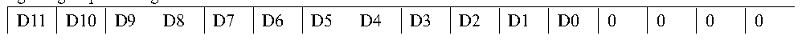
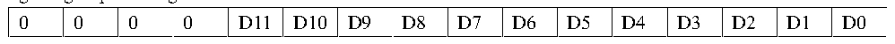

<!-- source-page: 113 -->

[← p.112](0112.md) · [index](../README.md) · [PDF p.113](https://ch32-riscv-ug.github.io/CH32V103/datasheet_en/CH32xRM.PDF#page=113) · [p.114 →](0114.md)

<!-- header: CH32x103 Reference Manual https://wch-ic.com -->
the DMA function of ADC can be enabled for the data not timely removed in the ADC_RDATAR register. The  
hardware will generate a DMA request when the conversion of the regular channel is completed (EOC bit is set),  
and transmit the converted data from the ADC_RDATAR register to the destination address specified by the  
user.  
After the channel configuration of the DMA controller module is completed, write the DMA bit in the  
ADC_CTLR2 register to 1 to enable the DMA function of the ADC.  
<em>Note: The injected group conversion does not support DMA function.</em>  
<strong>6) Data alignment</strong>  
The data storage alignment method after ADC conversion is selected for the ALIGN bit in the ADC_CTLR2  
register. 12-bit data supports left alignment and right alignment modes.  
The data register ADC_RDATAR of the regular group channel saves the actual converted 12-bit digital value;  
while the data register ADC_IDATARx of the injected group channel is the value written after the actual  
converted data is substracted from the defined offset of the ADC_IOFRx register, the value may be positive or  
negative, so there will be a sign bit (SIGNB).  

Figure 12-2 Data left alignment  
 <!-- rendered from the PDF; verify at https://ch32-riscv-ug.github.io/CH32V103/datasheet_en/CH32xRM.PDF#page=113 -->

Regular group data register  

🖼 Text parsed from the figure above

D11  D10  D9  D8  D7  D6  D5  D4  D3  D2  D1  D0  0  0  0  0  

Injected group data register  

<!-- p113-table-002 (table-11-3@1) -->
<table><tr><th>SIGNB</th><th>D11</th><th>D10</th><th>D9</th><th>D8</th><th>D7</th><th>D6</th><th>D5</th><th>D4</th><th>D3</th><th>D2</th><th>D1</th><th>D0</th><th>0</th><th>0</th><th>0</th></tr></table>

Figure 12-3 Data right alignment  
 <!-- rendered from the PDF; verify at https://ch32-riscv-ug.github.io/CH32V103/datasheet_en/CH32xRM.PDF#page=113 -->

Regular group data register  

🖼 Text parsed from the figure above

0  0  0  0  D11  D10  D9  D8  D7  D6  D5  D4  D3  D2  D1  D0  

Injected group data register  

<!-- p113-table-004 (table-11-3@1) -->
<table><tr><th>SIGNB</th><th>SIGNB</th><th>SIGNB</th><th>SIGNB</th><th>D11</th><th>D10</th><th>D9</th><th>D8</th><th>D7</th><th>D6</th><th>D5</th><th>D4</th><th>D3</th><th>D2</th><th>D1</th><th>D0</th></tr></table>

### 12.2.3 External Trigger Source

The ADC conversion start event can be triggered by an external event. If the EXTTRIG or JEXTTRIG bit in the  
ADC_CTLR2 register is set, the conversion of the regular group or the injected group channel can be triggered  
by an external event, respectively. At this time, the configuration of the EXTSEL[2:0] and JEXTSEL[2:0] bits  
determines the external event source of the rule group and the injected group.  
<em>Note: When an external trigger signal is selected as an ADC rule or injection conversion, only its rising edge</em>  
<em>can start the conversion.</em>  

<!-- p113-table-005 (table-12-1@1) -->
<table><caption>Table 12-1 External trigger source of regular group channel</caption><tr><th>EXTSEL[2:0]</th><th>Trigger source</th><th>Type</th></tr><tr><td>000</td><td>CC1 event of timer 1</td><td rowspan="6" style="text-align:left">Internal signal from on-chip timers</td></tr><tr><td>001</td><td>CC2 event of timer 1</td></tr><tr><td>010</td><td>CC3 event of timer 1</td></tr><tr><td>011</td><td>CC2 event of timer 2</td></tr><tr><td>100</td><td>TRGO event of timer 3</td></tr><tr><td>101</td><td>CC4 event of timer 4</td></tr><tr><td>110</td><td>EXTI line 11</td><td>From external pin</td></tr><tr><td>111</td><td>SWSTART bit set to 1 by software</td><td>Software control bit</td></tr></table>

<!-- image: p113-draw-image-00001 bbox=[518.88, 779.16, 538.32, 789.84] -->
<!-- footer: V1.9 111 -->
