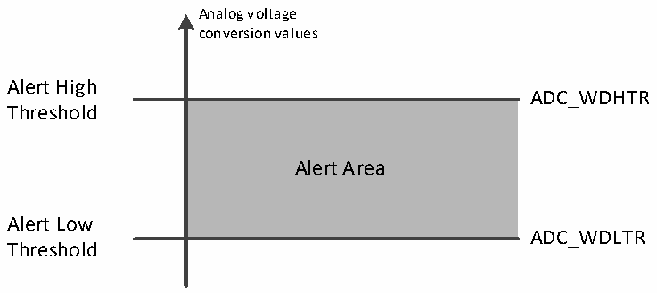

<!-- source-page: 117 -->

[← p.116](0116.md) · [index](../README.md) · [PDF p.117](https://ch32-riscv-ug.github.io/CH32V103/datasheet_en/CH32xRM.PDF#page=117) · [p.118 →](0118.md)

<!-- header: CH32x103 Reference Manual https://wch-ic.com -->
<em>and the discontinuous mode can only be used for one group of conversion.</em>  
<strong>4) Continuous conversion</strong>  
In the continuous conversion mode, another conversion is started as soon as the previous ADC conversion is  
finished, and the conversion does not stop on the last channel of the selection group, but continues again from  
the first channel of the selection group. The startup events for this mode include an external trigger event and  
ADON position 1, which is required to set CONT position 1 after startup.  
If a rule channel is converted, the conversion data is stored in the ADC_RDATAR register and the  
end-of-conversion flag EOC is set, generating an interrupt if EOCIE is set.  
If an injection channel is converted, the conversion data is stored in the ADC_IDATARx register, the  
end-of-injection-conversion flag JEOC is set, and an interrupt is generated if JEOCIE is set.  

### 12.2.5 Analog Watchdog

If the analog voltage converted by the ADC is lower than the low threshold or higher than the high threshold,  
the AWD analog watchdog status bit will be set. The threshold setting is located in the low 12 active bits in the  
ADC_WDHTR and ADC_WDLTR registers. By setting the AWDIE bit in the ADC_CTLR1 register, the  
corresponding interrupt is allowed to be generated.  

Figure 12-4 Analog watchdog guarded area  
 <!-- rendered from the PDF; verify at https://ch32-riscv-ug.github.io/CH32V103/datasheet_en/CH32xRM.PDF#page=117 -->

🖼 Text parsed from the figure above

Analog voltage  
conversion values  
Alert High  
ADC_WDHTR  
<!-- image: p117-draw-image-00002 inside the figure -->
Threshold  
Alert Area  
Alert Low  
ADC_WDLTR  
Threshold  

Configure the AWDSGL, AWDEN, JAWDEN and AWDCH[4:0] bits in the ADC_CTLR1 register to select the  
channel for analog watchdog vigilance. The specific relationship is shown in the following table:  

<!-- p117-table-001 (table-12-4@1) pages 117-118 -->
<table><caption>Table 12-4 Analog watchdog channel selection</caption><tr><th rowspan="2" style="text-align:left">Channels to ge guarded by analog watchdog</th><th colspan="4">ADC_CTLR1 register control bit</th></tr><tr><td>AWDSGL</td><td>AWDEN</td><td>JAWDEN</td><td>AWDCH[4:0]</td></tr><tr><td>None</td><td>Ignore</td><td>0</td><td>0</td><td>Ignore</td></tr><tr><td>All injected channels</td><td>0</td><td>0</td><td>1</td><td>Ignore</td></tr><tr><td>All regular channels</td><td>0</td><td>1</td><td>0</td><td>Ignore</td></tr><tr><td>All injected and regular channels</td><td>0</td><td>1</td><td>1</td><td>Ignore</td></tr><tr><td>Single injected channel</td><td>1</td><td>0</td><td>1</td><td style="text-align:left">Determine channel No.</td></tr><tr><td>Single regular channel</td><td>1</td><td>1</td><td>0</td><td style="text-align:left">Determine channel No.</td></tr><tr><td>Single injected and regular channel</td><td>1</td><td>1</td><td>1</td><td style="text-align:left">Determine channel No.</td></tr></table>

<!-- image: p117-draw-image-00001 bbox=[518.88, 779.16, 538.32, 789.84] -->
<!-- footer: V1.9 115 -->
