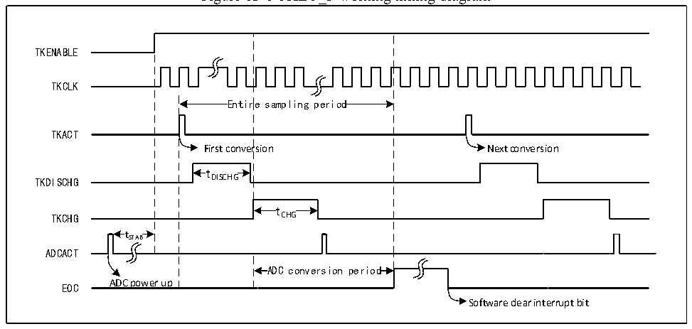

<!-- source-page: 129 -->

[← p.128](0128.md) · [index](../README.md) · [PDF p.129](https://ch32-riscv-ug.github.io/CH32V103/datasheet_en/CH32xRM.PDF#page=129) · [p.130 →](0130.md)

<!-- header: CH32x103 Reference Manual https://wch-ic.com -->

# Chapter 13 Touch Key Detection (TKEY)

<strong><em>This chapter applies to the whole family of CH32F103 and CH32V103.</em></strong>  
The touchkey detection control (TKEY_F) unit of the CH32F103 series products, with the help of the voltage  
conversion function of the ADC module, realizes the touch button detection function by converting the  
capacitance to the voltage for sampling. The detection channel multiplexes the 16 external channels of the ADC,  
and the touchkey detection is realized through the single conversion mode of the ADC module.  
The touchkey detection control (TKEY_V) unit of CH32V103 series products realizes the touchkey detection  
function by converting the capacitance change into the frequency change for sampling. The detection channel  
multiplexes the 16 external channels of the ADC. The application program judges the status of touch key based  
on the change of digital value.  

## 13.1 Functional Description of TKEY_F

● TKEY_F enable  
The coordination of ADC module is required during the TKEY_F detection process, so ADC module shall be at  
the power-down status (ADON=1) when the TKEY_F function is used. Then, set the TKENABLE bit in the  
ADC_CTLR1 register to 1, and switch on the TKEY_F unit function.  
TKEY_F only supports single 1-channel conversion mode. Configure the channel to be converted to the first of  
the regular group sequence of ADC module, and the software will start the conversion (writing the TKEY_ACT  
register).  
<em>Note: When TKEY_F conversion is not performed, the ADC channel configuration conversion function can still</em>  
<em>be retained.</em>  

Figure 13-1 TKEY_F working timing diagram  
 <!-- rendered from the PDF; verify at https://ch32-riscv-ug.github.io/CH32V103/datasheet_en/CH32xRM.PDF#page=129 -->

🖼 Text parsed from the figure above

TKENABLE  
TKCLK  
Entir  re sampling period  Entir  re sampling period  
TKACT  
First conversion Next conversion  
t DISCHG  tDISCHG  
TKDISCHG DISCHG  
t CHG  tCHG  
TKCHG CHG  
t  tSTAB  
ADCACT  
ADC conversion period  ADC conversion period  
EOC ADC power up  
Software clear interrupt bit  

● Programmable sampling time  
For TKEY unit conversion, multiple system clock cycles (tDISCHG) need to be used for discharge. Then, the  
channel is charged through multiple ADCCLK cycles (tCHG) for sampling. The number of charging cycles is  
changed by the TKCGx[2:0] bit in the TKEY_CHARGE1 and TKEY_CHARGE2 registers. In each channel,  
the sampling voltage can be regulated by different charging cycles.  
<!-- image: p129-draw-image-00001 bbox=[518.64, 779.16, 538.08, 789.84] -->
<!-- footer: V1.9 127 -->
