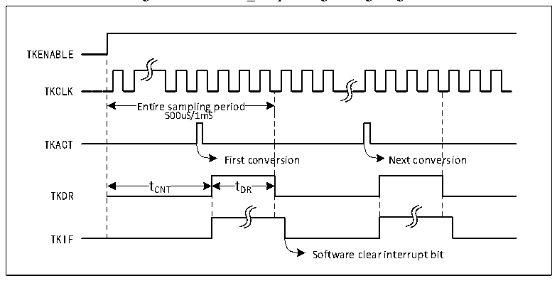

<!-- source-page: 133 -->

[← p.132](0132.md) · [index](../README.md) · [PDF p.133](https://ch32-riscv-ug.github.io/CH32V103/datasheet_en/CH32xRM.PDF#page=133) · [p.134 →](0134.md)

<!-- header: CH32x103 Reference Manual https://wch-ic.com -->

> ⬆ **Table continued** — rendered in full at [page 132](0132.md). <!-- p133-table-001 -->

<em>Note: This register maps the regular data register (ADC_RDATAR) of the ADC module.</em>  

## 13.4 Functional Description of TKEY_V

● TKEY_V enable  
The TKEY_V unit detects that the channel selection and partial register addresses of the ADC module which are  
multiplexed internally. To use the TKEY_V function, you need to enable the ADC module (ADON=1) and  
switch on the ADC clock to access the relevant registers. Then, set the TOKENABLE bit in the  
TKEY_V_CTLR (ADC_CTLR1) register to 1 and switch on the TKEY_V unit function.  
<em>Note: Because the sampling channel selection is shared, the ADC and TKEY_V detection functions cannot be</em>  
<em>used at the same time.</em>  
● Operate Principle  
Once the TKEY_V function is enabled, the hardware will automatically perform a periodic sampling and  
counting conversion process, and will notify the application code to take away the data within a fixed time (tDR)  
and start the next conversion after completing a conversion. This cycle process is is conducted automatically  
when TKEY_V is enabled. As shown in Figure 13-2, the hardware internally provides the pulse source TKCLK  
for counting. The application software selects 500us or 1ms as the current hardware counting cycle. When the  
internal counting statistics within the cycle are completed, the TKIF flag will be generated to notify the  
application code to read this conversion value. The application code needs to take away the data within the  
maximum length of 43uS (tDR). Otherwise, the next round of conversion will affect the contents of the data  
register.  

Figure 13-2 TKEY_V opreating timing diagram  
 <!-- rendered from the PDF; verify at https://ch32-riscv-ug.github.io/CH32V103/datasheet_en/CH32xRM.PDF#page=133 -->

🖼 Text parsed from the figure above

TKENABLE  
TKCLK  
Entire sampling period  Entire sampling period 500uS/1mS  
500uS/1mS  
TKACT  
First conversion Next conversion  
t CNT  tCNT  
t DR  tDR  
t t  
TKIF  
Software clear interrupt bit  

## 13.5 TKEY_V Operation Procedure

TKEY_V detects the touch key with the statistical value based on the principle that the internal oscillation  
frequency change is affected by changing the capacitance. The concrete operation process is as follows:  
1) Enable the ADCEN bit of RCC module and switch on the TKEY_V register operation authority.  
2) Switch on the TKEY_V function, set the ACON bit to 1, and wake up the ADC module. Set the TKENABLE  
bit in the ADC_CTLR1 register to 1, and switch on the TKEY_V unit.  
3) Configure the sampling period, operate the CCSEL[2:0] and TKCPS bits of the TKEY_V_CTLR register,  
<!-- image: p133-draw-image-00001 bbox=[518.88, 779.16, 538.32, 789.84] -->
<!-- footer: V1.9 131 -->
