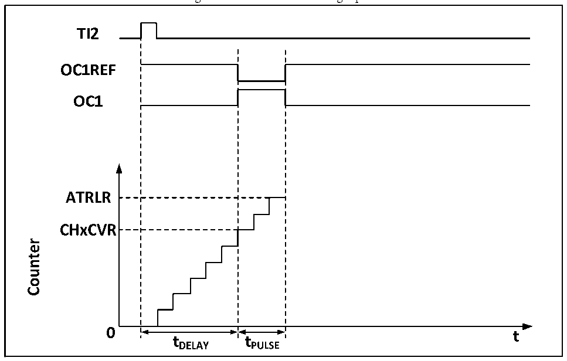

<!-- source-page: 145 -->

[← p.144](0144.md) · [index](../README.md) · [PDF p.145](https://ch32-riscv-ug.github.io/CH32V103/datasheet_en/CH32xRM.PDF#page=145) · [p.146 →](0146.md)

<!-- header: CH32x103 Reference Manual https://wch-ic.com -->

### 14.3.7 Break Signal

When the break signal is generated, the output enable signal and the invalid level will be modified according to  
the MOE, OIS, OISN, OSSI and OSSR bits. But OCx and OCxN will not be at the effective level at any time.  
The break event source can come from the break input pin, or it can be a clock failure event, and the clock  
failure event will be generated by CSS (Clock Security System).  
After the system is reset, the break function will be disabled by default (MOE bit is low). Setting the BKE bit  
can enable the break function. The polarity of the input break signal can be set by setting BKP. The BKE and  
BKP signals can be written at the same time. There will be an PB clock delay before the actual write, so you  
need to wait for an PB cycle to read the written value correctly.  
When the selected level appears on the break pin, the system will generate the following actions:  
1) The MOE bit is asynchronously cleared, and the output is set to the invalid status, idle status or reset status  
according to the setting of the SOOI bit;  
2) After MOE is cleared, each output channel will output the level determined by OISx;  
3) During the supplementary output: the output will be in an invalid status, depending on the polarity;  
4) If BIE is set, an interrupt will be generated when BIF is set; if the BDE bit is set, a DMA request will be  
generated;  
5) If AOE is set, the MOE bit will be automatically set during the next update of event UEV.  

### 14.3.8 Single Pulse Mode

The single pulse mode can be used to allow the microcontroller to respond to a specific event to generate a  
pulse after a delay. The delay and pulse width are programmable. Setting the OPM bit can make the core  
counter stop when the next update event UEV is generated (the counter turns over to 0).  
As shown in Figure 14-4, it is necessary to detect the beginning of a rising edge on the TI2 input pin. After  
delaying Tdelay, a positive pulse of length Tpulse will be generated on OC1:  

Figure 14-5 Generation of single pulse  
 <!-- rendered from the PDF; verify at https://ch32-riscv-ug.github.io/CH32V103/datasheet_en/CH32xRM.PDF#page=145 -->

🖼 Text parsed from the figure above

<!-- image: p145-draw-image-00003 inside the figure -->
<!-- image: p145-draw-image-00002 inside the figure -->
<!-- image: p145-draw-image-00004 inside the figure -->
<!-- image: p145-draw-image-00005 inside the figure -->
<!-- image: p145-draw-image-00006 inside the figure -->
<!-- image: p145-draw-image-00007 inside the figure -->
<!-- image: p145-draw-image-00008 inside the figure -->
<!-- image: p145-draw-image-00015 inside the figure -->
<!-- image: p145-draw-image-00016 inside the figure -->
<!-- image: p145-draw-image-00017 inside the figure -->
<!-- image: p145-draw-image-00009 inside the figure -->
<!-- image: p145-draw-image-00014 inside the figure -->
<!-- image: p145-draw-image-00010 inside the figure -->
<!-- image: p145-draw-image-00012 inside the figure -->
<!-- image: p145-draw-image-00013 inside the figure -->
<!-- image: p145-draw-image-00011 inside the figure -->

<!-- image: p145-draw-image-00001 bbox=[518.88, 779.16, 538.32, 789.84] -->
<!-- footer: V1.9 143 -->
