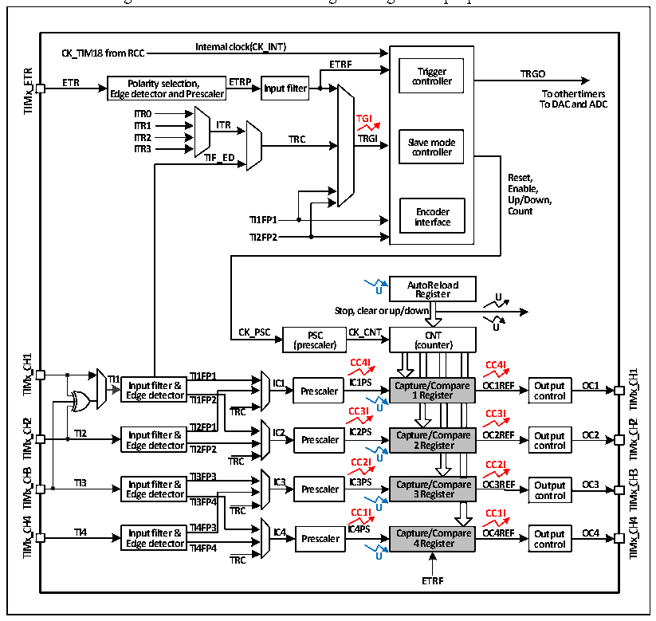

<!-- source-page: 168 -->

[← p.167](0167.md) · [index](../README.md) · [PDF p.168](https://ch32-riscv-ug.github.io/CH32V103/datasheet_en/CH32xRM.PDF#page=168) · [p.169 →](0169.md)

<!-- header: CH32x103 Reference Manual https://wch-ic.com -->

## 15.2 Principle and Structure

Figure 15-1 Structure block diagram of general-purpose timers  
 <!-- rendered from the PDF; verify at https://ch32-riscv-ug.github.io/CH32V103/datasheet_en/CH32xRM.PDF#page=168 -->

🖼 Text parsed from the figure above

<strong>Internal clock(CK_INT)</strong>  
<strong>CK_TIM18 from RCC</strong>  
<strong>ETRF</strong>  
<strong>Trigger TRGO</strong>  
<!-- image: p168-draw-image-00004 inside the figure -->
<strong>ETR Polarity selection, ETRP Input filter controller</strong>  
<!-- image: p168-draw-image-00003 inside the figure -->
<strong>Edge detector and Prescaler To other timers</strong>  
<!-- image: p168-draw-image-00002 inside the figure -->
<strong>To DAC and ADC</strong>  
<strong>ITR0</strong>  
<strong>TGI</strong>  
<strong>ITR1 ITR</strong>  
<strong>ITR2 TRC TRGI Slave mode</strong>  
<strong>ITR3 controller</strong>  
<strong>TIF_ED</strong>  
<strong>Reset,</strong>  
<strong>Enable,</strong>  
<strong>Up/Down,</strong>  
<strong>Encoder Count</strong>  
<strong>TI1FP1 interface</strong>  
<strong>TI2FP2</strong>  
<strong>AutoReload</strong>  
<strong>U Register U</strong>  
<strong>Stop, clear or up/down</strong>  
<strong>U</strong>  
<strong>CK_PSC PSC CK_CNT CNT</strong>  
<strong>(prescaler) (counter)</strong>  
<!-- image: p168-draw-image-00024 inside the figure -->
<strong>CC4I CC4I</strong>  
<!-- image: p168-draw-image-00023 inside the figure -->
<!-- image: p168-draw-image-00008 inside the figure -->
<!-- image: p168-draw-image-00022 inside the figure -->
<strong>TI1 Input filter &amp; TTII11FFPP11 IC1 IICC11PPSS Capture/Compare OC1REF Output OC1</strong>  
<!-- image: p168-draw-image-00007 inside the figure -->
<!-- image: p168-draw-image-00021 inside the figure -->
Input filter &amp; Edge detector  TI1FP1  
<!-- image: p168-draw-image-00006 inside the figure -->
<strong>Edge detector TI1FP2 Prescaler 1 Register control</strong>  
<!-- image: p168-draw-image-00005 inside the figure -->
<strong>TRC CC3I U CC3I</strong>  
<!-- image: p168-draw-image-00028 inside the figure -->
<!-- image: p168-draw-image-00012 inside the figure -->
<strong>TI2FP1</strong>  
<!-- image: p168-draw-image-00027 inside the figure -->
<!-- image: p168-draw-image-00011 inside the figure -->
<strong>TI2 Input filter &amp; IC2 Prescaler IC2PS Capture/Compare OC2REF Output OC2</strong>  
<!-- image: p168-draw-image-00026 inside the figure -->
<!-- image: p168-draw-image-00010 inside the figure -->
<!-- image: p168-draw-image-00025 inside the figure -->
<!-- image: p168-draw-image-00009 inside the figure -->
<strong>Edge detector TI2FP2 2 Register control</strong>  
<strong>TRC CC2I U CC2I</strong>  
<!-- image: p168-draw-image-00032 inside the figure -->
<!-- image: p168-draw-image-00016 inside the figure -->
<strong>TI3FP3</strong>  
<!-- image: p168-draw-image-00031 inside the figure -->
<!-- image: p168-draw-image-00015 inside the figure -->
<strong>TI3 Input filter &amp; IC3 Prescaler IC3PS Capture/Compare OC3REF Output OC3</strong>  
<!-- image: p168-draw-image-00030 inside the figure -->
<!-- image: p168-draw-image-00014 inside the figure -->
<!-- image: p168-draw-image-00029 inside the figure -->
<strong>Edge detector 3 Register control</strong>  
<!-- image: p168-draw-image-00013 inside the figure -->
<strong>TI3FP4</strong>  
<strong>TRC CC1IU CC1I</strong>  
<!-- image: p168-draw-image-00036 inside the figure -->
<!-- image: p168-draw-image-00020 inside the figure -->
<!-- image: p168-draw-image-00035 inside the figure -->
<!-- image: p168-draw-image-00019 inside the figure -->
<strong>TI4 E I d n g p e u t d f e il t t e e c r t &amp; or T T I I 4 4 F F P P 4 3 IC4 Prescaler IC4PS Capt 4 u r R e e / g C is o t m er pare OC4REF O co u n t t p r u o t l OC4</strong>  
<!-- image: p168-draw-image-00034 inside the figure -->
<!-- image: p168-draw-image-00018 inside the figure -->
<!-- image: p168-draw-image-00033 inside the figure -->
<!-- image: p168-draw-image-00017 inside the figure -->
<strong>TRC U</strong>  
<strong>ETRF</strong>  

### 15.2.1 Overview

As shown in Figure 15-1, the structure of the general-purpose timer can be roughly divided into three parts:  
Input clock part, core counter part and compare/capture part.  
The general-purpose timer clock can come from HB bus clock (CK_INT), external clock input pin  
(TIMx_ETR), other timers with clock output function (ITRx), or the input end of compare capture channel  
(TIMx_CHx). These input clock signals will become CK_PSC clocks after various set filtering and frequency  
division operations, and will output to the core counter part. In addition, these complex clock sources can also  
be output as TRGO to other peripherals such as timer, ADC and DAC.  
The core of the general-purpose timer is a 16-bit counter (CNT). After CK_PSC is divided by the prescaler  
(PSC), it becomes CK_CNT and finally outputs to CNT. CNT supports up-counting mode, down-counting  
mode and up/down counting mode, and there is an automatic reload value register (ATRLR). After each count  
cycle is completed, CNT will be reloaded with the initial value.  
The general-purpose timer has four groups of compare/captures. On each group of compare/capture, pulses can  
be inputted from its dedicated pins or output waveforms to the pins, i.e., the compare/captures support input and  
output modes. The input of each channel of the compare/capture register supports operations such as filtering,  
frequency division and edge detection, and supports mutual triggering between channels, and can also provide a  
clock for the core counter CNT. Each compare/capture has a set of compare/capture register (CHxCVR), which  
supports comparison with the main counter (CNT) so as to output pulse.  
<!-- image: p168-draw-image-00001 bbox=[518.88, 779.16, 538.32, 789.84] -->
<!-- footer: V1.9 166 -->
