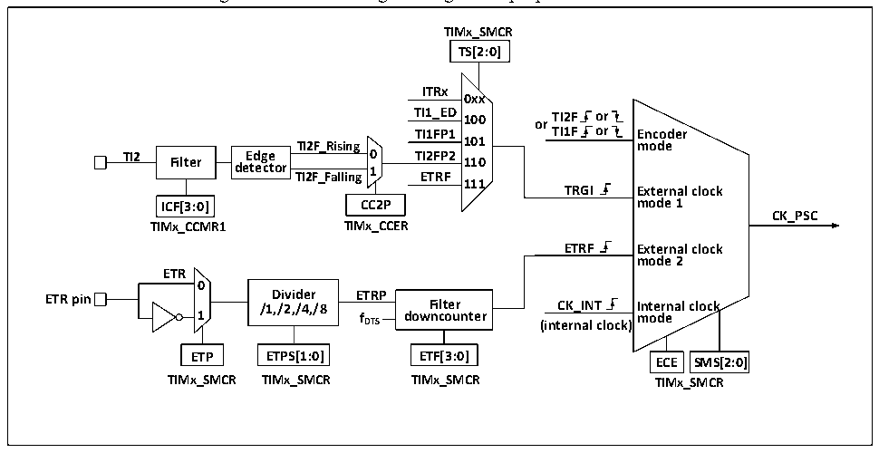

<!-- source-page: 169 -->

[← p.168](0168.md) · [index](../README.md) · [PDF p.169](https://ch32-riscv-ug.github.io/CH32V103/datasheet_en/CH32xRM.PDF#page=169) · [p.170 →](0170.md)

<!-- header: CH32x103 Reference Manual https://wch-ic.com -->

### 15.2.2 Difference between General-purpose Timer and Advanced-control Timer

Compared with the advanced-control timer, the general-purpose timer is lack of the following functions:  
1) The general-purpose timer lacks a repeated counting register that counts the count cycle of core counter.  
2) The compare/capture of general-purpose timer lacks dead zone generation and has no complementary output.  
3) The general-purpose timer has no break signal mechanism.  
4) The default clock CK_INT of the general-purpose timer comes from PB1, while the CK_INT of the  
advanced-control timer (TIM1) comes from PB2.  

### 15.2.3 Clock Input

This section describes the source of CK_PSC. The clock source part of the general structure block diagram of  
the general-purpose timer is abstracted here.  

Figure 15-2 Block diagram of general-purpose timer source  
 <!-- rendered from the PDF; verify at https://ch32-riscv-ug.github.io/CH32V103/datasheet_en/CH32xRM.PDF#page=169 -->

🖼 Text parsed from the figure above

<strong>TIMx_SMCR</strong>  
<strong>TS[2:0]</strong>  
<strong>ITRx</strong>  
<strong>0xx</strong>  
<strong>TI1_ED 100 or TI2F or</strong>  
<strong>TI1FP1 TI1F or Encoder</strong>  
<strong>TI2F_Rising 101 mode</strong>  
<strong>TI2 Filter Edge 0 TI2FP2 110</strong>  
<strong>detector TI2F_Falling 1 ETRF</strong>  
<strong>111</strong>  
<strong>TRGI External clock</strong>  
<strong>ICF[3:0] CC2P mode 1</strong>  
<strong>CK_PSC</strong>  
<strong>TIMx_CCMR1 TIMx_CCER</strong>  
<strong>ETRF External clock</strong>  
<strong>mode 2</strong>  
<strong>ETR</strong>  
<strong>0</strong>  
<strong>ETR pin /1 D ,/ i 2 vi , d /4 e , r /8 ETRP Filter CK_INT Internal clock</strong>  
<strong>1 f DTS downcounter (internal clock) mode</strong>  
<strong>ETP ETPS[1:0] ETF[3:0] ECE SMS[2:0]</strong>  
<strong>TIMx_SMCR TIMx_SMCR TIMx_SMCR TIMx_SMCR</strong>  

The available input clocks can be divided into 4 categories:  
1) The route of external clock pin (ETR) input: ETR→ETRP→ETRF;  
2) Internal PB clock input route: CK_INT;  
3) The route from the compare/capture pin (TIMx_CHx): TIMx_CHx→TIx→TIxFPx; this route is also used in  
encoder mode;  
4) Input from other internal timers: ITRx.  
The actual operation can be divided into 3 categories by determining the input pulse selection of the SMS from  
the CK_PSC source:  
1) Select the internal clock source (CK_INT);  
2) External clock source mode 1;  
3) External clock source mode 2;  
4) Encoder code.  
The 4 clock sources mentioned above can be selected by these 4 operations.  

#### 15.2.3.1 Internal Clock Source (CK_INT)

<!-- image: p169-draw-image-00001 bbox=[518.76, 779.16, 538.2, 789.84] -->
<!-- footer: V1.9 167 -->
