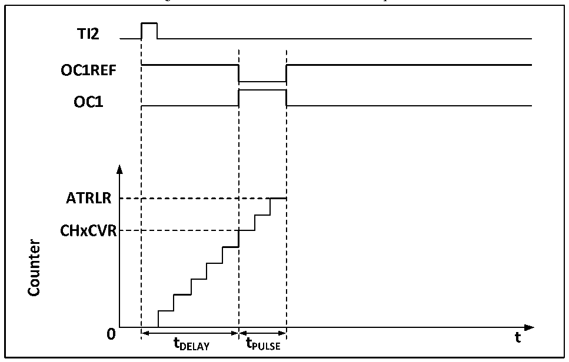

<!-- source-page: 174 -->

[← p.173](0173.md) · [index](../README.md) · [PDF p.174](https://ch32-riscv-ug.github.io/CH32V103/datasheet_en/CH32xRM.PDF#page=174) · [p.175 →](0175.md)

<!-- header: CH32x103 Reference Manual https://wch-ic.com -->
When the center-aligned mode is used, the core counter will run in a mode where up counting and down  
counting are performed alternately, and OCxREF performs rising and falling jumps when the values of the core  
counter and the compare/capture register are consistent. However, in three types of central alignment mode of  
comparison flag, the bit setting timing is different somewhat. When the center-alignment mode is used, it is the  
best to generate a software update flag (set the UG bit) before starting the core counter.  

### 15.3.6 Single Pulse Mode

The single pulse mode can be used to respond to a specific event to generate a pulse after a delay. The delay and  
pulse width are programmable. Setting the OPM bit can make the core counter stop when the next update event  
UEV is generated (the counter turns over to 0).  

Figure 15-4 Event Generation and Pulse Response  
 <!-- rendered from the PDF; verify at https://ch32-riscv-ug.github.io/CH32V103/datasheet_en/CH32xRM.PDF#page=174 -->

🖼 Text parsed from the figure above

<!-- image: p174-draw-image-00003 inside the figure -->
<!-- image: p174-draw-image-00002 inside the figure -->
<!-- image: p174-draw-image-00004 inside the figure -->
<!-- image: p174-draw-image-00005 inside the figure -->
<!-- image: p174-draw-image-00006 inside the figure -->
<!-- image: p174-draw-image-00007 inside the figure -->
<!-- image: p174-draw-image-00008 inside the figure -->
<!-- image: p174-draw-image-00015 inside the figure -->
<!-- image: p174-draw-image-00016 inside the figure -->
<!-- image: p174-draw-image-00017 inside the figure -->
<!-- image: p174-draw-image-00009 inside the figure -->
<!-- image: p174-draw-image-00014 inside the figure -->
<!-- image: p174-draw-image-00010 inside the figure -->
<!-- image: p174-draw-image-00012 inside the figure -->
<!-- image: p174-draw-image-00013 inside the figure -->
<!-- image: p174-draw-image-00011 inside the figure -->

As shown in Figure 15-4, it is necessary to detect the beginning of a rising edge on the TI2 input pin. After  
delaying Tdelay, a positive pulse of length Tpulse will be generated on OC1:  
1) Set TI2 as trigger. Set the CC2S field to 01b and map TI2FP2 to TI2; set the CC2P bit to 0b and set TI2FP2  
to rising edge detection; set the TS field to 110b and set TI2FP2 as the trigger source; set the SMS field to  
110b, and TI2FP2 is used to start the counter;  
2) Tdelay is defined by the value of the compare/capture register, and Tpulse is determined by the value of the  
auto-reload value register and the value of the compare/capture register.  

### 15.3.7 Encoder Mode

The encoder mode is a typical application of the timer. It can be used to access the dual-phase output of the  
encoder. The count direction of the core counter is synchronized with the rotating shaft of the encoder. Each  
pulse output by the encoder will increase the core counter by adding one or substracting one. The steps to use  
the encoder are: set the SMS field to 001b (count only on TI2 edge), 010b (count only on TI1 edge) or 011b  
(count on both TI1 and TI2 edges), and connect the encoder to compare/capture 1, 2 inputs, set a value for the  
<!-- image: p174-draw-image-00001 bbox=[518.64, 779.16, 538.08, 789.84] -->
<!-- footer: V1.9 172 -->
