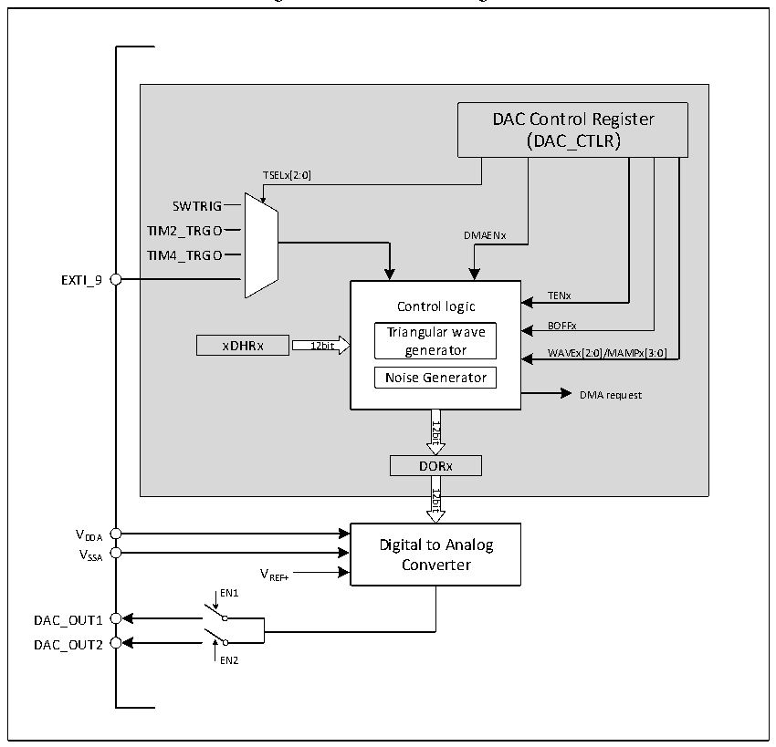

<!-- source-page: 195 -->

[← p.194](0194.md) · [index](../README.md) · [PDF p.195](https://ch32-riscv-ug.github.io/CH32V103/datasheet_en/CH32xRM.PDF#page=195) · [p.196 →](0196.md)

<!-- header: CH32x103 Reference Manual https://wch-ic.com -->

## 16.2 Functional Description

### 16.2.1 DAC Structure

Figure 16-1 DAC block diagram  
 <!-- rendered from the PDF; verify at https://ch32-riscv-ug.github.io/CH32V103/datasheet_en/CH32xRM.PDF#page=195 -->

🖼 Text parsed from the figure above

DAC Control Register  
（DAC_CTLR）  
TSELx[2:0]  
SWTRIG  
TIM2_TRGO DMAENx  
TIM4_TRGO  
EXTI_9  
TENx  
Control logic  
Triangular wave BOFFx  
xDHRx 12bit generator WAVEx[2:0]/MAMPx[3:0]  
Noise Generator  
DMA request  
12bit  
DORx  
12bit  
VDDA  
Digital to Analog  
VSSA  
Converter  
VREF+  
EN1  
DAC_OUT1  
DAC_OUT2  
EN2  

### 16.2.2 DAC Channel Configuration

1) Enable DAC function: Set the ENx bit in the DAC_CTLR register to 1, to enable the analog power to DAC  
channel x. After a period of start-up time, DAC channel x can be enabled. The DAC contains 2 analog output  
channels. When the outputs of the 2 channels are enabled at the same time (EN1 bit 1 and EN2 1), the same  
waveform will be outputted to the 2 analog channels in the configuration of channel 1; when only output of the  
channel 1 is enabled, the waveform will be outputted to the analog channel 1 according to the channel 1  
configuration, and the channel 2 will not output; when only the output of the channel 2 is enabled, the output  
waveform will be outputted to the analog channel 2 according to the channel 2 configuration, and channel 1 will  
not output.  
<em>Note: In order to avoid parasitic interference and additional power consumption, the corresponding pins of the</em>  
<em>DAC channel need to be set to analog input (AIN) mode in advance.</em>  
2) Enable output buffer: DAC integrates output buffers, which can be used to reduce the output impedance and  
increase the drive capacity to directly drive the external loads. Each DAC channel output buffer can be enabled  
<!-- image: p195-draw-image-00001 bbox=[518.88, 779.16, 538.32, 789.84] -->
<!-- footer: V1.9 193 -->
