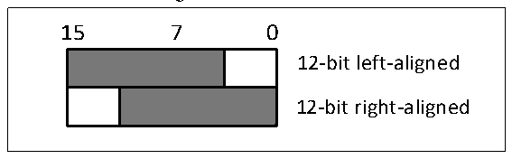

<!-- source-page: 196 -->

[← p.195](0195.md) · [index](../README.md) · [PDF p.196](https://ch32-riscv-ug.github.io/CH32V103/datasheet_en/CH32xRM.PDF#page=196) · [p.197 →](0197.md)

<!-- header: CH32x103 Reference Manual https://wch-ic.com -->
or disabled by setting the BOFFx bit in the DAC_CTLR register.  
3) Data format: Including 12-bit data left alignment and 12-bit data right alignment. Write data to  
DAC_R12BDHRx[11:0], the module will load (after 1 PB1 clock cycle) right-aligned data to the data output  
register DAC_DORx[11:0]; write data to DAC_L12BDHRx[15:3], the module will go through the  
corresponding shift to load the left-aligned data (after 1 PB1 clock cycle) to the data output register  
DAC_DORx[11:0].  

Figure 16-2 Data format  
 <!-- rendered from the PDF; verify at https://ch32-riscv-ug.github.io/CH32V103/datasheet_en/CH32xRM.PDF#page=196 -->

🖼 Text parsed from the figure above

15 7 0  
12-bit left-aligned  
12-bit right-aligned  

4) DMA function: DAC channel has the DMA function. Set the DMAENx bit in the DAC_CTLR register to 1,  
to enable the DMA function of the corresponding channel. When a trigger event (excluding software trigger)  
occurs, a DMA request is generated, and then the data in DAC_DORx register can be updated.  
5) Trigger event selection: DAC conversion can be triggered by the following 4 events. When the TENx bit in  
the DAC_CTLR register is set to 1, a trigger event to trigger DAC conversion can be selected by configuring  
the TSELx[2:0] control bits.  

<!-- p196-table-002 (table-16-1@1) -->
<table><caption>Table 16-1 Trigger events</caption><tr><th>Trigger source</th><th>Type</th><th>TSELx[2:0]</th></tr><tr><td>Timer 3 TRGO event</td><td rowspan="3">Internal signal from on-chip timer</td><td>001</td></tr><tr><td>Timer 2 TRGO event</td><td>100</td></tr><tr><td>Timer 4 TRGO event</td><td>101</td></tr><tr><td>EXTI line 9</td><td>External pin</td><td>110</td></tr><tr><td>SWTRIG (software trigger)</td><td>Software control bit</td><td>111</td></tr></table>

Every time a DAC interface detects a rising edge on the selected timer TRGO output or on the selected external  
interrupt line 9, the DAC_DORx register is updated three PB1 clock cycles after the trigger occurs.  
If the software trigger mode is configured, once the SWTRIG bit is set to 1, a conversion is started. The  
DAC_DORx register is updated one PB1 clock cycle after the trigger occurs, and the SWTRIG bit canl be  
automatically cleared by hardware.  
<em>Note: The TSELx[2:0] bits cannot be changed when ENx is 1.</em>  

### 16.2.3 DAC Conversion

The data of the DAC channel comes from the DAC_DORx register, but data cannot be directly written to the  
register DAC_DORx. Any data output to the DAC channel x must be written into the DAC_R12BDHR1,  
DAC_L12BDHR1, DAC_R12BDHR2, DAC_L12BDHR2 registers. The internal DAC_DHRx register obtains  
the value of above registers and transfers it to the DAC_DORx register after the corresponding time.  
In the non-trigger mode, the data written into the DAC_xDHRx register is shifted into the DAC_DORx register  
in one PB1 clock cycle.  
In software trigger mode, the DAC_DORx register is automatically updated in one PB1 clock cycle after the  
<!-- image: p196-draw-image-00001 bbox=[518.88, 779.16, 538.32, 789.84] -->
<!-- footer: V1.9 194 -->
