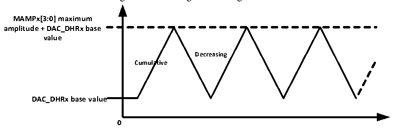

<!-- source-page: 197 -->

[← p.196](0196.md) · [index](../README.md) · [PDF p.197](https://ch32-riscv-ug.github.io/CH32V103/datasheet_en/CH32xRM.PDF#page=197) · [p.198 →](0198.md)

<!-- header: CH32x103 Reference Manual https://wch-ic.com -->
rising edge of the event trigger.  
In hardware trigger mode (timer TRGO event or external interrupt line 9 rising edge), the DAC_DORx register  
is automatically updated in 3 PB1 clock cycles after the trigger event.  
Load the DAC_DORx register data. After the time of tSETTLING, the output can be valid, and the length of this  
period of time will vary depending on the supply voltage and the analog output load.  
The digital input is linearly converted to analog voltage output by the DAC, and it ranges from 0 to VDDA. The  
output voltage on any DAC channel pin shall meet the following relationship:  
DAC output voltage = VDDA* (DAC_DORx/ 4096).  

### 16.2.4 DAC Triangular Wave Generator

The module has a built-in triangular wave generator, which can add a small amplitude triangle wave to the  
reference signal. Set WAVEx[1:0] bit as &#x27;10&#x27; and select the triangular wave generation function of DAC. Set  
MAMPx[3:0] bit in the DAC_CTLR register to select the amplitude of triangular wave.  
The system contains a triangular wave counter starting from 0, which accumulates by 1 in 3 PB1 clock cycles  
after each trigger event. The value of the counter is added to the value of the DAC_DHRx register and the  
overflow bit is discarded and then written to the DAC_DORx register. When the value transmitted into the  
DAC_DORx register is smaller than the maximum amplitude defined by the MAMPx[3:0] bits, the triangular  
wave counter will gradually accumulate. Once it reaches the set maximum amplitude, the counter will begin to  
decrease progressively, and then start to accumulate after reaching 0. Repeat this cycle. Set WAVEx[1:0] bits to  
‘00’ to reset the generation of triangle waves.  
<em>Note: 1. To generate a triangular wave, DAC trigger must be enabled, i.e., setting the TENx bit in the</em>  
<em>DAC_CTLR register to 1.</em>  
<em>2. MAMPx[3:0] bits must be set before enable the DAC. Otherwise, its value cannot be modified.</em>  

Figure 16-3 Triangular wave generation  
 <!-- rendered from the PDF; verify at https://ch32-riscv-ug.github.io/CH32V103/datasheet_en/CH32xRM.PDF#page=197 -->

🖼 Text parsed from the figure above

<strong>MAMPx[3:0] maximum</strong>  
<strong>amplitude + DAC_DHRx base</strong>  
<strong>value</strong>  
<strong>Decreasing</strong>  
<strong>Cumulative</strong>  
<strong>DAC_DHRx base value</strong>  
<strong>0</strong>  

### 16.2.5 DAC Noise Generator

The module has a built-in noise generator that uses the Linear Feedback Shift Register (LFSR) to generate  
pseudo noise with varying amplitude. Set WAVE[1:0] bits to ‘01’ to select the DAC noise generation function.  
Set the MAMPx[3:0] bits in the DAC_CTLR register to select the data of the masked part of the LFSR.  
The preload value of the register LFSR is 0xAAA. According to a specific algorithm, the value of this register is  
updated in 3 PB1 clock cycles after each trigger event. Setting the MAMPx[3:0] bits in the DAC_CR register  
can mask part or all of the LFSR data, so that the LSFR value obtained is added to the value of DAC_DHRx,  
and the overflow bit is removed and then written into the DAC_DORx register. If the register LFSR value is  
0x000, it will inject ‘1’ (anti-lock mechanism). Set WAVEx[1:0] bit to ‘00’ to reset the generation algorithm of  
LFSR waveform.  
<em>Note: To generate a noise wave, DAC trigger must be enabled, i.e., setting the TENx bit in the DAC_CTLR</em>  
<!-- image: p197-draw-image-00001 bbox=[518.88, 779.16, 538.32, 789.84] -->
<!-- footer: V1.9 195 -->
