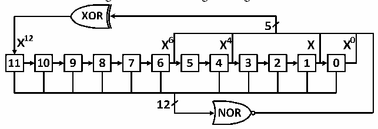

<!-- source-page: 198 -->

[← p.197](0197.md) · [index](../README.md) · [PDF p.198](https://ch32-riscv-ug.github.io/CH32V103/datasheet_en/CH32xRM.PDF#page=198) · [p.199 →](0199.md)

<!-- header: CH32x103 Reference Manual https://wch-ic.com -->
<em>register to 1.</em>  

Figure 16-4 LFSR register algorithm  
 <!-- rendered from the PDF; verify at https://ch32-riscv-ug.github.io/CH32V103/datasheet_en/CH32xRM.PDF#page=198 -->

🖼 Text parsed from the figure above

<!-- image: p198-draw-image-00039 inside the figure -->
<!-- image: p198-draw-image-00036 inside the figure -->
<!-- image: p198-draw-image-00027 inside the figure -->
<!-- image: p198-draw-image-00029 inside the figure -->
<!-- image: p198-draw-image-00034 inside the figure -->
<!-- image: p198-draw-image-00031 inside the figure -->
<!-- image: p198-draw-image-00026 inside the figure -->
<!-- image: p198-draw-image-00028 inside the figure -->
<!-- image: p198-draw-image-00030 inside the figure -->
<!-- image: p198-draw-image-00032 inside the figure -->
<!-- image: p198-draw-image-00033 inside the figure -->
<!-- image: p198-draw-image-00018 inside the figure -->
<!-- image: p198-draw-image-00016 inside the figure -->
<!-- image: p198-draw-image-00002 inside the figure -->
<!-- image: p198-draw-image-00004 inside the figure -->
<!-- image: p198-draw-image-00006 inside the figure -->
<!-- image: p198-draw-image-00008 inside the figure -->
<!-- image: p198-draw-image-00010 inside the figure -->
<!-- image: p198-draw-image-00012 inside the figure -->
<!-- image: p198-draw-image-00014 inside the figure -->
<!-- image: p198-draw-image-00020 inside the figure -->
<!-- image: p198-draw-image-00022 inside the figure -->
<!-- image: p198-draw-image-00024 inside the figure -->
<!-- image: p198-draw-image-00017 inside the figure -->
<!-- image: p198-draw-image-00003 inside the figure -->
<!-- image: p198-draw-image-00005 inside the figure -->
<!-- image: p198-draw-image-00009 inside the figure -->
<!-- image: p198-draw-image-00015 inside the figure -->
<!-- image: p198-draw-image-00021 inside the figure -->
<!-- image: p198-draw-image-00025 inside the figure -->
<!-- image: p198-draw-image-00019 inside the figure -->
<!-- image: p198-draw-image-00007 inside the figure -->
<!-- image: p198-draw-image-00011 inside the figure -->
<!-- image: p198-draw-image-00013 inside the figure -->
<!-- image: p198-draw-image-00023 inside the figure -->
<!-- image: p198-draw-image-00035 inside the figure -->
<!-- image: p198-draw-image-00038 inside the figure -->
<!-- image: p198-draw-image-00037 inside the figure -->

## 16.3 Register Description

<!-- p198-table-001 (table-16-2@1) -->
<table><caption>Table 16-2 DAC related registers</caption><tr><th><strong>Name</strong></th><th><strong>Access address</strong></th><th><strong>Description</strong></th><th><strong>Reset value</strong></th></tr><tr><td>R32_DAC_CTLR</td><td>0x40007400</td><td>DAC configuration register</td><td>0x00000000</td></tr><tr><td>R32_DAC_SWTR</td><td>0x40007404</td><td>DAC software trigger register</td><td>0x00000000</td></tr><tr><td>R32_DAC_R12BDHR1</td><td>0x40007408</td><td style="text-align:left">DAC channel 1 12-bit right-aligned data holding register</td><td>0x00000000</td></tr><tr><td>R32_DAC_L12BDHR1</td><td>0x4000740C</td><td style="text-align:left">DAC channel 1 12-bit left-aligned data holding register</td><td>0x00000000</td></tr><tr><td>R32_DAC_R12BDHR2</td><td>0x40007414</td><td style="text-align:left">DAC channel 2 12-bit right-aligned data holding register</td><td>0x00000000</td></tr><tr><td>R32_DAC_L12BDHR2</td><td>0x40007418</td><td style="text-align:left">DAC channel 2 12-bit left-aligned data holding register</td><td>0x00000000</td></tr><tr><td>R32_DAC_DOR1</td><td>0x4000742C</td><td>Data output register of DAC channel 1</td><td>0x00000000</td></tr><tr><td>R32_DAC_DOR2</td><td>0x40007430</td><td>Data output register of DAC channel 2</td><td>0x00000000</td></tr></table>

### 16.3.1 DAC Configuration Register (DAC_CTLR)

Offset address: 0x00  

<!-- p198-table-002 (table-16-2@1) -->
<table class="bitfield"><colgroup><col style="width:6.2500%"><col style="width:6.2500%"><col style="width:6.2500%"><col style="width:6.2500%"><col style="width:6.2500%"><col style="width:6.2500%"><col style="width:6.2500%"><col style="width:6.2500%"><col style="width:6.2500%"><col style="width:6.2500%"><col style="width:6.2500%"><col style="width:6.2500%"><col style="width:6.2500%"><col style="width:6.2500%"><col style="width:6.2500%"><col style="width:6.2500%"></colgroup><tr><th>31</th><th>30</th><th>29</th><th>28</th><th>27</th><th>26</th><th>25</th><th>24</th><th>23</th><th>22</th><th>21</th><th>20</th><th>19</th><th>18</th><th>17</th><th>16</th></tr><tr><td colspan="3">Reserved</td><td>DMAEN2</td><td colspan="4">MAMP2[3:0]</td><td colspan="2">WAVE2[2:0]</td><td colspan="3">TSEL2[2:0]</td><td>TEN2</td><td>BOFF2</td><td>EN2</td></tr></table>

<!-- p198-table-003 (table-16-2@1) -->
<table class="bitfield"><colgroup><col style="width:6.2500%"><col style="width:6.2500%"><col style="width:6.2500%"><col style="width:6.2500%"><col style="width:6.2500%"><col style="width:6.2500%"><col style="width:6.2500%"><col style="width:6.2500%"><col style="width:6.2500%"><col style="width:6.2500%"><col style="width:6.2500%"><col style="width:6.2500%"><col style="width:6.2500%"><col style="width:6.2500%"><col style="width:6.2500%"><col style="width:6.2500%"></colgroup><tr><th>15</th><th>14</th><th>13</th><th>12</th><th>11</th><th>10</th><th>9</th><th>8</th><th>7</th><th>6</th><th>5</th><th>4</th><th>3</th><th>2</th><th>1</th><th>0</th></tr><tr><td colspan="3">Reserved</td><td>DMAEN1</td><td colspan="4">MAMP1[3:0]</td><td colspan="2">WAVE1[2:0]</td><td colspan="3">TSEL1[2:0]</td><td>TEN1</td><td>BOFF1</td><td>EN1</td></tr></table>

<!-- p198-table-004 (table-16-2@1) pages 198-201 -->
<table><tr><th>Bit</th><th>Name</th><th>Access</th><th>Description</th><th style="text-align:left">Reset value</th></tr><tr><td>[31:29]</td><td>Reserved</td><td>RO</td><td>Reserved.</td><td>0</td></tr><tr><td>28</td><td>DMAEN2</td><td>RW</td><td style="text-align:left">DMA enable of DAC channel2: 1: DMA of DAC channel2 enabled; 0: DMA of DAC channel2 disabled.</td><td>0</td></tr><tr><td>[27:24]</td><td>MAMP2[3:0]</td><td>RW</td><td style="text-align:left">DAC channel2 mask/amplitude setting. The software sets this area to select the LFSR data mask bit in the noise generation mode, and select the waveform amplitude in the triangle waveform generation mode: 0000: Unmask bit0 of LSFR/ Triangle amplitude equal to 1; 0001: Unmask bits[1:0] of LSFR/ Triangle amplitude equal to 3; 0010: Unmask bits[2:0] of LSFR/ Triangle amplitude equal to 7; 0011: Unmask bits[3:0] of LSFR/ Triangle amplitude equal to 15; 0100: Unmask bits[4:0] of LSFR/ Triangle amplitude equal to 31; 0101: Unmask bits[5:0] of LSFR/ Triangle amplitude equal to 63; 0110: Unmask bits[6:0] of LSFR/ Triangle amplitude equal to 127; 0111: Unmask bits[7:0] of LSFR/ Triangle amplitude equal to 255; 1000: Unmask bits[8:0] of LSFR/ Triangle amplitude equal to 511; 1001: Unmask bits[9:0] of LSFR/ Triangle amplitude equal to 1023; 1010: Unmask bits[10:0] of LSFR/ Triangle amplitude equal to 2047; ≥1011: Unmask bits[11:0] of LSFR/ Triangle amplitude equal to 4095.</td><td>0</td></tr><tr><td>[23:22]</td><td>WAVE2[1:0]</td><td>RW</td><td style="text-align:left">Noise/Triangular wave generation enable of DAC channel 2 00: Wave generator disabled; 01: Noise wave generator enabled; 1x: Triangular wave generator enabled.</td><td>0</td></tr><tr><td>[21:19]</td><td>TSEL2[2:0]</td><td>RW</td><td style="text-align:left">Trigger event selection of DAC channel 2: 001: TRGO event of TIM3; 100: TRGO event of TIM2; 101: TRGO event of TIM4; 110: External interrupt line 9; 111: Software trigger; Others: Reserved.</td><td>0</td></tr><tr><td>18</td><td>TEN2</td><td>RW</td><td style="text-align:left">External trigger mode enable of DAC channel2: 1: Trigger of DAC channel2 enabled; the data written into the DAC_xDHR register is sent to the DAC_DOR2 register in 3 PB1 clock cycles. 0: Trigger of DAC channel2 disabled; the data written into the DAC_xDHR register will be sent to the DAC_DOR2 register in 1 PB1 clock cycle. Note: If software trigger is selected, the data in DAC_xDHR only needs to be sent to the DAC_DOR2 register in one PB1 clock cycle.</td><td>0</td></tr><tr><td>17</td><td>BOFF2</td><td>RW</td><td style="text-align:left">DAC channel2 output buffer disable control (recommended to be enabled): 1: DAC channel2 output buffer disabled; 0: DAC channel2 output buffer enabled.</td><td>0</td></tr><tr><td>16</td><td>EN2</td><td>RW</td><td style="text-align:left">DAC channel2 enable: 1: DAC channel2 enabled; 0: DAC channel2 disabled.</td><td>0</td></tr><tr><td>[15:13]</td><td>Reserved</td><td>RO</td><td>Reserved.</td><td>0</td></tr><tr><td>12</td><td>DMAEN1</td><td>RW</td><td style="text-align:left">DMA enable of DAC channel1: 1: DMA function of DAC channel1 enabled; 0: DMA function of DAC channel1 disabled.</td><td>0</td></tr><tr><td>[11:8]</td><td>MAMP1[3:0]</td><td>RW</td><td style="text-align:left">DAC channel 1 mask/amplitude setting. The software sets these bits to select the LFSR data mask bit in the noise generation mode, and select the wave amplitude in the triangle waveform generation mode: 0000: Unmask bit0 of LSFR/ Triangle amplitude equal to 1; 0001: Unmask bit[1:0] of LSFR/ Triangle amplitude equal to 3; 0010: Unmask bit[2:0] of LSFR/ Triangle amplitude equal to 7; 0011: Unmask bit [3:0] of LSFR/ Triangle amplitude equal to 15; 0100: Unmask bit[4:0] of LSFR/ Triangle amplitude equal to 31; 0101: Unmask bit[5:0] of LSFR/ Triangle amplitude equal to 63; 0110: Unmask bit[6:0] of LSFR/ Triangle amplitude equal to 127; 0111: Unmask bit[7:0] of LSFR/ Triangle amplitude equal to 255; 1000: Unmask bit[8:0] of LSFR/ Triangle amplitude equal to 511; 1001: Unmask bit[9:0] of LSFR/ Triangle amplitude equal to 1023; 1010: Unmask bit[10:0] of LSFR/ Triangle amplitude equal to 2047; ≥1011: Unmask bit[11:0] of LSFR/ Triangle amplitude equal to 4095.</td><td>0</td></tr><tr><td>[7:6]</td><td>WAVE1[1:0]</td><td>RW</td><td style="text-align:left">Noise/Triangular wave generation enable of DAC channel 1. 00: Wave generator disabled; 01:Noise wave generator enabled; 1x: Triangular wave generator enabled.</td><td>0</td></tr><tr><td>[5:3]</td><td>TSEL1[2:0]</td><td>RW</td><td style="text-align:left">Trigger event selection of DAC channel 1: 001: TRGO event of TIM3; 100: TRGO event of TIM2; 101: TRGO event of TIM4; 110: External interrupt line 9; 111: Software trigger; Others: Reserved.</td><td>0</td></tr><tr><td>2</td><td>TEN1</td><td>RW</td><td style="text-align:left">External trigger mode enable of DAC channel1: 1: Trigger of DAC channel1 enabled. The data written into the DAC_xDHR register is sent to the DAC_DOR1 register in 3 PB1 clock cycles. 0: Trigger of DAC channel1 disabled. The data written into the DAC_xDHR register is sent to the DAC_DOR1 register in 1 PB1 clock cycle. Note: If software trigger is selected, the data in DAC_xDHR only needs to be sent to the DAC_DOR1 register in one PB1 clock cycle.</td><td>0</td></tr><tr><td>1</td><td>BOFF1</td><td>RW</td><td style="text-align:left">DAC channel1 output buffer disable control (recommended to be enabled): 1: DAC channel1 output buffer disabled; 0: DAC channel1 output buffer enabled.</td><td>0</td></tr><tr><td>0</td><td>EN1</td><td>RW</td><td style="text-align:left">DAC channel1 enable: 1: DAC channel1 enabled; 0: DAC channel1 disabled.</td><td>0</td></tr></table>

<!-- image: p198-draw-image-00001 bbox=[518.88, 779.16, 538.32, 789.84] -->
<!-- footer: V1.9 196 -->
