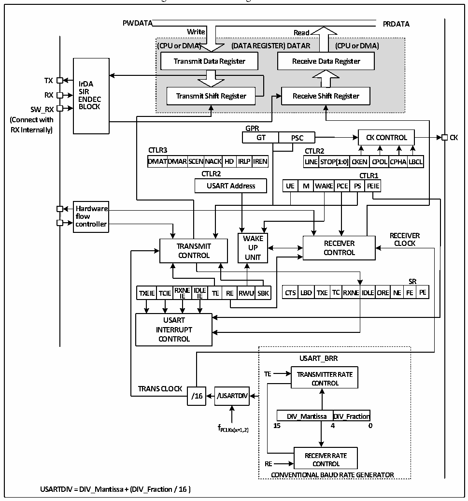

<!-- source-page: 206 -->

[← p.205](0205.md) · [index](../README.md) · [PDF p.206](https://ch32-riscv-ug.github.io/CH32V103/datasheet_en/CH32xRM.PDF#page=206) · [p.207 →](0207.md)

<!-- header: CH32x103 Reference Manual https://wch-ic.com -->

## 17.2 Overview

Figure 17-1 Block diagram of USART  
 <!-- rendered from the PDF; verify at https://ch32-riscv-ug.github.io/CH32V103/datasheet_en/CH32xRM.PDF#page=206 -->

🖼 Text parsed from the figure above

<strong>PWDATA PRDATA</strong>  
<!-- image: p206-draw-image-00005 inside the figure -->
<!-- image: p206-draw-image-00004 inside the figure -->
<strong>Write Read</strong>  
<strong>(CPU or DMA) (DATA REGISTER) DATAR (CPU or DMA)</strong>  
<strong>Transmit Data Register Receive Data Register</strong>  
<!-- image: p206-draw-image-00003 inside the figure -->
<!-- image: p206-draw-image-00006 inside the figure -->
<strong>TX</strong>  
<strong>IrDA</strong>  
<strong>SIR</strong>  
<strong>RX Transmit Shift Register Receive Shift Register</strong>  
<strong>ENDEC</strong>  
<strong>SW_RX BLOCK</strong>  
<strong>(Connect with</strong>  
<strong>RX Internally) GPR</strong>  
<strong>GT PSC CK CONTROL CK</strong>  
<strong>CTLR3 CTLR2</strong>  
DMAT  TDMAR  SCENN  NAC  CKHD  IRLPI  
CLITNLER2ST  TOP[1:0]  CKEN  CPOL  CPHA  ALBCL  
<strong>DMATDMARSCENNACKHD IRLPIREN LINESTOP[1:0]CKEN CPOLCPHALBCL</strong>  
<strong>CTLR2 CTLR1</strong>  
M  WA  AKE PCE  CTLR PS PE  R1EIE  
Hardware flow controller  
<!-- image: p206-draw-image-00002 inside the figure -->
<strong>WWAAKKEE RECEIVER</strong>  
<strong>TRANSMIT UUPP RECEIVER CLOCK</strong>  
<strong>CONTROL UUNNIITT CONTROL</strong>  
TXEIE  TCIE  RXNE IIE  IDLEIE  TE  RE  RWU  
<strong>SR</strong>  
LBD  TXE  TC  RXNE  EIDLE  EORE  NE  SRFE  RPE  
<strong>TXEIE TCIERX IE NE ID IE LE TE RE RWU SBK CTS LBD TXE TC RXNEIDLEORE NE FE PE</strong>  
<strong>USART</strong>  
<strong>INTERRUPT</strong>  
<strong>CONTROL</strong>  
<strong>USART_BRR</strong>  
<strong>TE TRANSMITTER RATE</strong>  
<strong>CONTROL</strong>  
<strong>TRANS CLOCK</strong>  
<strong>/16 /USARTDIV</strong>  
DIV_Mantissa  DIV_Fraction  
<strong>f 15 4 0</strong>  
<strong>PCLKx(x=1,2)</strong>  
<strong>RECEIVER RATE</strong>  
<strong>RE CONTROL</strong>  
<strong>CONVENTIONAL BAUD RATE GENERATOR</strong>  
<strong>USARTDIV = DIV_Mantissa + (DIV_Fraction / 16 )</strong>  

When TE (transmission enable bit) is set, the data in the transmitter shift register will be outputted on the TX  
pin, and the clock will be outputted on the CK pin. During transmission, the lowest significant bit is the first to  
be shifted out. Each data frame starts with a low-level start bit, and then the transmitter sends eight or nine bits  
of data according to the setting of the M (word length) bit, and finally a configurable number of stop bits. If  
there is a parity check bit, the last bit of the data word is the check bit.  
After TE is set, an idle frame is sent. The idle frame is 10-bit or 11-bit high level, including the stop bit.  
The break frame is a 10-bit or 11-bit low level, followed by a stop bit.  
<!-- image: p206-draw-image-00001 bbox=[518.88, 779.16, 538.32, 789.84] -->
<!-- footer: V1.9 204 -->
