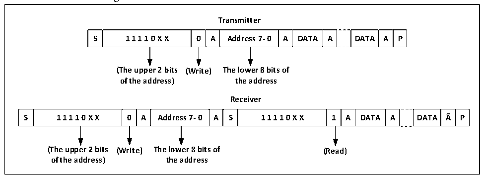
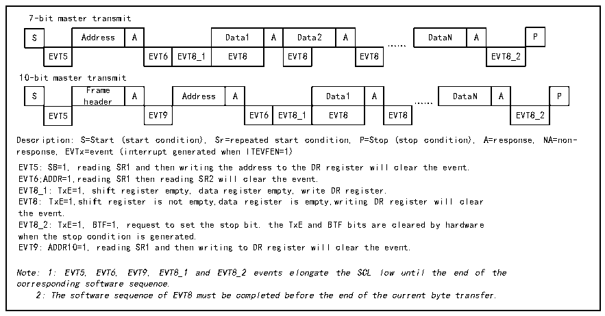

<!-- source-page: 222 -->

[← p.221](0221.md) · [index](../README.md) · [PDF p.222](https://ch32-riscv-ug.github.io/CH32V103/datasheet_en/CH32xRM.PDF#page=222) · [p.223 →](0223.md)

<!-- header: CH32x103 Reference Manual https://wch-ic.com -->

Figure 18-3 Master receiver transmitter in 10-bit address mode  
 <!-- rendered from the PDF; verify at https://ch32-riscv-ug.github.io/CH32V103/datasheet_en/CH32xRM.PDF#page=222 -->

🖼 Text parsed from the figure above

<strong>Transmitter</strong>  
S  1 1 1 1 0 X X  0  A  Address 7- 0  A  DATA  A  DATA  A  P  
<strong>(The upper 2 bits (Write) The lower 8 bits of</strong>  
<strong>of the address) the address</strong>  
<strong>Receiver</strong>  
S  1 1 1 1 0 X X  0  A  Address 7- 0  A  S  1 1 1 1 0 X X  1  A  DATA  A  DATA  A  P  
<strong>(The upper 2 bits (Write) The lower 8 bits of (Read)</strong>  
<strong>of the address) the address</strong>  

Transmit mode:  
The shift register inside the master device transmits data from the data register to the SDA line. When the  
master device receives an ACK, the TxE bit in the status register1 (R16_I2Cx_STAR1) is set. If both the  
ITEVTEN bit and the ITBUFEN bit are set, an interrupt is also generated. Write data to the data register, and  
the TxE bit can be cleared.  
If the TxE bit is set and no new data is written into the data register before the last data is sent, then the BTF bit  
is set. Before it is cleared, SCL remains Low. After reading R16_I2Cx_STAR1, write data into the data register  
to clear the BTF bit.  

Figure 18-4 Transmission sequence of the main transmitter  
 <!-- rendered from the PDF; verify at https://ch32-riscv-ug.github.io/CH32V103/datasheet_en/CH32xRM.PDF#page=222 -->

🖼 Text parsed from the figure above

7-bit master transmit  
S  Address  A  Data1  A  Data2  A  EVT5  EVT6  EVT8_1  EVT8  EVT8  EVT8  
DataN  A  P  EVT8_2  
……  
10-bit master transmit  
S  Frame header  A  Address  A  Data1  A  EVT5  EVT9  EVT6  EVT8_1  EVT8  … EVT8  
DataN  A  P  EVT8_2  
Description: S=Start (start condition), Sr=repeated start condition, P=Stop (stop condition), A=response, NA=non-  
response, EVTx=event (interrupt generated when ITEVFEN=1)  
EVT5: SB=1, reading SR1 and then writing the address to the DR register will clear the event.  
EVT6;ADDR=1,reading SR1 then reading SR2 will clear the event.  
EVT8_1: TxE=1, shift register empty, data register empty, write DR register.  
EVT8: TxE=1,shift register is not empty,data register is empty,writing DR register will clear  
the event.  
EVT8_2: TxE=1, BTF=1, request to set the stop bit. the TxE and BTF bits are cleared by hardware  
when the stop condition is generated.  
EVT9: ADDR10=1, reading SR1 and then writing to DR register will clear the event.  
Note: 1: EVT5, EVT6, EVT9, EVT8_1 and EVT8_2 events elongate the SCL low until the end of the  
corresponding software sequence.  
2: The software sequence of EVT8 must be completed before the end of the current byte transfer.  

Receive mode:  
The I2C module receives data from the SDA line. Write it into the data register through the shift register. After  
each byte, if the ACK bit is set, the I2C module sends an acknowledgment low level, and the RxNE bit is set at  
the same time. If both the ITEVTEN bit and the ITBUFEN bit are set, an interrupt is also generated. If RxNE is  
set and the original data is not read before the new data is received, the BTF bit is set. Before the BTF is cleared,  
SCL remains Low. After R16_I2Cx_STAR1 is read, read the data register to clear the BTF bit.  
<!-- image: p222-draw-image-00001 bbox=[518.88, 779.16, 538.32, 789.84] -->
<!-- footer: V1.9 220 -->
