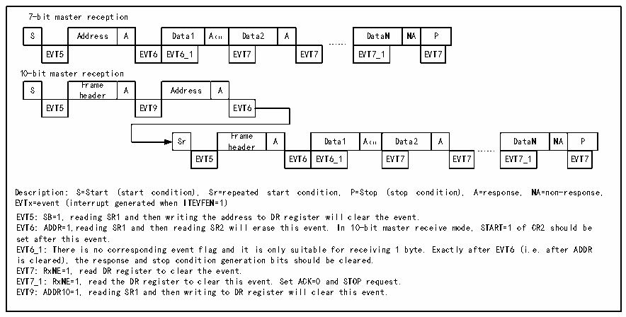

<!-- source-page: 223 -->

[← p.222](0222.md) · [index](../README.md) · [PDF p.223](https://ch32-riscv-ug.github.io/CH32V103/datasheet_en/CH32xRM.PDF#page=223) · [p.224 →](0224.md)

<!-- header: CH32x103 Reference Manual https://wch-ic.com -->

Figure 18-5 Receiver transmission sequence diagram  
 <!-- rendered from the PDF; verify at https://ch32-riscv-ug.github.io/CH32V103/datasheet_en/CH32xRM.PDF#page=223 -->

🖼 Text parsed from the figure above

7-bit master reception  
S  Address  A  Data1  A（1）  Data2  A  EVT5  EVT6  EVT6_1  EVT7  EVT7  
DataN  NA  P  EVT7_1  EVT7  
……  
10-bit master reception  
S  Frame header  A  Address  A  EVT5  EVT9  EVT6  
Sr  Frame header  A  Data1  A（1）  Data2  A  EVT5  EVT6  EVT6_1  EVT7  EVT7  
DataN  NA  P  EVT7_1  EVT7  
……  
Description: S=Start (start condition), Sr=repeated start condition, P=Stop (stop condition), A=response, NA=non-response,  
EVTx=event (interrupt generated when ITEVFEN=1)  
EVT5: SB=1, reading SR1 and then writing the address to DR register will clear the event.  
EVT6: ADDR=1,reading SR1 and then reading SR2 will erase this event. In 10-bit master receive mode, START=1 of CR2 should be  
set after this event.  
EVT6_1: There is no corresponding event flag and it is only suitable for receiving 1 byte. Exactly after EVT6 (i.e. after ADDR  
is cleared), the response and stop condition generation bits should be cleared.  
EVT7: RxNE=1, read DR register to clear the event.  
EVT7_1: RxNE=1, read the DR register to clear this event. Set ACK=0 and STOP request.  
EVT9: ADDR10=1, reading SR1 and then writing to DR register will clear this event.  

When the master device ends sending data, it will actively send an end event, that is, set the STOP bit, and I2C  
will switch to the slave mode. In receiving mode, the master device needs to release control of the SCL and  
SDA lines from the device after receiving the NACK at the answer position of the last data bit. The master  
device can then send a stop/restart condition. Note that when the stop condition is generated, the I2C module  
will automatically switch to slave mode.  

## 18.4 Slave Mode

In the slave mode, the I2C module can identify its own address and the general call address. The software can  
control to enable or disable the identification of the broadcast calling address. Once the start event is detected,  
the I2C module will compare the SDA data with its own address (the number of bits depends on ENDUAL and  
ADDMODE) or the broadcast address (when ENGC is set) through the shift register. If there is no match, it will  
be ignored until a new start event is generated. If it matches the header sequence, it will generate an ACK signal  
and wait for the address of the second byte; if the address of the second byte also matches or the whole-section  
address matches in the case of a 7-bit address, then:  
Firstly generate an ACK response;  
The ADDR bit will be set; if the ITEVTEN bit is already set, then the corresponding interrupt will be generated;  
If the dual-address mode (the ENDUAL bit is set) is used, you also need to read the DUALF bit to determine  
which address is woken up by the master device.  
The slave mode defaults to the receive mode, after the last bit of the received header sequence is 1, or the last  
bit of the 7-bit address is 1 (depending on whether the first receiving header sequence is a normal 7-bit address),  
when the repeated starting condition is received, the I2C module will enter the sender mode, and the TRA bit  
will indicate whether the current receiver or sender mode is.  
<strong>Transmit mode:</strong>  
After clearing the ADDR bit, the I2C module sends bytes from the data register to the SDA line via the shift  
register. The slave device keeps the SCL low until the ADDR bit is cleared and outgoing data is written to the  
data register. (See EVT1 and EVT3 in the figure below). After receiving a reply ACK, the TxE bit is set and an  
interrupt is generated if ITEVTEN and ITBUFEN are set. If TxE is set but no new data is written to the data  
register before the end of the next data transmission, the BTF bit is set. SCL will remain low until BTF is  
<!-- image: p223-draw-image-00001 bbox=[518.88, 779.16, 538.32, 789.84] -->
<!-- footer: V1.9 221 -->
