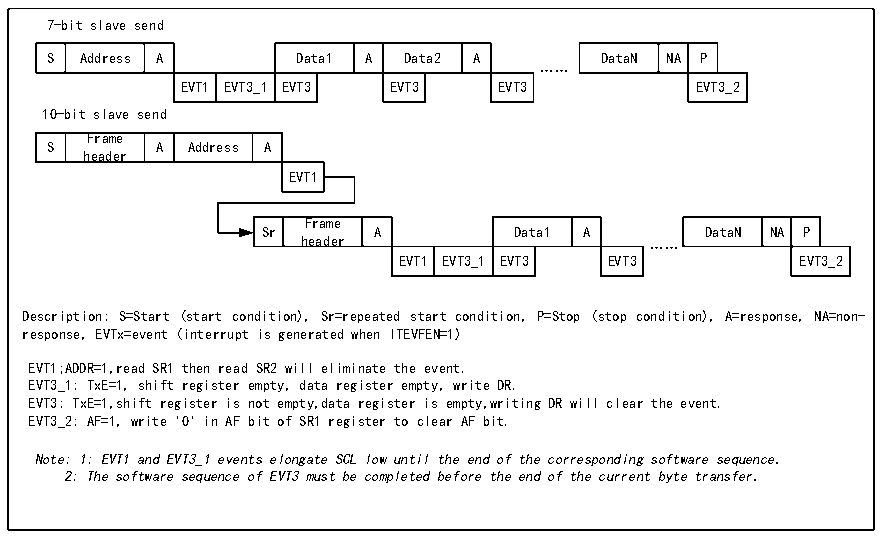
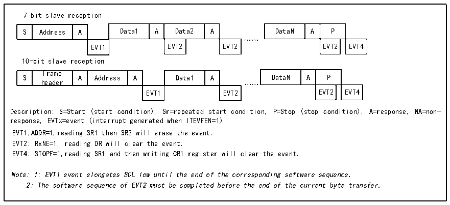

<!-- source-page: 224 -->

[← p.223](0223.md) · [index](../README.md) · [PDF p.224](https://ch32-riscv-ug.github.io/CH32V103/datasheet_en/CH32xRM.PDF#page=224) · [p.225 →](0225.md)

<!-- header: CH32x103 Reference Manual https://wch-ic.com -->
cleared. Reading status register 1 (R16_I2Cx_STAR1) and writing data to the data register will clear the BTF  
bit.  

Figure 18-6 Slave transmitter transmission sequence diagram  
 <!-- rendered from the PDF; verify at https://ch32-riscv-ug.github.io/CH32V103/datasheet_en/CH32xRM.PDF#page=224 -->

🖼 Text parsed from the figure above

7-bit slave send  
S  Address  A  Data1  A  Data2  A  EVT1  EVT3_1  EVT3  EVT3  EVT3  
DataN  NA  P  EVT3_2  
……  
10-bit slave send  
S  Frame header  A  Address  A  EVT1  
Sr  Frame header  A  Data1  A  EVT1  EVT3_1  EVT3  EVT3  
DataN  NA  P  EVT3_2  
……  
Description: S=Start (start condition), Sr=repeated start condition, P=Stop (stop condition), A=response, NA=non-  
response, EVTx=event (interrupt is generated when ITEVFEN=1)  
EVT1;ADDR=1,read SR1 then read SR2 will eliminate the event.  
EVT3_1: TxE=1, shift register empty, data register empty, write DR.  
EVT3: TxE=1,shift register is not empty,data register is empty,writing DR will clear the event.  
EVT3_2: AF=1, write &#x27;0&#x27; in AF bit of SR1 register to clear AF bit.  
Note: 1: EVT1 and EVT3_1 events elongate SCL low until the end of the corresponding software sequence.  
2: The software sequence of EVT3 must be completed before the end of the current byte transfer.  

Receive mode:  
After the ADDR is cleared, the I2C module stores the data from the SDA into the data register through the shift  
register. After each byte received, the I2C module sets an ACK bit and a RxNE bit. If ITEVTEN and ITBUFEN  
are set, an interrupt is also generated. If RxNE is set and the old data is not read out before the new data is  
received, then BTF is set. The SCL remains low until the BTF bit is cleared. Reading status register 1  
(R16_I2Cx_STAR1) and reading data in the data register clears the BTF bit.  

Figure 18-7 Receiver transmission sequence diagram  
 <!-- rendered from the PDF; verify at https://ch32-riscv-ug.github.io/CH32V103/datasheet_en/CH32xRM.PDF#page=224 -->

🖼 Text parsed from the figure above

7-bit slave reception  
S  Address  A  Data1  A  Data2  A  EVT1  EVT2  EVT2  
DataN  A  P  EVT2  EVT4  
……  
10-bit slave reception  
S  Frame header  A  Address  A  Data1  A  EVT1  EVT2  
DataN  A  P  EVT2  EVT4  
EVT1 EVT2 EVT2 EVT4  
Description: S=Start (start condition), Sr=repeated start condition, P=Stop (stop condition), A=response, NA=non-  
response, EVTx=event (interrupt generated when ITEVFEN=1)  
EVT1;ADDR=1,reading SR1 then SR2 will erase the event.  
EVT2: RxNE=1, reading DR will clear the event.  
EVT4: STOPF=1,reading SR1 and then writing CR1 register will clear the event.  
Note: 1: EVT1 event elongates SCL low until the end of the corresponding software sequence.  
2: The software sequence of EVT2 must be completed before the end of the current byte transfer.  

When the master device transfers the last data byte, it generates a stop condition. When the I2C module detects  
the stop event, it sets the STOPF bit, and if the ITEVFEN bit is set, it also generates an interrupt. The user needs  
to read the status register (R16_I2Cx_STAR1) and write the control register (such as reset control word SWRST)  
<!-- image: p224-draw-image-00001 bbox=[518.88, 779.16, 538.32, 789.84] -->
<!-- footer: V1.9 222 -->
