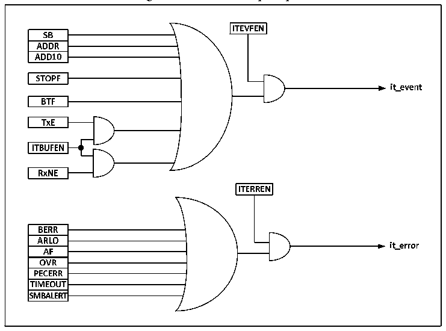

<!-- source-page: 226 -->

[← p.225](0225.md) · [index](../README.md) · [PDF p.226](https://ch32-riscv-ug.github.io/CH32V103/datasheet_en/CH32xRM.PDF#page=226) · [p.227 →](0227.md)

<!-- header: CH32x103 Reference Manual https://wch-ic.com -->
It can be seen that enabling clock extension can avoid overrun/underrun errors.  

## 18.7 SMBus

SMBus is also a two-wire interface, which is generally used between the system and power management.  
SMBus and I2C have many similarities. For example, SMBus uses the same 7-bit address mode as I2C.  
Similarities between SMBus and I2C:  
1) Master-slave communication mode; the host provides the clock and supports multiple masters and multiple  
slaves;  
2) Two-wire communication structure, of which a warning line can be selected for SMBus;  
3) Support 7-bit address format.  
Differences between SMBus and I2C:  
1) I2C supports the maximum speed of 400 KHz, while SMBus supports the maximum speed of 100 KHz, and  
SMBus has the minimum speed limit of 10 KHz;  
2) When the SMBus clock is lower than 35mS, it will report a timeout, but I2C has no such limitation;  
3) SMBus has a fixed logic level, but I2C does not, depending on VDD;  
4) SMBus has a bus protocol, but I2C does not.  
SMBus also includes device identification, address resolution protocol, unique device identifier, SMBus  
reminder, and various bus protocols. For details, please refer to SMBus specification version 2.0. When SMBus  
is used, only the SMBus bit in the control register needs to be set, and the SMBTYPE and ENAARP bits need  
to be configured as needed.  

## 18.8 Interrupt

Each I2C module has two interrupt vectors: event interrupt and error interrupt. Two types of interrupts support  
the interrupt sources as shown in Figure 18-4.  

Figure 18-8 I2C interrupt request  
 <!-- rendered from the PDF; verify at https://ch32-riscv-ug.github.io/CH32V103/datasheet_en/CH32xRM.PDF#page=226 -->

🖼 Text parsed from the figure above

<!-- image: p226-draw-image-00018 inside the figure -->
<!-- image: p226-draw-image-00002 inside the figure -->
<!-- image: p226-draw-image-00003 inside the figure -->
<!-- image: p226-draw-image-00005 inside the figure -->
<!-- image: p226-draw-image-00004 inside the figure -->
<!-- image: p226-draw-image-00006 inside the figure -->
<!-- image: p226-draw-image-00020 inside the figure -->
<!-- image: p226-draw-image-00022 inside the figure -->
<!-- image: p226-draw-image-00021 inside the figure -->
<!-- image: p226-draw-image-00007 inside the figure -->
<!-- image: p226-draw-image-00008 inside the figure -->
<!-- image: p226-draw-image-00009 inside the figure -->
<!-- image: p226-draw-image-00010 inside the figure -->
<!-- image: p226-draw-image-00019 inside the figure -->
<!-- image: p226-draw-image-00011 inside the figure -->
<!-- image: p226-draw-image-00012 inside the figure -->
<!-- image: p226-draw-image-00023 inside the figure -->
<!-- image: p226-draw-image-00025 inside the figure -->
<!-- image: p226-draw-image-00013 inside the figure -->
<!-- image: p226-draw-image-00024 inside the figure -->
<!-- image: p226-draw-image-00014 inside the figure -->
<!-- image: p226-draw-image-00015 inside the figure -->
<!-- image: p226-draw-image-00016 inside the figure -->
<!-- image: p226-draw-image-00017 inside the figure -->

<!-- image: p226-draw-image-00001 bbox=[518.88, 779.16, 538.32, 789.84] -->
<!-- footer: V1.9 224 -->
