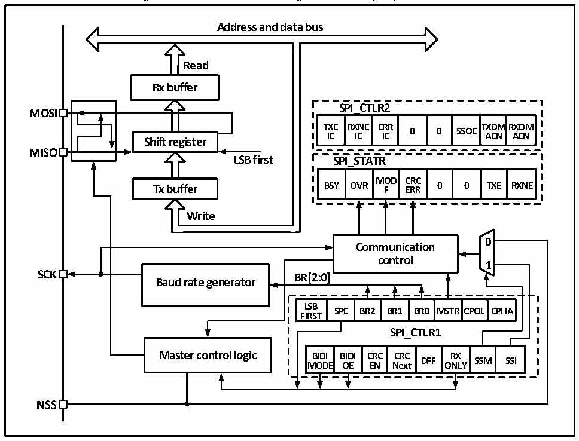

<!-- source-page: 239 -->

[← p.238](0238.md) · [index](../README.md) · [PDF p.239](https://ch32-riscv-ug.github.io/CH32V103/datasheet_en/CH32xRM.PDF#page=239) · [p.240 →](0240.md)

<!-- header: CH32x103 Reference Manual https://wch-ic.com -->

## 19.2 Functional Description

### 19.2.1 Overview

Figure 19-1 Structure block diagram of serial peripheral bus  
 <!-- rendered from the PDF; verify at https://ch32-riscv-ug.github.io/CH32V103/datasheet_en/CH32xRM.PDF#page=239 -->

🖼 Text parsed from the figure above

<strong>Address and data bus</strong>  
<!-- image: p239-draw-image-00004 inside the figure -->
<strong>Read</strong>  
<strong>Rx buffer</strong>  
<strong>SPI_CTLR2</strong>  
<strong>MOSI</strong>  
<strong>TXE RXNE ERR TXDMRXDM</strong>  
<strong>0 0 SSOE</strong>  
<strong>IE IE IE AEN AEN</strong>  
<strong>Shift register</strong>  
<strong>MISO</strong>  
<strong>LSB first SPI_STATR</strong>  
OVR  MODF  CRCERR  0  0  TXE  
<strong>Tx buffer BSY OVR F ERR 0 0 TXE RXNE</strong>  
<strong>Write</strong>  
<!-- image: p239-draw-image-00002 inside the figure -->
<!-- image: p239-draw-image-00003 inside the figure -->
<strong>0</strong>  
<strong>Communication</strong>  
<strong>control</strong>  
<strong>1</strong>  
<strong>SCK BR[2:0]</strong>  
<strong>Baud rate generator</strong>  
SPE  BR2  BR1  BR0  MSTR  CPOL  CPHA  
<strong>LSB</strong>  
<strong>FIRST</strong>  
<strong>SPI_CTLR1</strong>  
BIDIMODE  BIDIOE  CRCEN  CRCNext  DFF  RXONLY  SSM  SSI  
<strong>NSS</strong>  

Figure 19-1 shows that the four pins related to SPI are MISO, MOSI, SCK and NSS. The MISO pin is a data  
input pin when the SPI module works in the master mode; it is a data output pin when working in the slave  
mode. When the MOSI pin works in the master mode, it is the data output pin; when it works in the slave mode,  
it is the data input pin. SCK is a clock pin; the clock signal is always outputted by the master, and the slave  
receives the clock signal and synchronizes the transmission and receiving of data.  
NSS pin is a chip selection pin and can be used as follows:  
1) NSS is controlled by software: SSM is set at this time, and internal NSS signal is determined by SSI to output  
high or low value. This circumstance is generally applied in the SPI master mode;  
2) NSS is controlled by hardware: When the NSS output is enabled, that is, when the SSOE is set, the SPI host  
will actively pull down the NSS pin when sending out output. If the NSS pin is not pulled down successfully,  
it indicates that other master devices on the main line are communicating, and a hardware error will be  
generated. If the SSOE is unset, it can be used in multi-host mode, and if it is pulled down, it will be forced  
into slave mode and the MSTR bit will be automatically cleared.  
The operating mode of SPI can be configured through CPHA and CPOL. When CPHA bit is set, it means that  
the module performs data sampling on the second edge of the clock and the data is latched. When CPHA is  
latched, it means that the SPI module samples on the first edge of the clock and the data is latched. CPOL  
indicates whether the clock remains to be high or low when there is no data. See the Figure 18-2 for details.  
<!-- image: p239-draw-image-00001 bbox=[518.64, 783.36, 538.08, 794.04] -->
<!-- footer: V1.9 237 -->
