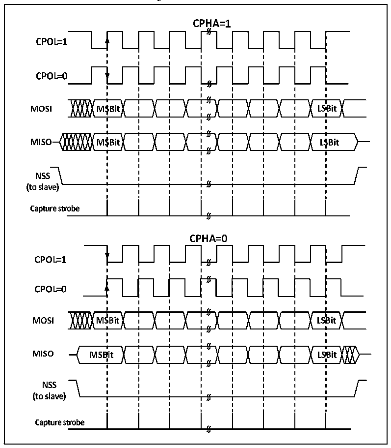

<!-- source-page: 240 -->

[← p.239](0239.md) · [index](../README.md) · [PDF p.240](https://ch32-riscv-ug.github.io/CH32V103/datasheet_en/CH32xRM.PDF#page=240) · [p.241 →](0241.md)

<!-- header: CH32x103 Reference Manual https://wch-ic.com -->

Figure 19-2 SPI mode  
 <!-- rendered from the PDF; verify at https://ch32-riscv-ug.github.io/CH32V103/datasheet_en/CH32xRM.PDF#page=240 -->

🖼 Text parsed from the figure above

<!-- image: p240-draw-image-00002 inside the figure -->
<!-- image: p240-draw-image-00004 inside the figure -->
<!-- image: p240-draw-image-00003 inside the figure -->
<!-- image: p240-draw-image-00005 inside the figure -->
<!-- image: p240-draw-image-00007 inside the figure -->
<!-- image: p240-draw-image-00006 inside the figure -->
<!-- image: p240-draw-image-00008 inside the figure -->
<!-- image: p240-draw-image-00028 inside the figure -->
<!-- image: p240-draw-image-00010 inside the figure -->
<!-- image: p240-draw-image-00030 inside the figure -->
<!-- image: p240-draw-image-00009 inside the figure -->
<!-- image: p240-draw-image-00029 inside the figure -->
<!-- image: p240-draw-image-00020 inside the figure -->
<!-- image: p240-draw-image-00018 inside the figure -->
<!-- image: p240-draw-image-00011 inside the figure -->
<!-- image: p240-draw-image-00019 inside the figure -->
<!-- image: p240-draw-image-00021 inside the figure -->
<!-- image: p240-draw-image-00012 inside the figure -->
<!-- image: p240-draw-image-00013 inside the figure -->
<!-- image: p240-draw-image-00014 inside the figure -->
<!-- image: p240-draw-image-00016 inside the figure -->
<!-- image: p240-draw-image-00015 inside the figure -->
<!-- image: p240-draw-image-00017 inside the figure -->
<!-- image: p240-draw-image-00022 inside the figure -->
<!-- image: p240-draw-image-00024 inside the figure -->
<!-- image: p240-draw-image-00023 inside the figure -->
<!-- image: p240-draw-image-00025 inside the figure -->
<!-- image: p240-draw-image-00027 inside the figure -->
<!-- image: p240-draw-image-00026 inside the figure -->
<!-- image: p240-draw-image-00031 inside the figure -->
<!-- image: p240-draw-image-00033 inside the figure -->
<!-- image: p240-draw-image-00032 inside the figure -->
<!-- image: p240-draw-image-00041 inside the figure -->
<!-- image: p240-draw-image-00043 inside the figure -->
<!-- image: p240-draw-image-00034 inside the figure -->
<!-- image: p240-draw-image-00035 inside the figure -->
<!-- image: p240-draw-image-00042 inside the figure -->
<!-- image: p240-draw-image-00044 inside the figure -->
<!-- image: p240-draw-image-00036 inside the figure -->
<!-- image: p240-draw-image-00037 inside the figure -->
<!-- image: p240-draw-image-00039 inside the figure -->
<!-- image: p240-draw-image-00038 inside the figure -->
<!-- image: p240-draw-image-00040 inside the figure -->

The host and device need to be set to the same SPI mode, and the SPE bit needs to be cleared before the SPI  
mode is configured. The DEF bit can determine whether the single data length of SP is 8 bits or 16 bits.  
LSBFIRST can control whether the single data word is high bit in front or low bit in front.  

### 19.2.2 Master Mode

When the SPI module is working in the master mode, the serial clock will be generated by SCK. The master  
mode is configured in the following steps:  
1) Configure BR[2:0] of the control register to determine the clock;  
2) Configure CPOL and CPHA bits to determine the SPI mode;  
3) Configure DEF to determine the data word length;  
4) Configure LSBFIRST to determine the frame format;  
5) Configure the NSS pin, such as setting the SSOE bit to enable the hardware to set NSS. SSM bit can be also  
set and SSI bit can be also set to be high;  
6) Set the MSTR bit and SPE bit to ensure that the NSS is already high at this time.  
When data needs to be sent, only the data to be sent needs to be written to the data register. SPI will send data  
from the transmission buffer to the shift register in parallel, and then send the data from the shift register  
<!-- image: p240-draw-image-00001 bbox=[518.88, 783.36, 538.32, 794.04] -->
<!-- footer: V1.9 238 -->
