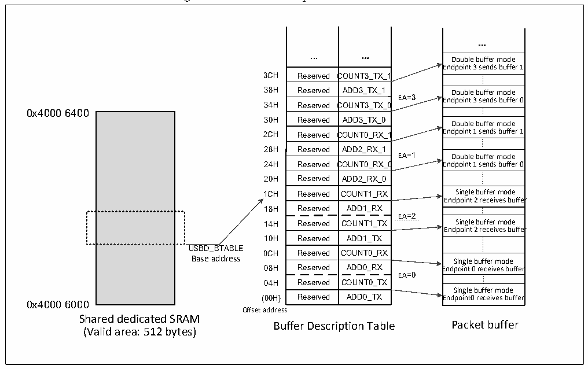

<!-- source-page: 252 -->

[← p.251](0251.md) · [index](../README.md) · [PDF p.252](https://ch32-riscv-ug.github.io/CH32V103/datasheet_en/CH32xRM.PDF#page=252) · [p.253 →](0253.md)

<!-- header: CH32x103 Reference Manual https://wch-ic.com -->

Figure 20-1 Buffer description table structure  
 <!-- rendered from the PDF; verify at https://ch32-riscv-ug.github.io/CH32V103/datasheet_en/CH32xRM.PDF#page=252 -->

🖼 Text parsed from the figure above

...  
... ...  
Double buffer mode  
Endpoint 3 sends buffer 1  
Reserved  COUNT3_TX_1  Reserved Reserved C  ADD3_TX_1COUNT3_TX_0  Reserved  ADD3_TX_0  Reserved  COUNT0_RX_1  Reserved Reserved C  ADD2_RX_1COUNT0_RX_0  Reserved  ADD2_RX_0  Reserved  COUNT1_RX  Reserved Reserved  ADD1_RXCOUNT1_TX  Reserved  ADD1_TX  Reserved  COUNT0_RX  Reserved Reserved  ADD0_RXCOUNT0_TX  Reserved  ADD0_TX  
Double buffer mode Endpoint 3 sends buffer 0  Double buffer mode Endpoint 1 sends buffer 1  Double buffer mode Endpoint 1 sends buffer 0  Single buffer mode Endpoint 2 receives buffer  Single buffer mode Endpoint 2 receives buffer  Single buffer mode Endpoint 0 receives buffer  Endpoint 0 receives buffer Single buffer mode Endpoint0 receives buffer  
0x4000 6400  
2CH Reserved COUNT0_RX_1 Endpoint 1 sends buffer 1  
24H Reserved COUNT0_RX_0 Endpoint 1 sends buffer 0  
EA=2  
USBD_BTABLE  
08H Reserved ADD0_RX Endpoint 0 receives buffer  
EA=0  
0x4000 6000  
Offset address  
Shared dedicated SRAM  
Buffer Description Table Packet buffer  
(Valid area: 512 bytes)  

For reception or transmission, the packet buffer is used from the bottom. The USBD module will not change the  
contents of other buffers beyond the buffer currently allocated. If the buffer receives a data packet larger than  
itself, it will only receive data up to its own size, and discard the others, i.e., a so-called buffer overflow  
exception occurs.  
<strong>1) Endpoint initialization</strong>  
The first step of the endpoint initialization is to write the appropriate value to the USBD_ADDRx_TX or  
USBD_ADDRx_RX register, so that the USBD module can find the data to be transmitted or the buffer that is  
ready to receive the data. The EPTYPE[1:0] bit in the USBD_EPRx register determines the basic type of the  
endpoint, and the EP_KIND bit determines the special characteristics of the endpoint. The sender needs to set  
the STAT_TX bit in the USBD_EPRx register to enable the endpoint, and configure the COUNTx_TX bit to  
determine the transmission length. The receiver needs to set the STAT_RX bit to enable the endpoint, set the  
BL_SIZE and NUM_BLOCK bits and determine the size of the receive buffer to detect buffer overflow  
exception. For the one-way endpoint of asynchronous non-double-buffer batch transmission, only one register at  
the transmission direction needs to be set. Once the endpoint is enabled, the application program can no longer  
modify the value of the USBD_EPRx register and the location of the USBD_ADDRx_TX/USBD_ADDRx_RX  
and USBD_COUNTx_TX/ USBD_COUNTx_RX registers, because these values will be modified by the  
hardware real-timely. When the data transmission is completed, the CTR interrupt will be generated. At this  
time, the above-mentioned registers can be accessed and a new transmission can be re-enabled.  
<strong>2) IN transaction (for data transmission)</strong>  
When an IN token packet is received, if the received address matches a configured endpoint address, and the  
STAT_TX bit on the register USBD_EPRx indicates that it can be transmitted, the USBD module will packet  
<!-- image: p252-draw-image-00001 bbox=[518.88, 779.16, 538.32, 789.84] -->
<!-- footer: V1.9 250 -->
