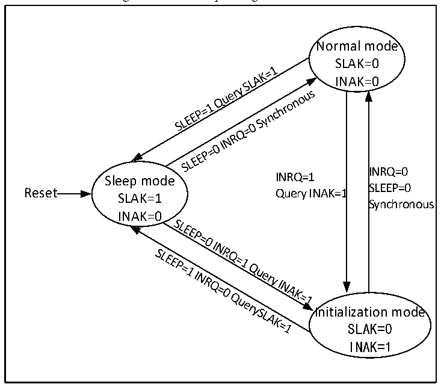

<!-- source-page: 292 -->

[← p.291](0291.md) · [index](../README.md) · [PDF p.292](https://ch32-riscv-ug.github.io/CH32V103/datasheet_en/CH32xRM.PDF#page=292) · [p.293 →](0293.md)

<!-- header: CH32x103 Reference Manual https://wch-ic.com -->
To enter the initialization mode from sleep mode, the SLEEP bit in CAN_CTLR must be cleared to 0 and the  
INRQ bit shall be set to 1. When the INAK bit in the CAN_STATR register is automatically set to 1, the switch  
to the initialization state will be completed.  
To enter the normal mode from the sleep mode, the SLEEP bit in CAN_CTLR must be cleared to 0. When the  
SNAK bit in the CAN_STATR register is automatically cleared to 0, the normal mode will be entered.  

Figure 22-1 CAN operating mode switch  
 <!-- rendered from the PDF; verify at https://ch32-riscv-ug.github.io/CH32V103/datasheet_en/CH32xRM.PDF#page=292 -->

🖼 Text parsed from the figure above

Normal mode  
SLAK=0  
INAK=0  
INRQ=0  
Sleep mode INRQ=1  
SLEEP=0  
Reset Query INAK=1  
SLAK=1  
Synchronous  
INAK=0  
Initialization mode  
SLAK=0  
INAK=1  

## 22.3 CAN Test Mode

In the initialization mode, operate the SILM and LBKM bits in the CAN_BTIMR register to prepare to enter  
one of the test modes, and then clear the INRQ bit in the CAN_CTLR register to zero to exit the initialization  
mode and enter the test mode. There are 3 test modes: silent mode, loopback mode and loopback combined with  
silent mode.  

### 22.3.1 Silent Test Mode

Set the SILM bit in the CAN_BTIMR register to 1, and you can choose to prepare to enter the silent mode. In  
this mode, the CAN controller can receive but cannot send messages externally. It is always in a recessive bit to  
avoid affecting the bus, but the message can be received by the controller of the node where it is located.  
Generally, the silent mode is used for CAN bus status analysis.  

### 22.3.2 Loopback Test Mode

Set the LBKM bit in the CAN_BTIMR register to 1, and you can choose to prepare to enter the loopback mode.  
In this mode, the CAN controller can send external messages, but cannot receive external messages. However,  
the sent messages can be received by the controller at the node where it is located, and the reception filtering  
<!-- image: p292-draw-image-00001 bbox=[518.88, 779.16, 538.32, 789.84] -->
<!-- footer: V1.9 290 -->
