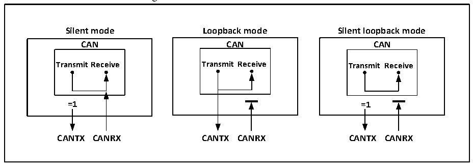

<!-- source-page: 293 -->

[← p.292](0292.md) · [index](../README.md) · [PDF p.293](https://ch32-riscv-ug.github.io/CH32V103/datasheet_en/CH32xRM.PDF#page=293) · [p.294 →](0294.md)

<!-- header: CH32x103 Reference Manual https://wch-ic.com -->
mechanism is effective. Generally, the loopback mode is used for the transceiving test of CAN controller.  

### 22.3.3 Loopback Combined with Silent Test Mode

Set the SILM and LBKM bits of the CAN_BTIMR register to 1, and you can choose to prepare to enter the  
silent loopback mode. This mode is usually used for the closed self-test of the CAN controller. In this mode, it  
has no impact on the CAN bus, the RX pin is disconnected from the bus, and the TX pin is set to a recessive bit.  

Figure 21-2 Three test modes of CAN bus  
 <!-- rendered from the PDF; verify at https://ch32-riscv-ug.github.io/CH32V103/datasheet_en/CH32xRM.PDF#page=293 -->

🖼 Text parsed from the figure above

<strong>Silent mode Loopback mode Silent loopback mode</strong>  
<strong>CAN CAN CAN</strong>  
<strong>TransmitReceive Transmit Receive Transmit Receive</strong>  
<strong>=1 =1</strong>  
<strong>CANTX CANRX CANTX CANRX CANTX CANRX</strong>  

## 22.4 CAN Functional Description

### 22.4.1 Transmission Handling

The transmission handling is as follows: If there are vacant mailboxes in the three transmitting mailboxes, the  
application layer software only has write access to the registers of the vacant mailboxes, and operates on the  
registers CAN_TXMIRx, CAN_TXMDTRx, CAN_TXMDLRx and CAN_TXMDHRx. The message identifier  
and message Text length, time stamp and message data, etc. can be set. After the data is ready, set the TXRQ bit  
in the CAN_TXMIRx register to 1 to request sending. The mailbox will enter the registered state, and priority  
queuing will be conducted; once it becomes the highest priority mailbox, it will become the scheduled  
transmission state, waiting for the CAN bus to be idle; when the CAN bus is idle, the message of the scheduled  
transmission mailbox will enter the transmission status immediately; after the message is transmitted, the  
mailbox will become vacant again, and the RQCP and TXOK bits of the CAN_TSTATR register will be set to 1,  
indicating that the transmission is successful; if the arbitration fails during transmission, the ALST bit in the  
CAN_TSTATR register will be set to 1; for the transmission error, set TERR bit to 1.  

### 22.4.2 Transmission Priority

The transmission priority can be determined by the identifier or the request order of the transmission. Set the  
TXFP bit of the CAN_CTLR register to 1, send in the order of transmission requests, and the transmission  
request order is mainly used for segmented transmission; clearing to determine the transmission order according  
to the priority of the identifier. The smaller identifier means the higher priority. In the case of the same identifier,  
the mailbox with the lower number has a higher priority.  

### 22.4.3 Transmission Abort Handling

If the ABRQ bit in the CAN_TSTATR register is set to 1, the transmission request can be aborted. When the  
mailbox status is registered or scheduled to transmission, the transmission request will be directly aborted; when  
the mailbox is at the transmission status, the aborting request may succeed (transmission stop) or fail  
<!-- image: p293-draw-image-00001 bbox=[518.88, 779.16, 538.32, 789.84] -->
<!-- footer: V1.9 291 -->
