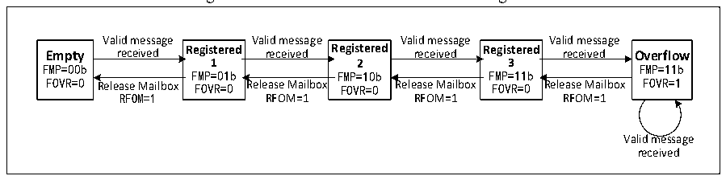

<!-- source-page: 294 -->

[← p.293](0293.md) · [index](../README.md) · [PDF p.294](https://ch32-riscv-ug.github.io/CH32V103/datasheet_en/CH32xRM.PDF#page=294) · [p.295 →](0295.md)

<!-- header: CH32x103 Reference Manual https://wch-ic.com -->
(transmission completion). The result can be inquired by the TXOK bit in the CAN_TSTATR register.  

### 22.4.4 Time Based Trigger Mode

Traditional CAN is based on an event trigger mode. When the bus is busy in this mode, low-priority messages  
are likely to be blocked for a long time, even failing to meet its time limit requirements. In order to solve this  
bottleneck, related protocols based on the time-trigger mode have been introduced. This type of protocol has a  
certain scale of application in the industry. The function based on the time-trigger mode is the application of this  
type of protocol.  
Set the TTCM bit in the CAN_CTLR register to 1 to enable the time trigger mode. At this time, the internal  
timer will be activated to generate the time stamp of the sending and receiving mailboxes. The timer  
accumulates time at the CAN bit and is sampled at the bit time sampling point to generate the timestamp.  

### 22.4.5 Reception Handling

The reception of CAN bus messages is completed by the controller hardware, without the intervention of the  
MCU, which reduces the processing load of the MCU. The received messages are stored in two FIFOs with  
3-level mailbox depth according to the setting of the CAN_FAFIFOR register. If the application layer needs to  
obtain messages, it can only read valid received messages through the receiver FIFO mailbox.  
Initially, the receiver FIFO is empty, and the FMR[1:0] value of the receiver FIFO register CAN_RFIFOx is  
binary 00b. After receiving a valid receiving message, it will become the registered 1 status, and the controller  
will automatically set the FMR [1:0] of receiver FIFO register CAN_RFIFOx to binary 01b; if the mailbox data  
registers CAN_RXMDLRx and CAN_RXMDHRx are read at this moment, the mailbox will be released by  
setting the RFOM bit in receiver FIFO register CAN_RFIFOx to 1, and the receiver FIFO state will become  
vacant; if the mailbox is not released at the suspended 1 state, the state of receiver FIFO is switched to the  
suspended 2 state after the next valid receiving message is received. At this time, FMR[1:0] of the receiver  
FIFO register CAN_RFIFOx will be automatically set to binary 10b; if the mailbox data register is read and the  
mailbox is released, the state will return to registered 1; if the mailbox is not released at the registered 2 state,  
the receiver FIFO will enter the registered 3 stats; also read the message and release into the mailbox in the  
registered 3 state, it will return to the registered 2 state; if the mailbox is not released at the registered 3 state,  
the message will be inevitably lost when the next valid message is received.  

Figure 22-3 Receiver FIFO state switch diagram  
 <!-- rendered from the PDF; verify at https://ch32-riscv-ug.github.io/CH32V103/datasheet_en/CH32xRM.PDF#page=294 -->

🖼 Text parsed from the figure above

Valid message Valid message Valid message Valid message  
Empty received Registered received Registered received Registered received Overflow  
FMP=00b 1 2 3 FMP=11b  
FMP=01b FMP=10b FMP=11b  
FOVR=0 Release Mailbox FOVR=0 Release Mailbox FOVR=0 Release Mailbox FOVR=0 Release Mailbox FOVR=1  
RFOM=1 RFOM=1 RFOM=1 RFOM=1  
Valid message  
received  

The above message loss situation means that the receiver FIFO is full, and the message overflow causes the  
message to be lost. The FOVR bit in the receiver FIFO register CAN_RFIFOx will be automatically set to 1 by  
hardware for overflow query. If the RFLM bit in the CAN_CTLR register is set to 1, the receiver FIFO lock  
function will be enabled, and the discarded message will be a new received message; the RFLM bit in the  
CAN_CTLR register will be cleared, and the receiver FIFO lock function will be disabled. Among the three  
original messages in the receiver FIFO, the last message received will be overwritten by the new message.  
When the related bit in the CAN_INTENR register is set, an interrupt can be generated if the receiver FIFO  
<!-- image: p294-draw-image-00001 bbox=[518.76, 779.16, 538.2, 789.84] -->
<!-- footer: V1.9 292 -->
