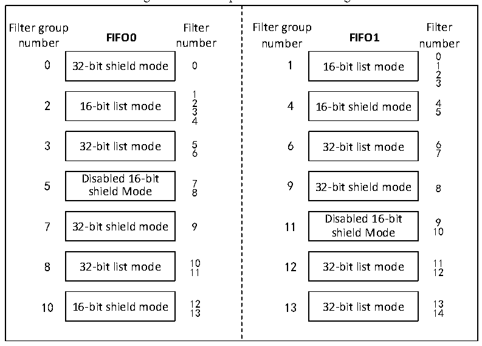

<!-- source-page: 296 -->

[← p.295](0295.md) · [index](../README.md) · [PDF p.296](https://ch32-riscv-ug.github.io/CH32V103/datasheet_en/CH32xRM.PDF#page=296) · [p.297 →](0297.md)

<!-- header: CH32x103 Reference Manual https://wch-ic.com -->

> ⬆ **Table continued** — rendered in full at [page 295](0295.md). <!-- p296-table-001 -->

Messages entering the FIFO mailbox will be read and stored by the application program. Usually the  
application program distinguishes the message data according to the message identifier. The CAN controller  
provides the filter number for the messages filtered by different filters in the receiver FIFO. The number is  
stored in the FMI[7:0] of the register CAN_RXMDTRx. You do not need to consider whether the filter group is  
enabled or not during numbering. See the example in Figure 22-4 for the numbering rules.  
When a message can be filtered by multiple filters, the filter number stored in the receiving mailbox determines  
which filter number is stored according to the filter priority rules. The filter priority rules are as follows:  
● All 32-bit filters have higher priority than 16-bit filters.  
● For filters of the same width, the priority of the filter of the identifier list is higher than the filter of the  
mask bit mode.  
● For filters with the same width and pattern, filters with lower number have higher priority  
As shown in Figure 22-5: When receiving a message, firstly match the identifier with the 32-bit identifier list  
mode filter during screening; if there is no match, then match and filter with the 32-bit mask bit mode filter; if  
there is no match, continuously filter with the 16-bit identifier list mode filter. If there is no match, match with  
the 16-bit mask bit mode filter finally. If there is no match, the message will be discarded. If there is a match,  
the message will be stored in the mailbox of the receiver FIFO, and the identifier number will be stored in the  
FMI of the register CAN_RXMDTRx.  

Figure 22-4 Example of filter numbering  
 <!-- rendered from the PDF; verify at https://ch32-riscv-ug.github.io/CH32V103/datasheet_en/CH32xRM.PDF#page=296 -->

🖼 Text parsed from the figure above

Filter group Filter FIFO0 number number 0 32-bit shield mode 01 2 16-bit list mode 234 3 32-bit list mode 56 Disabled 16-bit 5 7 shield Mode 8 7 32-bit shield mode 9 8 32-bit list mode 1011 10 16-bit shield mode 1213  Filter group Filter FIFO1 number number 0 1 16-bit list mode 123 4 16-bit shield mode 45 6 32-bit list mode 67 9 32-bit shield mode 8 11 Disabled 16-bit 9 shield Mode 10 12 32-bit list mode 1112 13 32-bit list mode 1314  

<!-- image: p296-draw-image-00001 bbox=[518.88, 779.16, 538.32, 789.84] -->
<!-- footer: V1.9 294 -->
