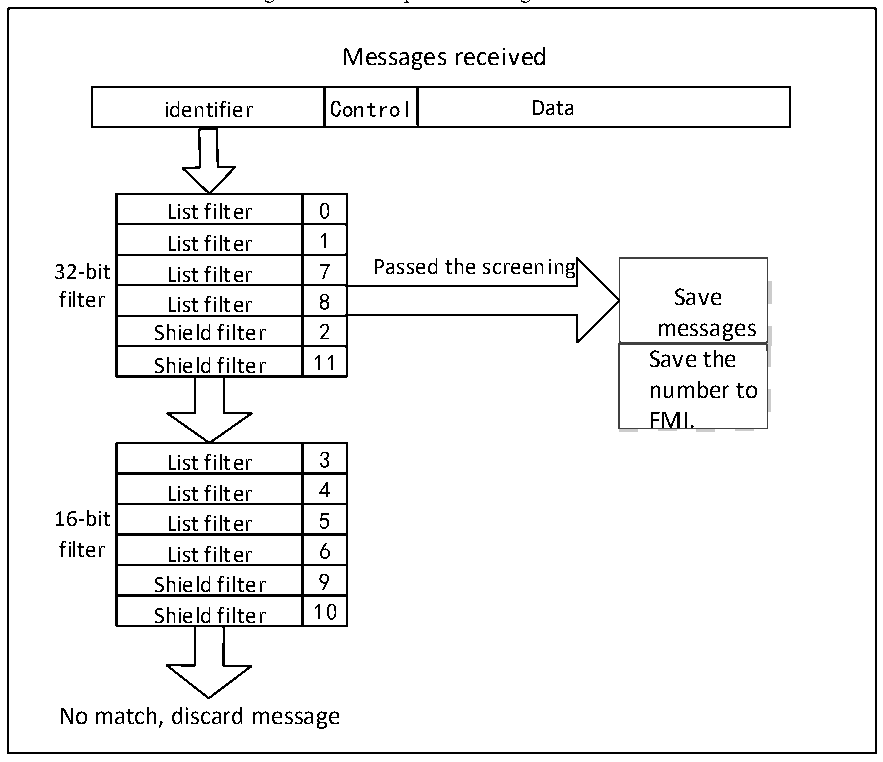

<!-- source-page: 297 -->

[← p.296](0296.md) · [index](../README.md) · [PDF p.297](https://ch32-riscv-ug.github.io/CH32V103/datasheet_en/CH32xRM.PDF#page=297) · [p.298 →](0298.md)

<!-- header: CH32x103 Reference Manual https://wch-ic.com -->

Figure 22-5 Example of filtering mechanism  
 <!-- rendered from the PDF; verify at https://ch32-riscv-ug.github.io/CH32V103/datasheet_en/CH32xRM.PDF#page=297 -->

🖼 Text parsed from the figure above

Messages received  
identifier  Control  Data  
List filter  0  List filter List filter  1  List filter List filter  7  List filter List filter  8  List filter Shield filter  2  Shield filter Shield filter  11  
Save messages  Save the number to FMI.  
<!-- image: p297-draw-image-00002 inside the figure -->
filter List filter 8 Save  
Shield filter 2 messages  
<!-- image: p297-draw-image-00003 inside the figure -->
Shield filter 11 Save the  
List filter  3  List filter List filter  4  List filter List filter  5  List filter List filter  6  List filter Shield filter  9  Shield filter Shield filter  10  
No match, discard message  

### 22.4.7 Error Management

The CAN controller relies on the status error register CAN_ERRSR for error management on the bus. The TEC  
and REC in the status error register CAN_ERRSR respectively represent the transmission and receiving error  
count values, which increase according to the increase in sending and receiving errors and decrease when the  
sending and receiving succeeds. The stability of the CAN bus can be judged according to their values.  
When the TEC and REC in the status error register CAN_ERRSR are less than 128, the current CAN node will  
be in the error active state, can participate in bus communication normally, and will send an active error flag  
when an error is detected.  
When the TEC and REC in the status error register CAN_ERRSR are greater than 127, the current CAN node  
will be in an error passive state, and the active error flag will not be allowed to be sent when an error is detected,  
only the passive error flag can be sent.  
When the TEC in the status error register CAN_ERRSR is greater than 255, the current CAN node will enter  
the offline state.  
When 11 consecutive recessive bits appear for 128 times in the bus monitoring, it will recover to the error active  
state. This recovery method is affected by the ABOM bit in the main control register CAN_CTLR. If ABOM is  
set to 1, the hardware will automatically exit the offline state. If ABOM is 0, the software needs to operate the  
INRQ bit to enter the initialization mode, and then exits the initialization to exit the offline state.  
<!-- image: p297-draw-image-00001 bbox=[518.88, 779.16, 538.32, 789.84] -->
<!-- footer: V1.9 295 -->
