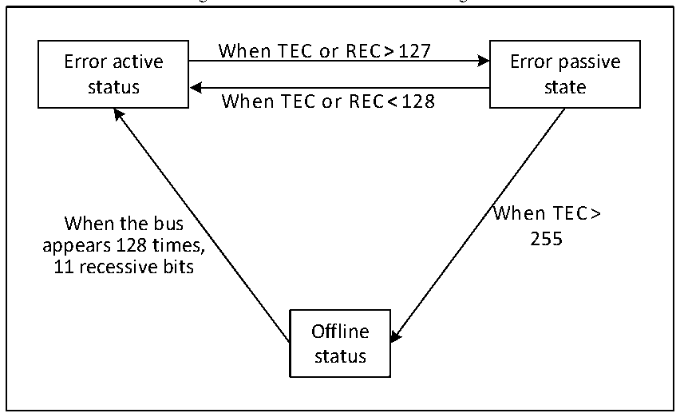

<!-- source-page: 298 -->

[← p.297](0297.md) · [index](../README.md) · [PDF p.298](https://ch32-riscv-ug.github.io/CH32V103/datasheet_en/CH32xRM.PDF#page=298) · [p.299 →](0299.md)

<!-- header: CH32x103 Reference Manual https://wch-ic.com -->

Figure 22-6 CAN error state switch diagram  
 <!-- rendered from the PDF; verify at https://ch32-riscv-ug.github.io/CH32V103/datasheet_en/CH32xRM.PDF#page=298 -->

🖼 Text parsed from the figure above

When TEC or REC&gt;127  
Error active Error passive  
status state  
When TEC or REC&lt;128  
When TEC&gt;  
When the bus  
255  
appears 128 times,  
11 recessive bits  
Offline  
status  

### 22.4.8 Bit timing

According to the CAN bus standard, each bit time is divided into four segments: synchronization segment,  
propagation time segment, phase buffer segment 1 and phase buffer segment 2. These segments are composed  
of the minimum time unit Tq. The CAN controller monitors the CAN bus changes through sampling and  
synchronizes through the edge of the frame start bit  
The CAN controller re-divides the above four segments into three segments, namely:  
● Synchronization segment (SS): It is the synchronization segment in the CAN standard, which is fixed to 1  
minimum time unit. Under normal circumstances, the expected bit jump occurs in this time period.  
● Bit segment 1 (BS1): It contains the propagation time period and phase buffer section 1 in the CAN  
standard. It can be set to include the minimum time unit from 1 to 16 and can be automatically extended to  
compensate the corresponding forward drift arising from the frequency accuracy error at different nodes on  
the CAN bus. The end of the time period is the sampling point position.  
● Bit segment 2 (BS2): It is the phase buffer section 2 in the CAN standard, which can be set to 1 to 8  
minimum time units and can be automatically shortened to compensate the phase negative drift arising  
from the frequency accuracy error at different nodes on the CAN bus.  
The resynchronization jump width (SJW) is the upper limit of the minimum number of time units that can be  
extended and reduced per bit, and the range can be set to 1 to 4 minimum time units.  
The above parameters can be configured in the CAN bus timing register CAN_BTIMR.  
<!-- image: p298-draw-image-00001 bbox=[518.88, 779.16, 538.32, 789.84] -->
<!-- footer: V1.9 296 -->
