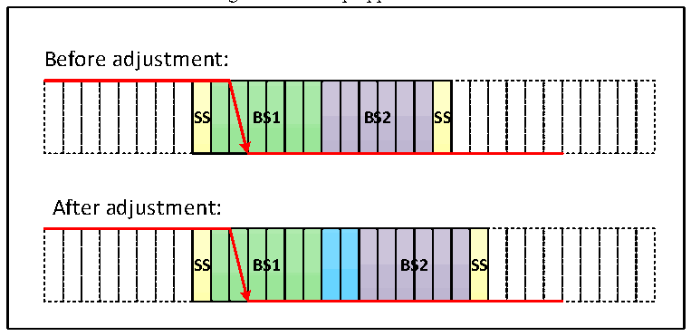
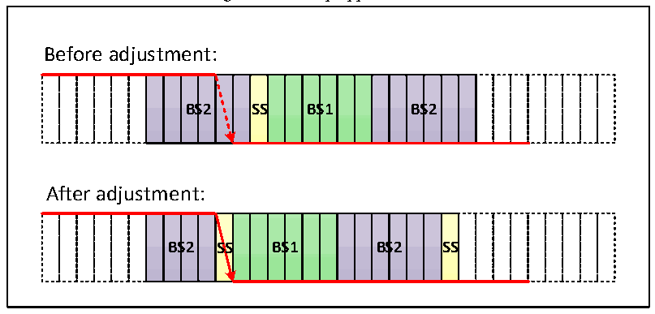

<!-- source-page: 299 -->

[← p.298](0298.md) · [index](../README.md) · [PDF p.299](https://ch32-riscv-ug.github.io/CH32V103/datasheet_en/CH32xRM.PDF#page=299) · [p.300 →](0300.md)

<!-- header: CH32x103 Reference Manual https://wch-ic.com -->

Figure 22-7 Jump appears in BS1  
 <!-- rendered from the PDF; verify at https://ch32-riscv-ug.github.io/CH32V103/datasheet_en/CH32xRM.PDF#page=299 -->

🖼 Text parsed from the figure above

Before adjustment:  
<!-- image: p299-draw-image-00002 inside the figure -->
<!-- image: p299-draw-image-00003 inside the figure -->
<!-- image: p299-draw-image-00004 inside the figure -->
<!-- image: p299-draw-image-00005 inside the figure -->
<!-- image: p299-draw-image-00015 inside the figure -->
<!-- image: p299-draw-image-00006 inside the figure -->
<!-- image: p299-draw-image-00007 inside the figure -->
<!-- image: p299-draw-image-00008 inside the figure -->
<!-- image: p299-draw-image-00009 inside the figure -->
<!-- image: p299-draw-image-00010 inside the figure -->
<!-- image: p299-draw-image-00011 inside the figure -->
<!-- image: p299-draw-image-00012 inside the figure -->
<!-- image: p299-draw-image-00013 inside the figure -->
<!-- image: p299-draw-image-00014 inside the figure -->
SS  BS  S1  BS  S2  SS  
After adjustment:  
<!-- image: p299-draw-image-00016 inside the figure -->
<!-- image: p299-draw-image-00017 inside the figure -->
<!-- image: p299-draw-image-00018 inside the figure -->
<!-- image: p299-draw-image-00019 inside the figure -->
<!-- image: p299-draw-image-00029 inside the figure -->
<!-- image: p299-draw-image-00020 inside the figure -->
<!-- image: p299-draw-image-00021 inside the figure -->
<!-- image: p299-draw-image-00022 inside the figure -->
<!-- image: p299-draw-image-00023 inside the figure -->
<!-- image: p299-draw-image-00024 inside the figure -->
<!-- image: p299-draw-image-00025 inside the figure -->
<!-- image: p299-draw-image-00026 inside the figure -->
<!-- image: p299-draw-image-00027 inside the figure -->
<!-- image: p299-draw-image-00028 inside the figure -->
<!-- image: p299-draw-image-00030 inside the figure -->
<!-- image: p299-draw-image-00031 inside the figure -->
SS  BS  S1  BS  S2  SS  

As shown in Figure 22-7, SJW is 2, and the bus level jump is detected in time period 1. You need to extend the  
length of time period 1, and extend SJW to the greatest extent to delay the position of the sampling point.  

Figure 22-8 Jump appears in BS2  
 <!-- rendered from the PDF; verify at https://ch32-riscv-ug.github.io/CH32V103/datasheet_en/CH32xRM.PDF#page=299 -->

🖼 Text parsed from the figure above

Before adjustment:  
<!-- image: p299-draw-image-00032 inside the figure -->
<!-- image: p299-draw-image-00033 inside the figure -->
<!-- image: p299-draw-image-00034 inside the figure -->
<!-- image: p299-draw-image-00035 inside the figure -->
<!-- image: p299-draw-image-00036 inside the figure -->
<!-- image: p299-draw-image-00037 inside the figure -->
<!-- image: p299-draw-image-00047 inside the figure -->
<!-- image: p299-draw-image-00038 inside the figure -->
<!-- image: p299-draw-image-00039 inside the figure -->
<!-- image: p299-draw-image-00040 inside the figure -->
<!-- image: p299-draw-image-00041 inside the figure -->
<!-- image: p299-draw-image-00042 inside the figure -->
<!-- image: p299-draw-image-00043 inside the figure -->
<!-- image: p299-draw-image-00044 inside the figure -->
<!-- image: p299-draw-image-00045 inside the figure -->
<!-- image: p299-draw-image-00046 inside the figure -->
<!-- image: p299-draw-image-00048 inside the figure -->
<!-- image: p299-draw-image-00049 inside the figure -->
<!-- image: p299-draw-image-00050 inside the figure -->
BS  S2  SS  S  BS  S1  BS  S2  
After adjustment:  
<!-- image: p299-draw-image-00051 inside the figure -->
<!-- image: p299-draw-image-00052 inside the figure -->
<!-- image: p299-draw-image-00053 inside the figure -->
<!-- image: p299-draw-image-00054 inside the figure -->
<!-- image: p299-draw-image-00055 inside the figure -->
<!-- image: p299-draw-image-00056 inside the figure -->
<!-- image: p299-draw-image-00066 inside the figure -->
<!-- image: p299-draw-image-00057 inside the figure -->
<!-- image: p299-draw-image-00058 inside the figure -->
<!-- image: p299-draw-image-00059 inside the figure -->
<!-- image: p299-draw-image-00060 inside the figure -->
<!-- image: p299-draw-image-00061 inside the figure -->
<!-- image: p299-draw-image-00062 inside the figure -->
<!-- image: p299-draw-image-00063 inside the figure -->
<!-- image: p299-draw-image-00064 inside the figure -->
<!-- image: p299-draw-image-00065 inside the figure -->
<!-- image: p299-draw-image-00067 inside the figure -->
<!-- image: p299-draw-image-00068 inside the figure -->
BS  S2  SS  S  BS  S1  BS  S2  SS  S  

As shown in Figure 22-8, SJW is 2, and the bus level jump is detected in time period 2. Then, the length of time  
period 2 needs to be reduced, and SJW is reduced to the greatest extent to advance the position of the sampling  
point.  
The CAN baud rate is calculated as follows:  
<!-- image: p299-draw-image-00069 bbox=[317.4, 571.8, 319.8, 572.4] -->
<!-- image: p299-draw-image-00070 bbox=[320.4, 571.8, 322.8, 572.4] -->
<!-- image: p299-draw-image-00071 bbox=[318.0, 572.4, 319.8, 573.0] -->
<!-- image: p299-draw-image-00072 bbox=[321.0, 572.4, 322.8, 573.0] -->
<!-- image: p299-draw-image-00073 bbox=[328.2, 572.4, 330.0, 573.0] -->
<!-- image: p299-draw-image-00074 bbox=[303.6, 573.0, 305.4, 573.6] -->
<!-- image: p299-draw-image-00075 bbox=[318.0, 573.0, 319.8, 573.6] -->
<!-- image: p299-draw-image-00076 bbox=[321.0, 573.0, 322.8, 573.6] -->
<!-- image: p299-draw-image-00077 bbox=[327.0, 573.0, 330.0, 573.6] -->
<!-- image: p299-draw-image-00078 bbox=[303.6, 573.6, 305.4, 574.2] -->
<!-- image: p299-draw-image-00079 bbox=[318.0, 573.6, 319.8, 574.2] -->
<!-- image: p299-draw-image-00080 bbox=[321.0, 573.6, 322.8, 574.2] -->
<!-- image: p299-draw-image-00081 bbox=[326.4, 573.6, 330.0, 574.2] -->
<!-- image: p299-draw-image-00082 bbox=[303.0, 574.2, 311.4, 574.8] -->
<!-- image: p299-draw-image-00083 bbox=[313.8, 574.2, 317.4, 574.8] -->
<!-- image: p299-draw-image-00084 bbox=[318.0, 574.2, 319.8, 574.8] -->
<!-- image: p299-draw-image-00085 bbox=[321.0, 574.2, 322.8, 574.8] -->
<!-- image: p299-draw-image-00086 bbox=[323.4, 574.2, 326.4, 574.8] -->
<!-- image: p299-draw-image-00087 bbox=[328.2, 574.2, 330.0, 574.8] -->
<!-- image: p299-draw-image-00088 bbox=[303.6, 574.8, 305.4, 575.4] -->
<!-- image: p299-draw-image-00089 bbox=[307.2, 574.8, 309.6, 575.4] -->
<!-- image: p299-draw-image-00090 bbox=[310.2, 574.8, 312.0, 575.4] -->
<!-- image: p299-draw-image-00091 bbox=[313.2, 574.8, 315.0, 575.4] -->
<!-- image: p299-draw-image-00092 bbox=[315.6, 574.8, 317.4, 575.4] -->
<!-- image: p299-draw-image-00093 bbox=[318.0, 574.8, 319.8, 575.4] -->
<!-- image: p299-draw-image-00094 bbox=[321.0, 574.8, 322.8, 575.4] -->
<!-- image: p299-draw-image-00095 bbox=[323.4, 574.8, 325.8, 575.4] -->
<!-- image: p299-draw-image-00096 bbox=[328.2, 574.8, 330.0, 575.4] -->
<!-- image: p299-draw-image-00097 bbox=[303.6, 575.4, 305.4, 576.0] -->
<!-- image: p299-draw-image-00098 bbox=[307.2, 575.4, 309.0, 576.0] -->
<!-- image: p299-draw-image-00099 bbox=[310.2, 575.4, 312.6, 576.0] -->
<!-- image: p299-draw-image-00100 bbox=[313.2, 575.4, 315.0, 576.0] -->
<!-- image: p299-draw-image-00101 bbox=[318.0, 575.4, 319.8, 576.0] -->
<!-- image: p299-draw-image-00102 bbox=[321.0, 575.4, 322.8, 576.0] -->
<!-- image: p299-draw-image-00103 bbox=[323.4, 575.4, 325.2, 576.0] -->
<!-- image: p299-draw-image-00104 bbox=[328.2, 575.4, 330.0, 576.0] -->
<!-- image: p299-draw-image-00105 bbox=[303.6, 576.0, 305.4, 576.6] -->
<!-- image: p299-draw-image-00106 bbox=[307.2, 576.0, 309.0, 576.6] -->
<!-- image: p299-draw-image-00107 bbox=[310.8, 576.0, 314.4, 576.6] -->
<!-- image: p299-draw-image-00108 bbox=[318.0, 576.0, 319.8, 576.6] -->
<!-- image: p299-draw-image-00109 bbox=[321.0, 576.0, 324.6, 576.6] -->
<!-- image: p299-draw-image-00110 bbox=[328.2, 576.0, 330.0, 576.6] -->
<!-- image: p299-draw-image-00111 bbox=[303.6, 576.6, 305.4, 577.2] -->
<!-- image: p299-draw-image-00112 bbox=[307.2, 576.6, 309.0, 577.2] -->
<!-- image: p299-draw-image-00113 bbox=[310.8, 576.6, 314.4, 577.2] -->
<!-- image: p299-draw-image-00114 bbox=[318.0, 576.6, 319.8, 577.2] -->
<!-- image: p299-draw-image-00115 bbox=[321.0, 576.6, 324.6, 577.2] -->
<!-- image: p299-draw-image-00116 bbox=[328.2, 576.6, 330.0, 577.2] -->
<!-- image: p299-draw-image-00117 bbox=[303.6, 577.2, 305.4, 577.8] -->
<!-- image: p299-draw-image-00118 bbox=[307.2, 577.2, 309.0, 577.8] -->
<!-- image: p299-draw-image-00119 bbox=[310.8, 577.2, 314.4, 577.8] -->
<!-- image: p299-draw-image-00120 bbox=[318.0, 577.2, 319.8, 577.8] -->
<!-- image: p299-draw-image-00121 bbox=[321.0, 577.2, 324.6, 577.8] -->
<!-- image: p299-draw-image-00122 bbox=[328.2, 577.2, 330.0, 577.8] -->
<!-- image: p299-draw-image-00123 bbox=[303.6, 577.8, 305.4, 578.4] -->
<!-- image: p299-draw-image-00124 bbox=[307.2, 577.8, 309.0, 578.4] -->
<!-- image: p299-draw-image-00125 bbox=[310.2, 577.8, 312.0, 578.4] -->
<!-- image: p299-draw-image-00126 bbox=[312.6, 577.8, 314.4, 578.4] -->
<!-- image: p299-draw-image-00127 bbox=[318.0, 577.8, 319.8, 578.4] -->
<!-- image: p299-draw-image-00128 bbox=[321.0, 577.8, 322.8, 578.4] -->
<!-- image: p299-draw-image-00129 bbox=[323.4, 577.8, 325.2, 578.4] -->
<!-- image: p299-draw-image-00130 bbox=[328.2, 577.8, 330.0, 578.4] -->
<!-- image: p299-draw-image-00131 bbox=[303.6, 578.4, 305.4, 579.0] -->
<!-- image: p299-draw-image-00132 bbox=[306.0, 578.4, 309.6, 579.0] -->
<!-- image: p299-draw-image-00133 bbox=[310.2, 578.4, 312.0, 579.0] -->
<!-- image: p299-draw-image-00134 bbox=[313.2, 578.4, 315.0, 579.0] -->
<!-- image: p299-draw-image-00135 bbox=[315.6, 578.4, 317.4, 579.0] -->
<!-- image: p299-draw-image-00136 bbox=[318.0, 578.4, 319.8, 579.0] -->
<!-- image: p299-draw-image-00137 bbox=[321.0, 578.4, 322.8, 579.0] -->
<!-- image: p299-draw-image-00138 bbox=[324.0, 578.4, 325.8, 579.0] -->
<!-- image: p299-draw-image-00139 bbox=[328.2, 578.4, 330.0, 579.0] -->
<!-- image: p299-draw-image-00140 bbox=[304.2, 579.0, 306.6, 579.6] -->
<!-- image: p299-draw-image-00141 bbox=[307.2, 579.0, 311.4, 579.6] -->
<!-- image: p299-draw-image-00142 bbox=[313.8, 579.0, 316.8, 579.6] -->
<!-- image: p299-draw-image-00143 bbox=[317.4, 579.0, 331.2, 579.6] -->
<!-- image: p299-draw-image-00144 bbox=[307.2, 579.6, 309.0, 580.2] -->
<!-- image: p299-draw-image-00145 bbox=[165.0, 580.2, 169.2, 580.8] -->
<!-- image: p299-draw-image-00146 bbox=[171.6, 580.2, 174.0, 580.8] -->
<!-- image: p299-draw-image-00147 bbox=[175.8, 580.2, 178.8, 580.8] -->
<!-- image: p299-draw-image-00148 bbox=[180.0, 580.2, 183.0, 580.8] -->
<!-- image: p299-draw-image-00149 bbox=[183.6, 580.2, 185.4, 580.8] -->
<!-- image: p299-draw-image-00150 bbox=[307.2, 580.2, 309.0, 580.8] -->
<!-- image: p299-draw-image-00151 bbox=[164.4, 580.8, 169.2, 581.4] -->
<!-- image: p299-draw-image-00152 bbox=[171.6, 580.8, 174.0, 581.4] -->
<!-- image: p299-draw-image-00153 bbox=[176.4, 580.8, 178.8, 581.4] -->
<!-- image: p299-draw-image-00154 bbox=[180.6, 580.8, 182.4, 581.4] -->
<!-- image: p299-draw-image-00155 bbox=[183.6, 580.8, 185.4, 581.4] -->
<!-- image: p299-draw-image-00156 bbox=[306.6, 580.8, 309.6, 581.4] -->
<!-- image: p299-draw-image-00157 bbox=[163.8, 581.4, 165.6, 582.0] -->
<!-- image: p299-draw-image-00158 bbox=[167.4, 581.4, 169.2, 582.0] -->
<!-- image: p299-draw-image-00159 bbox=[171.6, 581.4, 174.0, 582.0] -->
<!-- image: p299-draw-image-00160 bbox=[176.4, 581.4, 179.4, 582.0] -->
<!-- image: p299-draw-image-00161 bbox=[180.6, 581.4, 182.4, 582.0] -->
<!-- image: p299-draw-image-00162 bbox=[183.6, 581.4, 185.4, 582.0] -->
<!-- image: p299-draw-image-00163 bbox=[163.8, 582.0, 165.6, 582.6] -->
<!-- image: p299-draw-image-00164 bbox=[171.0, 582.0, 174.6, 582.6] -->
<!-- image: p299-draw-image-00165 bbox=[176.4, 582.0, 180.0, 582.6] -->
<!-- image: p299-draw-image-00166 bbox=[180.6, 582.0, 182.4, 582.6] -->
<!-- image: p299-draw-image-00167 bbox=[183.6, 582.0, 187.8, 582.6] -->
<!-- image: p299-draw-image-00168 bbox=[189.0, 582.0, 193.8, 582.6] -->
<!-- image: p299-draw-image-00169 bbox=[195.6, 582.0, 199.8, 582.6] -->
<!-- image: p299-draw-image-00170 bbox=[163.2, 582.6, 165.6, 583.2] -->
<!-- image: p299-draw-image-00171 bbox=[171.0, 582.6, 172.2, 583.2] -->
<!-- image: p299-draw-image-00172 bbox=[172.8, 582.6, 174.6, 583.2] -->
<!-- image: p299-draw-image-00173 bbox=[176.4, 582.6, 180.0, 583.2] -->
<!-- image: p299-draw-image-00174 bbox=[180.6, 582.6, 182.4, 583.2] -->
<!-- image: p299-draw-image-00175 bbox=[183.6, 582.6, 186.0, 583.2] -->
<!-- image: p299-draw-image-00176 bbox=[186.6, 582.6, 188.4, 583.2] -->
<!-- image: p299-draw-image-00177 bbox=[189.6, 582.6, 192.0, 583.2] -->
<!-- image: p299-draw-image-00178 bbox=[192.6, 582.6, 194.4, 583.2] -->
<!-- image: p299-draw-image-00179 bbox=[195.0, 582.6, 199.8, 583.2] -->
<!-- image: p299-draw-image-00180 bbox=[163.2, 583.2, 165.6, 583.8] -->
<!-- image: p299-draw-image-00181 bbox=[170.4, 583.2, 172.2, 583.8] -->
<!-- image: p299-draw-image-00182 bbox=[172.8, 583.2, 174.6, 583.8] -->
<!-- image: p299-draw-image-00183 bbox=[176.4, 583.2, 178.2, 583.8] -->
<!-- image: p299-draw-image-00184 bbox=[178.8, 583.2, 182.4, 583.8] -->
<!-- image: p299-draw-image-00185 bbox=[183.6, 583.2, 185.4, 583.8] -->
<!-- image: p299-draw-image-00186 bbox=[186.6, 583.2, 188.4, 583.8] -->
<!-- image: p299-draw-image-00187 bbox=[189.6, 583.2, 191.4, 583.8] -->
<!-- image: p299-draw-image-00188 bbox=[192.6, 583.2, 196.8, 583.8] -->
<!-- image: p299-draw-image-00189 bbox=[198.0, 583.2, 199.8, 583.8] -->
<!-- image: p299-draw-image-00190 bbox=[202.2, 583.2, 209.4, 583.8] -->
<!-- image: p299-draw-image-00191 bbox=[163.2, 583.8, 165.6, 584.4] -->
<!-- image: p299-draw-image-00192 bbox=[170.4, 583.8, 172.2, 584.4] -->
<!-- image: p299-draw-image-00193 bbox=[172.8, 583.8, 174.6, 584.4] -->
<!-- image: p299-draw-image-00194 bbox=[176.4, 583.8, 178.2, 584.4] -->
<!-- image: p299-draw-image-00195 bbox=[178.8, 583.8, 182.4, 584.4] -->
<!-- image: p299-draw-image-00196 bbox=[183.6, 583.8, 185.4, 584.4] -->
<!-- image: p299-draw-image-00197 bbox=[187.2, 583.8, 189.0, 584.4] -->
<!-- image: p299-draw-image-00198 bbox=[189.6, 583.8, 191.4, 584.4] -->
<!-- image: p299-draw-image-00199 bbox=[193.2, 583.8, 195.0, 584.4] -->
<!-- image: p299-draw-image-00200 bbox=[195.6, 583.8, 198.0, 584.4] -->
<!-- image: p299-draw-image-00201 bbox=[212.4, 583.8, 423.0, 584.4] -->
<!-- image: p299-draw-image-00202 bbox=[163.2, 584.4, 165.6, 585.0] -->
<!-- image: p299-draw-image-00203 bbox=[170.4, 584.4, 175.2, 585.0] -->
<!-- image: p299-draw-image-00204 bbox=[176.4, 584.4, 178.2, 585.0] -->
<!-- image: p299-draw-image-00205 bbox=[179.4, 584.4, 182.4, 585.0] -->
<!-- image: p299-draw-image-00206 bbox=[183.6, 584.4, 185.4, 585.0] -->
<!-- image: p299-draw-image-00207 bbox=[187.2, 584.4, 189.0, 585.0] -->
<!-- image: p299-draw-image-00208 bbox=[189.6, 584.4, 191.4, 585.0] -->
<!-- image: p299-draw-image-00209 bbox=[193.2, 584.4, 195.0, 585.0] -->
<!-- image: p299-draw-image-00210 bbox=[196.2, 584.4, 199.2, 585.0] -->
<!-- image: p299-draw-image-00211 bbox=[163.8, 585.0, 165.6, 585.6] -->
<!-- image: p299-draw-image-00212 bbox=[169.8, 585.0, 171.6, 585.6] -->
<!-- image: p299-draw-image-00213 bbox=[173.4, 585.0, 175.2, 585.6] -->
<!-- image: p299-draw-image-00214 bbox=[176.4, 585.0, 178.2, 585.6] -->
<!-- image: p299-draw-image-00215 bbox=[179.4, 585.0, 182.4, 585.6] -->
<!-- image: p299-draw-image-00216 bbox=[183.6, 585.0, 185.4, 585.6] -->
<!-- image: p299-draw-image-00217 bbox=[187.2, 585.0, 189.0, 585.6] -->
<!-- image: p299-draw-image-00218 bbox=[189.6, 585.0, 191.4, 585.6] -->
<!-- image: p299-draw-image-00219 bbox=[193.2, 585.0, 195.0, 585.6] -->
<!-- image: p299-draw-image-00220 bbox=[197.4, 585.0, 199.2, 585.6] -->
<!-- image: p299-draw-image-00221 bbox=[202.2, 585.0, 209.4, 585.6] -->
<!-- image: p299-draw-image-00222 bbox=[163.8, 585.6, 165.6, 586.2] -->
<!-- image: p299-draw-image-00223 bbox=[167.4, 585.6, 169.2, 586.2] -->
<!-- image: p299-draw-image-00224 bbox=[169.8, 585.6, 171.6, 586.2] -->
<!-- image: p299-draw-image-00225 bbox=[173.4, 585.6, 175.2, 586.2] -->
<!-- image: p299-draw-image-00226 bbox=[176.4, 585.6, 178.2, 586.2] -->
<!-- image: p299-draw-image-00227 bbox=[180.0, 585.6, 182.4, 586.2] -->
<!-- image: p299-draw-image-00228 bbox=[183.6, 585.6, 185.4, 586.2] -->
<!-- image: p299-draw-image-00229 bbox=[186.6, 585.6, 188.4, 586.2] -->
<!-- image: p299-draw-image-00230 bbox=[189.6, 585.6, 191.4, 586.2] -->
<!-- image: p299-draw-image-00231 bbox=[192.6, 585.6, 194.4, 586.2] -->
<!-- image: p299-draw-image-00232 bbox=[195.0, 585.6, 196.8, 586.2] -->
<!-- image: p299-draw-image-00233 bbox=[198.0, 585.6, 199.8, 586.2] -->
<!-- image: p299-draw-image-00234 bbox=[163.8, 586.2, 166.2, 586.8] -->
<!-- image: p299-draw-image-00235 bbox=[166.8, 586.2, 171.0, 586.8] -->
<!-- image: p299-draw-image-00236 bbox=[173.4, 586.2, 175.8, 586.8] -->
<!-- image: p299-draw-image-00237 bbox=[176.4, 586.2, 178.2, 586.8] -->
<!-- image: p299-draw-image-00238 bbox=[180.6, 586.2, 182.4, 586.8] -->
<!-- image: p299-draw-image-00239 bbox=[183.6, 586.2, 188.4, 586.8] -->
<!-- image: p299-draw-image-00240 bbox=[189.6, 586.2, 192.0, 586.8] -->
<!-- image: p299-draw-image-00241 bbox=[192.6, 586.2, 194.4, 586.8] -->
<!-- image: p299-draw-image-00242 bbox=[195.0, 586.2, 196.8, 586.8] -->
<!-- image: p299-draw-image-00243 bbox=[197.4, 586.2, 199.2, 586.8] -->
<!-- image: p299-draw-image-00244 bbox=[234.6, 586.2, 238.2, 586.8] -->
<!-- image: p299-draw-image-00245 bbox=[253.8, 586.2, 256.8, 586.8] -->
<!-- image: p299-draw-image-00246 bbox=[306.0, 586.2, 309.6, 586.8] -->
<!-- image: p299-draw-image-00247 bbox=[324.6, 586.2, 327.6, 586.8] -->
<!-- image: p299-draw-image-00248 bbox=[164.4, 586.8, 172.2, 587.4] -->
<!-- image: p299-draw-image-00249 bbox=[172.8, 586.8, 178.8, 587.4] -->
<!-- image: p299-draw-image-00250 bbox=[180.6, 586.8, 182.4, 587.4] -->
<!-- image: p299-draw-image-00251 bbox=[183.6, 586.8, 187.8, 587.4] -->
<!-- image: p299-draw-image-00252 bbox=[189.6, 586.8, 193.8, 587.4] -->
<!-- image: p299-draw-image-00253 bbox=[195.0, 586.8, 199.2, 587.4] -->
<!-- image: p299-draw-image-00254 bbox=[214.8, 586.8, 217.2, 587.4] -->
<!-- image: p299-draw-image-00255 bbox=[234.6, 586.8, 236.4, 587.4] -->
<!-- image: p299-draw-image-00256 bbox=[255.0, 586.8, 256.8, 587.4] -->
<!-- image: p299-draw-image-00257 bbox=[306.0, 586.8, 307.8, 587.4] -->
<!-- image: p299-draw-image-00258 bbox=[325.8, 586.8, 327.6, 587.4] -->
<!-- image: p299-draw-image-00259 bbox=[364.8, 586.8, 366.6, 587.4] -->
<!-- image: p299-draw-image-00260 bbox=[400.2, 586.8, 403.8, 587.4] -->
<!-- image: p299-draw-image-00261 bbox=[419.4, 586.8, 422.4, 587.4] -->
<!-- image: p299-draw-image-00262 bbox=[189.6, 587.4, 191.4, 588.0] -->
<!-- image: p299-draw-image-00263 bbox=[214.2, 587.4, 216.6, 588.0] -->
<!-- image: p299-draw-image-00264 bbox=[217.2, 587.4, 223.8, 588.0] -->
<!-- image: p299-draw-image-00265 bbox=[225.0, 587.4, 228.0, 588.0] -->
<!-- image: p299-draw-image-00266 bbox=[231.0, 587.4, 232.8, 588.0] -->
<!-- image: p299-draw-image-00267 bbox=[234.6, 587.4, 236.4, 588.0] -->
<!-- image: p299-draw-image-00268 bbox=[238.2, 587.4, 242.4, 588.0] -->
<!-- image: p299-draw-image-00269 bbox=[249.0, 587.4, 252.6, 588.0] -->
<!-- image: p299-draw-image-00270 bbox=[255.0, 587.4, 256.8, 588.0] -->
<!-- image: p299-draw-image-00271 bbox=[271.8, 587.4, 273.6, 588.0] -->
<!-- image: p299-draw-image-00272 bbox=[288.0, 587.4, 294.6, 588.0] -->
<!-- image: p299-draw-image-00273 bbox=[295.8, 587.4, 299.4, 588.0] -->
<!-- image: p299-draw-image-00274 bbox=[300.0, 587.4, 304.2, 588.0] -->
<!-- image: p299-draw-image-00275 bbox=[306.0, 587.4, 307.8, 588.0] -->
<!-- image: p299-draw-image-00276 bbox=[309.6, 587.4, 313.8, 588.0] -->
<!-- image: p299-draw-image-00277 bbox=[319.8, 587.4, 323.4, 588.0] -->
<!-- image: p299-draw-image-00278 bbox=[325.8, 587.4, 327.6, 588.0] -->
<!-- image: p299-draw-image-00279 bbox=[343.2, 587.4, 345.0, 588.0] -->
<!-- image: p299-draw-image-00280 bbox=[361.2, 587.4, 363.0, 588.0] -->
<!-- image: p299-draw-image-00281 bbox=[365.4, 587.4, 367.2, 588.0] -->
<!-- image: p299-draw-image-00282 bbox=[380.4, 587.4, 386.4, 588.0] -->
<!-- image: p299-draw-image-00283 bbox=[387.0, 587.4, 392.4, 588.0] -->
<!-- image: p299-draw-image-00284 bbox=[393.6, 587.4, 399.0, 588.0] -->
<!-- image: p299-draw-image-00285 bbox=[400.2, 587.4, 402.0, 588.0] -->
<!-- image: p299-draw-image-00286 bbox=[404.4, 587.4, 408.0, 588.0] -->
<!-- image: p299-draw-image-00287 bbox=[414.6, 587.4, 418.2, 588.0] -->
<!-- image: p299-draw-image-00288 bbox=[420.6, 587.4, 422.4, 588.0] -->
<!-- image: p299-draw-image-00289 bbox=[189.6, 588.0, 191.4, 588.6] -->
<!-- image: p299-draw-image-00290 bbox=[213.6, 588.0, 215.4, 588.6] -->
<!-- image: p299-draw-image-00291 bbox=[217.2, 588.0, 219.0, 588.6] -->
<!-- image: p299-draw-image-00292 bbox=[219.6, 588.0, 223.8, 588.6] -->
<!-- image: p299-draw-image-00293 bbox=[224.4, 588.0, 226.2, 588.6] -->
<!-- image: p299-draw-image-00294 bbox=[226.8, 588.0, 228.6, 588.6] -->
<!-- image: p299-draw-image-00295 bbox=[229.8, 588.0, 232.8, 588.6] -->
<!-- image: p299-draw-image-00296 bbox=[234.6, 588.0, 236.4, 588.6] -->
<!-- image: p299-draw-image-00297 bbox=[238.2, 588.0, 240.0, 588.6] -->
<!-- image: p299-draw-image-00298 bbox=[240.6, 588.0, 243.0, 588.6] -->
<!-- image: p299-draw-image-00299 bbox=[248.4, 588.0, 253.2, 588.6] -->
<!-- image: p299-draw-image-00300 bbox=[255.0, 588.0, 256.8, 588.6] -->
<!-- image: p299-draw-image-00301 bbox=[262.2, 588.0, 264.0, 588.6] -->
<!-- image: p299-draw-image-00302 bbox=[270.6, 588.0, 273.6, 588.6] -->
<!-- image: p299-draw-image-00303 bbox=[280.8, 588.0, 282.6, 588.6] -->
<!-- image: p299-draw-image-00304 bbox=[288.0, 588.0, 289.8, 588.6] -->
<!-- image: p299-draw-image-00305 bbox=[290.4, 588.0, 294.6, 588.6] -->
<!-- image: p299-draw-image-00306 bbox=[295.2, 588.0, 297.0, 588.6] -->
<!-- image: p299-draw-image-00307 bbox=[297.6, 588.0, 301.8, 588.6] -->
<!-- image: p299-draw-image-00308 bbox=[302.4, 588.0, 304.8, 588.6] -->
<!-- image: p299-draw-image-00309 bbox=[306.0, 588.0, 307.8, 588.6] -->
<!-- image: p299-draw-image-00310 bbox=[309.6, 588.0, 311.4, 588.6] -->
<!-- image: p299-draw-image-00311 bbox=[312.0, 588.0, 314.4, 588.6] -->
<!-- image: p299-draw-image-00312 bbox=[319.2, 588.0, 324.0, 588.6] -->
<!-- image: p299-draw-image-00313 bbox=[325.8, 588.0, 327.6, 588.6] -->
<!-- image: p299-draw-image-00314 bbox=[333.6, 588.0, 335.4, 588.6] -->
<!-- image: p299-draw-image-00315 bbox=[342.0, 588.0, 345.0, 588.6] -->
<!-- image: p299-draw-image-00316 bbox=[351.6, 588.0, 353.4, 588.6] -->
<!-- image: p299-draw-image-00317 bbox=[360.0, 588.0, 363.0, 588.6] -->
<!-- image: p299-draw-image-00318 bbox=[366.0, 588.0, 367.8, 588.6] -->
<!-- image: p299-draw-image-00319 bbox=[381.0, 588.0, 382.8, 588.6] -->
<!-- image: p299-draw-image-00320 bbox=[384.0, 588.0, 386.4, 588.6] -->
<!-- image: p299-draw-image-00321 bbox=[387.6, 588.0, 389.4, 588.6] -->
<!-- image: p299-draw-image-00322 bbox=[390.6, 588.0, 393.0, 588.6] -->
<!-- image: p299-draw-image-00323 bbox=[394.2, 588.0, 396.0, 588.6] -->
<!-- image: p299-draw-image-00324 bbox=[397.2, 588.0, 399.6, 588.6] -->
<!-- image: p299-draw-image-00325 bbox=[400.2, 588.0, 402.0, 588.6] -->
<!-- image: p299-draw-image-00326 bbox=[403.8, 588.0, 405.6, 588.6] -->
<!-- image: p299-draw-image-00327 bbox=[406.2, 588.0, 408.6, 588.6] -->
<!-- image: p299-draw-image-00328 bbox=[414.0, 588.0, 418.8, 588.6] -->
<!-- image: p299-draw-image-00329 bbox=[420.6, 588.0, 422.4, 588.6] -->
<!-- image: p299-draw-image-00330 bbox=[189.6, 588.6, 191.4, 589.2] -->
<!-- image: p299-draw-image-00331 bbox=[213.6, 588.6, 215.4, 589.2] -->
<!-- image: p299-draw-image-00332 bbox=[217.2, 588.6, 218.4, 589.2] -->
<!-- image: p299-draw-image-00333 bbox=[219.6, 588.6, 221.4, 589.2] -->
<!-- image: p299-draw-image-00334 bbox=[222.0, 588.6, 225.6, 589.2] -->
<!-- image: p299-draw-image-00335 bbox=[227.4, 588.6, 228.6, 589.2] -->
<!-- image: p299-draw-image-00336 bbox=[229.2, 588.6, 232.8, 589.2] -->
<!-- image: p299-draw-image-00337 bbox=[234.6, 588.6, 236.4, 589.2] -->
<!-- image: p299-draw-image-00338 bbox=[238.2, 588.6, 239.4, 589.2] -->
<!-- image: p299-draw-image-00339 bbox=[241.2, 588.6, 243.0, 589.2] -->
<!-- image: p299-draw-image-00340 bbox=[248.4, 588.6, 250.2, 589.2] -->
<!-- image: p299-draw-image-00341 bbox=[251.4, 588.6, 253.2, 589.2] -->
<!-- image: p299-draw-image-00342 bbox=[255.0, 588.6, 256.8, 589.2] -->
<!-- image: p299-draw-image-00343 bbox=[262.2, 588.6, 264.0, 589.2] -->
<!-- image: p299-draw-image-00344 bbox=[270.0, 588.6, 273.6, 589.2] -->
<!-- image: p299-draw-image-00345 bbox=[280.8, 588.6, 282.6, 589.2] -->
<!-- image: p299-draw-image-00346 bbox=[288.0, 588.6, 289.2, 589.2] -->
<!-- image: p299-draw-image-00347 bbox=[290.4, 588.6, 292.2, 589.2] -->
<!-- image: p299-draw-image-00348 bbox=[292.8, 588.6, 296.4, 589.2] -->
<!-- image: p299-draw-image-00349 bbox=[298.2, 588.6, 301.2, 589.2] -->
<!-- image: p299-draw-image-00350 bbox=[303.0, 588.6, 304.8, 589.2] -->
<!-- image: p299-draw-image-00351 bbox=[306.0, 588.6, 307.8, 589.2] -->
<!-- image: p299-draw-image-00352 bbox=[309.6, 588.6, 310.8, 589.2] -->
<!-- image: p299-draw-image-00353 bbox=[312.6, 588.6, 314.4, 589.2] -->
<!-- image: p299-draw-image-00354 bbox=[319.2, 588.6, 321.0, 589.2] -->
<!-- image: p299-draw-image-00355 bbox=[322.2, 588.6, 324.0, 589.2] -->
<!-- image: p299-draw-image-00356 bbox=[325.8, 588.6, 327.6, 589.2] -->
<!-- image: p299-draw-image-00357 bbox=[333.6, 588.6, 335.4, 589.2] -->
<!-- image: p299-draw-image-00358 bbox=[341.4, 588.6, 345.0, 589.2] -->
<!-- image: p299-draw-image-00359 bbox=[351.6, 588.6, 353.4, 589.2] -->
<!-- image: p299-draw-image-00360 bbox=[359.4, 588.6, 363.0, 589.2] -->
<!-- image: p299-draw-image-00361 bbox=[366.6, 588.6, 368.4, 589.2] -->
<!-- image: p299-draw-image-00362 bbox=[372.0, 588.6, 373.2, 589.2] -->
<!-- image: p299-draw-image-00363 bbox=[376.2, 588.6, 378.0, 589.2] -->
<!-- image: p299-draw-image-00364 bbox=[381.0, 588.6, 382.8, 589.2] -->
<!-- image: p299-draw-image-00365 bbox=[384.6, 588.6, 387.0, 589.2] -->
<!-- image: p299-draw-image-00366 bbox=[387.6, 588.6, 389.4, 589.2] -->
<!-- image: p299-draw-image-00367 bbox=[391.2, 588.6, 393.0, 589.2] -->
<!-- image: p299-draw-image-00368 bbox=[394.2, 588.6, 396.0, 589.2] -->
<!-- image: p299-draw-image-00369 bbox=[397.8, 588.6, 399.6, 589.2] -->
<!-- image: p299-draw-image-00370 bbox=[400.2, 588.6, 402.0, 589.2] -->
<!-- image: p299-draw-image-00371 bbox=[403.2, 588.6, 405.0, 589.2] -->
<!-- image: p299-draw-image-00372 bbox=[406.8, 588.6, 408.6, 589.2] -->
<!-- image: p299-draw-image-00373 bbox=[414.0, 588.6, 415.8, 589.2] -->
<!-- image: p299-draw-image-00374 bbox=[417.0, 588.6, 418.8, 589.2] -->
<!-- image: p299-draw-image-00375 bbox=[420.6, 588.6, 422.4, 589.2] -->
<!-- image: p299-draw-image-00376 bbox=[213.0, 589.2, 214.8, 589.8] -->
<!-- image: p299-draw-image-00377 bbox=[219.6, 589.2, 221.4, 589.8] -->
<!-- image: p299-draw-image-00378 bbox=[224.4, 589.2, 226.8, 589.8] -->
<!-- image: p299-draw-image-00379 bbox=[231.0, 589.2, 232.8, 589.8] -->
<!-- image: p299-draw-image-00380 bbox=[234.6, 589.2, 236.4, 589.8] -->
<!-- image: p299-draw-image-00381 bbox=[240.0, 589.2, 242.4, 589.8] -->
<!-- image: p299-draw-image-00382 bbox=[244.2, 589.2, 246.0, 589.8] -->
<!-- image: p299-draw-image-00383 bbox=[247.8, 589.2, 250.2, 589.8] -->
<!-- image: p299-draw-image-00384 bbox=[251.4, 589.2, 253.8, 589.8] -->
<!-- image: p299-draw-image-00385 bbox=[255.0, 589.2, 256.8, 589.8] -->
<!-- image: p299-draw-image-00386 bbox=[262.2, 589.2, 264.0, 589.8] -->
<!-- image: p299-draw-image-00387 bbox=[271.8, 589.2, 273.6, 589.8] -->
<!-- image: p299-draw-image-00388 bbox=[280.8, 589.2, 282.6, 589.8] -->
<!-- image: p299-draw-image-00389 bbox=[290.4, 589.2, 292.2, 589.8] -->
<!-- image: p299-draw-image-00390 bbox=[295.2, 589.2, 297.6, 589.8] -->
<!-- image: p299-draw-image-00391 bbox=[303.0, 589.2, 304.8, 589.8] -->
<!-- image: p299-draw-image-00392 bbox=[306.0, 589.2, 307.8, 589.8] -->
<!-- image: p299-draw-image-00393 bbox=[312.6, 589.2, 314.4, 589.8] -->
<!-- image: p299-draw-image-00394 bbox=[315.0, 589.2, 316.8, 589.8] -->
<!-- image: p299-draw-image-00395 bbox=[318.6, 589.2, 321.0, 589.8] -->
<!-- image: p299-draw-image-00396 bbox=[322.2, 589.2, 324.6, 589.8] -->
<!-- image: p299-draw-image-00397 bbox=[325.8, 589.2, 327.6, 589.8] -->
<!-- image: p299-draw-image-00398 bbox=[333.6, 589.2, 335.4, 589.8] -->
<!-- image: p299-draw-image-00399 bbox=[343.2, 589.2, 345.0, 589.8] -->
<!-- image: p299-draw-image-00400 bbox=[351.6, 589.2, 353.4, 589.8] -->
<!-- image: p299-draw-image-00401 bbox=[361.2, 589.2, 363.0, 589.8] -->
<!-- image: p299-draw-image-00402 bbox=[366.6, 589.2, 368.4, 589.8] -->
<!-- image: p299-draw-image-00403 bbox=[372.0, 589.2, 374.4, 589.8] -->
<!-- image: p299-draw-image-00404 bbox=[375.0, 589.2, 376.8, 589.8] -->
<!-- image: p299-draw-image-00405 bbox=[381.0, 589.2, 382.8, 589.8] -->
<!-- image: p299-draw-image-00406 bbox=[384.0, 589.2, 386.4, 589.8] -->
<!-- image: p299-draw-image-00407 bbox=[387.6, 589.2, 389.4, 589.8] -->
<!-- image: p299-draw-image-00408 bbox=[391.2, 589.2, 393.0, 589.8] -->
<!-- image: p299-draw-image-00409 bbox=[394.2, 589.2, 396.0, 589.8] -->
<!-- image: p299-draw-image-00410 bbox=[397.8, 589.2, 399.6, 589.8] -->
<!-- image: p299-draw-image-00411 bbox=[400.2, 589.2, 402.0, 589.8] -->
<!-- image: p299-draw-image-00412 bbox=[403.2, 589.2, 405.0, 589.8] -->
<!-- image: p299-draw-image-00413 bbox=[406.8, 589.2, 409.2, 589.8] -->
<!-- image: p299-draw-image-00414 bbox=[409.8, 589.2, 411.6, 589.8] -->
<!-- image: p299-draw-image-00415 bbox=[413.4, 589.2, 415.8, 589.8] -->
<!-- image: p299-draw-image-00416 bbox=[417.0, 589.2, 419.4, 589.8] -->
<!-- image: p299-draw-image-00417 bbox=[420.6, 589.2, 422.4, 589.8] -->
<!-- image: p299-draw-image-00418 bbox=[213.0, 589.8, 214.8, 590.4] -->
<!-- image: p299-draw-image-00419 bbox=[219.6, 589.8, 221.4, 590.4] -->
<!-- image: p299-draw-image-00420 bbox=[225.0, 589.8, 228.0, 590.4] -->
<!-- image: p299-draw-image-00421 bbox=[231.0, 589.8, 232.8, 590.4] -->
<!-- image: p299-draw-image-00422 bbox=[234.6, 589.8, 236.4, 590.4] -->
<!-- image: p299-draw-image-00423 bbox=[238.8, 589.8, 242.4, 590.4] -->
<!-- image: p299-draw-image-00424 bbox=[244.2, 589.8, 246.0, 590.4] -->
<!-- image: p299-draw-image-00425 bbox=[247.8, 589.8, 250.2, 590.4] -->
<!-- image: p299-draw-image-00426 bbox=[251.4, 589.8, 253.8, 590.4] -->
<!-- image: p299-draw-image-00427 bbox=[255.0, 589.8, 256.8, 590.4] -->
<!-- image: p299-draw-image-00428 bbox=[262.2, 589.8, 264.0, 590.4] -->
<!-- image: p299-draw-image-00429 bbox=[271.8, 589.8, 273.6, 590.4] -->
<!-- image: p299-draw-image-00430 bbox=[280.8, 589.8, 282.6, 590.4] -->
<!-- image: p299-draw-image-00431 bbox=[290.4, 589.8, 292.2, 590.4] -->
<!-- image: p299-draw-image-00432 bbox=[295.8, 589.8, 298.8, 590.4] -->
<!-- image: p299-draw-image-00433 bbox=[302.4, 589.8, 304.2, 590.4] -->
<!-- image: p299-draw-image-00434 bbox=[306.0, 589.8, 307.8, 590.4] -->
<!-- image: p299-draw-image-00435 bbox=[312.0, 589.8, 313.8, 590.4] -->
<!-- image: p299-draw-image-00436 bbox=[315.0, 589.8, 316.8, 590.4] -->
<!-- image: p299-draw-image-00437 bbox=[318.6, 589.8, 321.0, 590.4] -->
<!-- image: p299-draw-image-00438 bbox=[322.2, 589.8, 324.6, 590.4] -->
<!-- image: p299-draw-image-00439 bbox=[325.8, 589.8, 327.6, 590.4] -->
<!-- image: p299-draw-image-00440 bbox=[333.6, 589.8, 335.4, 590.4] -->
<!-- image: p299-draw-image-00441 bbox=[343.2, 589.8, 345.0, 590.4] -->
<!-- image: p299-draw-image-00442 bbox=[351.6, 589.8, 353.4, 590.4] -->
<!-- image: p299-draw-image-00443 bbox=[361.2, 589.8, 363.0, 590.4] -->
<!-- image: p299-draw-image-00444 bbox=[367.2, 589.8, 368.4, 590.4] -->
<!-- image: p299-draw-image-00445 bbox=[372.6, 589.8, 376.8, 590.4] -->
<!-- image: p299-draw-image-00446 bbox=[381.0, 589.8, 385.8, 590.4] -->
<!-- image: p299-draw-image-00447 bbox=[387.6, 589.8, 389.4, 590.4] -->
<!-- image: p299-draw-image-00448 bbox=[390.6, 589.8, 392.4, 590.4] -->
<!-- image: p299-draw-image-00449 bbox=[394.2, 589.8, 396.0, 590.4] -->
<!-- image: p299-draw-image-00450 bbox=[397.2, 589.8, 399.6, 590.4] -->
<!-- image: p299-draw-image-00451 bbox=[400.2, 589.8, 402.0, 590.4] -->
<!-- image: p299-draw-image-00452 bbox=[403.8, 589.8, 405.6, 590.4] -->
<!-- image: p299-draw-image-00453 bbox=[406.2, 589.8, 409.2, 590.4] -->
<!-- image: p299-draw-image-00454 bbox=[409.8, 589.8, 411.6, 590.4] -->
<!-- image: p299-draw-image-00455 bbox=[413.4, 589.8, 415.8, 590.4] -->
<!-- image: p299-draw-image-00456 bbox=[417.0, 589.8, 419.4, 590.4] -->
<!-- image: p299-draw-image-00457 bbox=[420.6, 589.8, 422.4, 590.4] -->
<!-- image: p299-draw-image-00458 bbox=[213.0, 590.4, 214.8, 591.0] -->
<!-- image: p299-draw-image-00459 bbox=[219.6, 590.4, 221.4, 591.0] -->
<!-- image: p299-draw-image-00460 bbox=[225.6, 590.4, 228.0, 591.0] -->
<!-- image: p299-draw-image-00461 bbox=[231.0, 590.4, 232.8, 591.0] -->
<!-- image: p299-draw-image-00462 bbox=[234.6, 590.4, 236.4, 591.0] -->
<!-- image: p299-draw-image-00463 bbox=[240.6, 590.4, 243.0, 591.0] -->
<!-- image: p299-draw-image-00464 bbox=[247.8, 590.4, 250.2, 591.0] -->
<!-- image: p299-draw-image-00465 bbox=[251.4, 590.4, 253.8, 591.0] -->
<!-- image: p299-draw-image-00466 bbox=[255.0, 590.4, 256.8, 591.0] -->
<!-- image: p299-draw-image-00467 bbox=[259.8, 590.4, 267.0, 591.0] -->
<!-- image: p299-draw-image-00468 bbox=[271.8, 590.4, 273.6, 591.0] -->
<!-- image: p299-draw-image-00469 bbox=[278.4, 590.4, 285.6, 591.0] -->
<!-- image: p299-draw-image-00470 bbox=[290.4, 590.4, 292.2, 591.0] -->
<!-- image: p299-draw-image-00471 bbox=[296.4, 590.4, 299.4, 591.0] -->
<!-- image: p299-draw-image-00472 bbox=[301.8, 590.4, 303.6, 591.0] -->
<!-- image: p299-draw-image-00473 bbox=[306.0, 590.4, 307.8, 591.0] -->
<!-- image: p299-draw-image-00474 bbox=[311.4, 590.4, 313.2, 591.0] -->
<!-- image: p299-draw-image-00475 bbox=[318.6, 590.4, 321.0, 591.0] -->
<!-- image: p299-draw-image-00476 bbox=[322.2, 590.4, 324.6, 591.0] -->
<!-- image: p299-draw-image-00477 bbox=[325.8, 590.4, 327.6, 591.0] -->
<!-- image: p299-draw-image-00478 bbox=[331.2, 590.4, 338.4, 591.0] -->
<!-- image: p299-draw-image-00479 bbox=[343.2, 590.4, 345.0, 591.0] -->
<!-- image: p299-draw-image-00480 bbox=[349.2, 590.4, 356.4, 591.0] -->
<!-- image: p299-draw-image-00481 bbox=[361.2, 590.4, 363.0, 591.0] -->
<!-- image: p299-draw-image-00482 bbox=[367.2, 590.4, 369.0, 591.0] -->
<!-- image: p299-draw-image-00483 bbox=[373.2, 590.4, 376.2, 591.0] -->
<!-- image: p299-draw-image-00484 bbox=[381.0, 590.4, 382.8, 591.0] -->
<!-- image: p299-draw-image-00485 bbox=[384.0, 590.4, 386.4, 591.0] -->
<!-- image: p299-draw-image-00486 bbox=[387.6, 590.4, 391.8, 591.0] -->
<!-- image: p299-draw-image-00487 bbox=[394.2, 590.4, 399.0, 591.0] -->
<!-- image: p299-draw-image-00488 bbox=[400.2, 590.4, 402.0, 591.0] -->
<!-- image: p299-draw-image-00489 bbox=[403.8, 590.4, 408.6, 591.0] -->
<!-- image: p299-draw-image-00490 bbox=[413.4, 590.4, 415.8, 591.0] -->
<!-- image: p299-draw-image-00491 bbox=[417.0, 590.4, 419.4, 591.0] -->
<!-- image: p299-draw-image-00492 bbox=[420.6, 590.4, 422.4, 591.0] -->
<!-- image: p299-draw-image-00493 bbox=[213.0, 591.0, 214.8, 591.6] -->
<!-- image: p299-draw-image-00494 bbox=[219.6, 591.0, 221.4, 591.6] -->
<!-- image: p299-draw-image-00495 bbox=[226.8, 591.0, 228.6, 591.6] -->
<!-- image: p299-draw-image-00496 bbox=[231.0, 591.0, 232.8, 591.6] -->
<!-- image: p299-draw-image-00497 bbox=[234.6, 591.0, 236.4, 591.6] -->
<!-- image: p299-draw-image-00498 bbox=[241.2, 591.0, 243.0, 591.6] -->
<!-- image: p299-draw-image-00499 bbox=[247.8, 591.0, 250.2, 591.6] -->
<!-- image: p299-draw-image-00500 bbox=[251.4, 591.0, 253.2, 591.6] -->
<!-- image: p299-draw-image-00501 bbox=[255.0, 591.0, 256.8, 591.6] -->
<!-- image: p299-draw-image-00502 bbox=[262.2, 591.0, 264.0, 591.6] -->
<!-- image: p299-draw-image-00503 bbox=[271.8, 591.0, 273.6, 591.6] -->
<!-- image: p299-draw-image-00504 bbox=[280.8, 591.0, 282.6, 591.6] -->
<!-- image: p299-draw-image-00505 bbox=[290.4, 591.0, 292.2, 591.6] -->
<!-- image: p299-draw-image-00506 bbox=[297.6, 591.0, 300.0, 591.6] -->
<!-- image: p299-draw-image-00507 bbox=[301.2, 591.0, 303.0, 591.6] -->
<!-- image: p299-draw-image-00508 bbox=[306.0, 591.0, 307.8, 591.6] -->
<!-- image: p299-draw-image-00509 bbox=[310.8, 591.0, 312.6, 591.6] -->
<!-- image: p299-draw-image-00510 bbox=[318.6, 591.0, 321.0, 591.6] -->
<!-- image: p299-draw-image-00511 bbox=[322.2, 591.0, 324.0, 591.6] -->
<!-- image: p299-draw-image-00512 bbox=[325.8, 591.0, 327.6, 591.6] -->
<!-- image: p299-draw-image-00513 bbox=[333.6, 591.0, 335.4, 591.6] -->
<!-- image: p299-draw-image-00514 bbox=[343.2, 591.0, 345.0, 591.6] -->
<!-- image: p299-draw-image-00515 bbox=[351.6, 591.0, 353.4, 591.6] -->
<!-- image: p299-draw-image-00516 bbox=[361.2, 591.0, 363.0, 591.6] -->
<!-- image: p299-draw-image-00517 bbox=[367.2, 591.0, 369.0, 591.6] -->
<!-- image: p299-draw-image-00518 bbox=[373.2, 591.0, 376.2, 591.6] -->
<!-- image: p299-draw-image-00519 bbox=[381.0, 591.0, 382.8, 591.6] -->
<!-- image: p299-draw-image-00520 bbox=[384.6, 591.0, 387.0, 591.6] -->
<!-- image: p299-draw-image-00521 bbox=[387.6, 591.0, 389.4, 591.6] -->
<!-- image: p299-draw-image-00522 bbox=[390.0, 591.0, 392.4, 591.6] -->
<!-- image: p299-draw-image-00523 bbox=[394.2, 591.0, 396.0, 591.6] -->
<!-- image: p299-draw-image-00524 bbox=[400.2, 591.0, 402.0, 591.6] -->
<!-- image: p299-draw-image-00525 bbox=[406.8, 591.0, 408.6, 591.6] -->
<!-- image: p299-draw-image-00526 bbox=[413.4, 591.0, 415.8, 591.6] -->
<!-- image: p299-draw-image-00527 bbox=[417.0, 591.0, 418.8, 591.6] -->
<!-- image: p299-draw-image-00528 bbox=[420.6, 591.0, 422.4, 591.6] -->
<!-- image: p299-draw-image-00529 bbox=[213.0, 591.6, 214.8, 592.2] -->
<!-- image: p299-draw-image-00530 bbox=[219.6, 591.6, 221.4, 592.2] -->
<!-- image: p299-draw-image-00531 bbox=[227.4, 591.6, 228.6, 592.2] -->
<!-- image: p299-draw-image-00532 bbox=[231.0, 591.6, 232.8, 592.2] -->
<!-- image: p299-draw-image-00533 bbox=[234.6, 591.6, 236.4, 592.2] -->
<!-- image: p299-draw-image-00534 bbox=[241.2, 591.6, 243.0, 592.2] -->
<!-- image: p299-draw-image-00535 bbox=[248.4, 591.6, 250.2, 592.2] -->
<!-- image: p299-draw-image-00536 bbox=[251.4, 591.6, 253.2, 592.2] -->
<!-- image: p299-draw-image-00537 bbox=[255.0, 591.6, 256.8, 592.2] -->
<!-- image: p299-draw-image-00538 bbox=[262.2, 591.6, 264.0, 592.2] -->
<!-- image: p299-draw-image-00539 bbox=[271.8, 591.6, 273.6, 592.2] -->
<!-- image: p299-draw-image-00540 bbox=[280.8, 591.6, 282.6, 592.2] -->
<!-- image: p299-draw-image-00541 bbox=[290.4, 591.6, 292.2, 592.2] -->
<!-- image: p299-draw-image-00542 bbox=[298.2, 591.6, 300.0, 592.2] -->
<!-- image: p299-draw-image-00543 bbox=[301.2, 591.6, 303.0, 592.2] -->
<!-- image: p299-draw-image-00544 bbox=[306.0, 591.6, 307.8, 592.2] -->
<!-- image: p299-draw-image-00545 bbox=[310.8, 591.6, 312.6, 592.2] -->
<!-- image: p299-draw-image-00546 bbox=[319.2, 591.6, 321.0, 592.2] -->
<!-- image: p299-draw-image-00547 bbox=[322.2, 591.6, 324.0, 592.2] -->
<!-- image: p299-draw-image-00548 bbox=[325.8, 591.6, 327.6, 592.2] -->
<!-- image: p299-draw-image-00549 bbox=[333.6, 591.6, 335.4, 592.2] -->
<!-- image: p299-draw-image-00550 bbox=[343.2, 591.6, 345.0, 592.2] -->
<!-- image: p299-draw-image-00551 bbox=[351.6, 591.6, 353.4, 592.2] -->
<!-- image: p299-draw-image-00552 bbox=[361.2, 591.6, 363.0, 592.2] -->
<!-- image: p299-draw-image-00553 bbox=[367.2, 591.6, 369.0, 592.2] -->
<!-- image: p299-draw-image-00554 bbox=[372.6, 591.6, 376.8, 592.2] -->
<!-- image: p299-draw-image-00555 bbox=[381.0, 591.6, 382.8, 592.2] -->
<!-- image: p299-draw-image-00556 bbox=[384.6, 591.6, 387.0, 592.2] -->
<!-- image: p299-draw-image-00557 bbox=[387.6, 591.6, 389.4, 592.2] -->
<!-- image: p299-draw-image-00558 bbox=[390.6, 591.6, 392.4, 592.2] -->
<!-- image: p299-draw-image-00559 bbox=[394.2, 591.6, 396.0, 592.2] -->
<!-- image: p299-draw-image-00560 bbox=[400.2, 591.6, 402.0, 592.2] -->
<!-- image: p299-draw-image-00561 bbox=[406.8, 591.6, 408.6, 592.2] -->
<!-- image: p299-draw-image-00562 bbox=[414.0, 591.6, 415.8, 592.2] -->
<!-- image: p299-draw-image-00563 bbox=[417.0, 591.6, 418.8, 592.2] -->
<!-- image: p299-draw-image-00564 bbox=[420.6, 591.6, 422.4, 592.2] -->
<!-- image: p299-draw-image-00565 bbox=[213.0, 592.2, 214.8, 592.8] -->
<!-- image: p299-draw-image-00566 bbox=[219.6, 592.2, 221.4, 592.8] -->
<!-- image: p299-draw-image-00567 bbox=[223.8, 592.2, 225.6, 592.8] -->
<!-- image: p299-draw-image-00568 bbox=[227.4, 592.2, 228.6, 592.8] -->
<!-- image: p299-draw-image-00569 bbox=[231.0, 592.2, 232.8, 592.8] -->
<!-- image: p299-draw-image-00570 bbox=[234.6, 592.2, 236.4, 592.8] -->
<!-- image: p299-draw-image-00571 bbox=[237.6, 592.2, 239.4, 592.8] -->
<!-- image: p299-draw-image-00572 bbox=[241.2, 592.2, 243.0, 592.8] -->
<!-- image: p299-draw-image-00573 bbox=[248.4, 592.2, 250.2, 592.8] -->
<!-- image: p299-draw-image-00574 bbox=[251.4, 592.2, 253.2, 592.8] -->
<!-- image: p299-draw-image-00575 bbox=[255.0, 592.2, 256.8, 592.8] -->
<!-- image: p299-draw-image-00576 bbox=[262.2, 592.2, 264.0, 592.8] -->
<!-- image: p299-draw-image-00577 bbox=[271.8, 592.2, 273.6, 592.8] -->
<!-- image: p299-draw-image-00578 bbox=[280.8, 592.2, 282.6, 592.8] -->
<!-- image: p299-draw-image-00579 bbox=[290.4, 592.2, 292.2, 592.8] -->
<!-- image: p299-draw-image-00580 bbox=[294.6, 592.2, 296.4, 592.8] -->
<!-- image: p299-draw-image-00581 bbox=[298.2, 592.2, 300.0, 592.8] -->
<!-- image: p299-draw-image-00582 bbox=[300.6, 592.2, 302.4, 592.8] -->
<!-- image: p299-draw-image-00583 bbox=[303.6, 592.2, 304.8, 592.8] -->
<!-- image: p299-draw-image-00584 bbox=[306.0, 592.2, 307.8, 592.8] -->
<!-- image: p299-draw-image-00585 bbox=[310.2, 592.2, 312.0, 592.8] -->
<!-- image: p299-draw-image-00586 bbox=[313.2, 592.2, 314.4, 592.8] -->
<!-- image: p299-draw-image-00587 bbox=[319.2, 592.2, 321.0, 592.8] -->
<!-- image: p299-draw-image-00588 bbox=[322.2, 592.2, 324.0, 592.8] -->
<!-- image: p299-draw-image-00589 bbox=[325.8, 592.2, 327.6, 592.8] -->
<!-- image: p299-draw-image-00590 bbox=[333.6, 592.2, 335.4, 592.8] -->
<!-- image: p299-draw-image-00591 bbox=[343.2, 592.2, 345.0, 592.8] -->
<!-- image: p299-draw-image-00592 bbox=[351.6, 592.2, 353.4, 592.8] -->
<!-- image: p299-draw-image-00593 bbox=[361.2, 592.2, 363.0, 592.8] -->
<!-- image: p299-draw-image-00594 bbox=[367.2, 592.2, 368.4, 592.8] -->
<!-- image: p299-draw-image-00595 bbox=[372.0, 592.2, 374.4, 592.8] -->
<!-- image: p299-draw-image-00596 bbox=[375.0, 592.2, 377.4, 592.8] -->
<!-- image: p299-draw-image-00597 bbox=[381.0, 592.2, 382.8, 592.8] -->
<!-- image: p299-draw-image-00598 bbox=[384.6, 592.2, 387.0, 592.8] -->
<!-- image: p299-draw-image-00599 bbox=[387.6, 592.2, 389.4, 592.8] -->
<!-- image: p299-draw-image-00600 bbox=[390.6, 592.2, 393.0, 592.8] -->
<!-- image: p299-draw-image-00601 bbox=[394.2, 592.2, 396.0, 592.8] -->
<!-- image: p299-draw-image-00602 bbox=[400.2, 592.2, 402.0, 592.8] -->
<!-- image: p299-draw-image-00603 bbox=[406.2, 592.2, 408.0, 592.8] -->
<!-- image: p299-draw-image-00604 bbox=[414.0, 592.2, 415.8, 592.8] -->
<!-- image: p299-draw-image-00605 bbox=[417.0, 592.2, 418.8, 592.8] -->
<!-- image: p299-draw-image-00606 bbox=[420.6, 592.2, 422.4, 592.8] -->
<!-- image: p299-draw-image-00607 bbox=[213.0, 592.8, 214.8, 593.4] -->
<!-- image: p299-draw-image-00608 bbox=[219.6, 592.8, 221.4, 593.4] -->
<!-- image: p299-draw-image-00609 bbox=[223.8, 592.8, 226.2, 593.4] -->
<!-- image: p299-draw-image-00610 bbox=[226.8, 592.8, 228.0, 593.4] -->
<!-- image: p299-draw-image-00611 bbox=[231.0, 592.8, 232.8, 593.4] -->
<!-- image: p299-draw-image-00612 bbox=[234.6, 592.8, 236.4, 593.4] -->
<!-- image: p299-draw-image-00613 bbox=[237.6, 592.8, 240.0, 593.4] -->
<!-- image: p299-draw-image-00614 bbox=[240.6, 592.8, 243.0, 593.4] -->
<!-- image: p299-draw-image-00615 bbox=[244.2, 592.8, 246.0, 593.4] -->
<!-- image: p299-draw-image-00616 bbox=[248.4, 592.8, 253.2, 593.4] -->
<!-- image: p299-draw-image-00617 bbox=[255.0, 592.8, 256.8, 593.4] -->
<!-- image: p299-draw-image-00618 bbox=[262.2, 592.8, 264.0, 593.4] -->
<!-- image: p299-draw-image-00619 bbox=[271.8, 592.8, 273.6, 593.4] -->
<!-- image: p299-draw-image-00620 bbox=[280.8, 592.8, 282.6, 593.4] -->
<!-- image: p299-draw-image-00621 bbox=[290.4, 592.8, 292.2, 593.4] -->
<!-- image: p299-draw-image-00622 bbox=[294.6, 592.8, 297.0, 593.4] -->
<!-- image: p299-draw-image-00623 bbox=[297.6, 592.8, 299.4, 593.4] -->
<!-- image: p299-draw-image-00624 bbox=[300.0, 592.8, 301.8, 593.4] -->
<!-- image: p299-draw-image-00625 bbox=[303.0, 592.8, 304.8, 593.4] -->
<!-- image: p299-draw-image-00626 bbox=[306.0, 592.8, 307.8, 593.4] -->
<!-- image: p299-draw-image-00627 bbox=[309.6, 592.8, 311.4, 593.4] -->
<!-- image: p299-draw-image-00628 bbox=[312.6, 592.8, 314.4, 593.4] -->
<!-- image: p299-draw-image-00629 bbox=[315.0, 592.8, 316.8, 593.4] -->
<!-- image: p299-draw-image-00630 bbox=[319.2, 592.8, 324.0, 593.4] -->
<!-- image: p299-draw-image-00631 bbox=[325.8, 592.8, 327.6, 593.4] -->
<!-- image: p299-draw-image-00632 bbox=[333.6, 592.8, 335.4, 593.4] -->
<!-- image: p299-draw-image-00633 bbox=[343.2, 592.8, 345.0, 593.4] -->
<!-- image: p299-draw-image-00634 bbox=[351.6, 592.8, 353.4, 593.4] -->
<!-- image: p299-draw-image-00635 bbox=[361.2, 592.8, 363.0, 593.4] -->
<!-- image: p299-draw-image-00636 bbox=[366.6, 592.8, 368.4, 593.4] -->
<!-- image: p299-draw-image-00637 bbox=[372.0, 592.8, 373.8, 593.4] -->
<!-- image: p299-draw-image-00638 bbox=[375.6, 592.8, 377.4, 593.4] -->
<!-- image: p299-draw-image-00639 bbox=[381.0, 592.8, 382.8, 593.4] -->
<!-- image: p299-draw-image-00640 bbox=[384.0, 592.8, 386.4, 593.4] -->
<!-- image: p299-draw-image-00641 bbox=[387.6, 592.8, 389.4, 593.4] -->
<!-- image: p299-draw-image-00642 bbox=[391.2, 592.8, 393.6, 593.4] -->
<!-- image: p299-draw-image-00643 bbox=[394.2, 592.8, 396.0, 593.4] -->
<!-- image: p299-draw-image-00644 bbox=[400.2, 592.8, 402.0, 593.4] -->
<!-- image: p299-draw-image-00645 bbox=[405.6, 592.8, 408.0, 593.4] -->
<!-- image: p299-draw-image-00646 bbox=[409.8, 592.8, 411.6, 593.4] -->
<!-- image: p299-draw-image-00647 bbox=[414.0, 592.8, 418.8, 593.4] -->
<!-- image: p299-draw-image-00648 bbox=[420.6, 592.8, 422.4, 593.4] -->
<!-- image: p299-draw-image-00649 bbox=[213.0, 593.4, 214.8, 594.0] -->
<!-- image: p299-draw-image-00650 bbox=[219.0, 593.4, 222.0, 594.0] -->
<!-- image: p299-draw-image-00651 bbox=[224.4, 593.4, 228.0, 594.0] -->
<!-- image: p299-draw-image-00652 bbox=[229.2, 593.4, 234.0, 594.0] -->
<!-- image: p299-draw-image-00653 bbox=[234.6, 593.4, 236.4, 594.0] -->
<!-- image: p299-draw-image-00654 bbox=[238.2, 593.4, 242.4, 594.0] -->
<!-- image: p299-draw-image-00655 bbox=[244.2, 593.4, 246.0, 594.0] -->
<!-- image: p299-draw-image-00656 bbox=[249.0, 593.4, 252.6, 594.0] -->
<!-- image: p299-draw-image-00657 bbox=[255.0, 593.4, 256.8, 594.0] -->
<!-- image: p299-draw-image-00658 bbox=[262.2, 593.4, 264.0, 594.0] -->
<!-- image: p299-draw-image-00659 bbox=[270.0, 593.4, 274.8, 594.0] -->
<!-- image: p299-draw-image-00660 bbox=[280.8, 593.4, 282.6, 594.0] -->
<!-- image: p299-draw-image-00661 bbox=[289.8, 593.4, 292.8, 594.0] -->
<!-- image: p299-draw-image-00662 bbox=[295.2, 593.4, 299.4, 594.0] -->
<!-- image: p299-draw-image-00663 bbox=[300.0, 593.4, 304.8, 594.0] -->
<!-- image: p299-draw-image-00664 bbox=[306.0, 593.4, 307.8, 594.0] -->
<!-- image: p299-draw-image-00665 bbox=[309.6, 593.4, 314.4, 594.0] -->
<!-- image: p299-draw-image-00666 bbox=[315.0, 593.4, 316.8, 594.0] -->
<!-- image: p299-draw-image-00667 bbox=[319.8, 593.4, 323.4, 594.0] -->
<!-- image: p299-draw-image-00668 bbox=[325.8, 593.4, 327.6, 594.0] -->
<!-- image: p299-draw-image-00669 bbox=[333.6, 593.4, 335.4, 594.0] -->
<!-- image: p299-draw-image-00670 bbox=[341.4, 593.4, 346.2, 594.0] -->
<!-- image: p299-draw-image-00671 bbox=[351.6, 593.4, 353.4, 594.0] -->
<!-- image: p299-draw-image-00672 bbox=[359.4, 593.4, 364.2, 594.0] -->
<!-- image: p299-draw-image-00673 bbox=[366.6, 593.4, 368.4, 594.0] -->
<!-- image: p299-draw-image-00674 bbox=[372.0, 593.4, 373.2, 594.0] -->
<!-- image: p299-draw-image-00675 bbox=[376.2, 593.4, 378.0, 594.0] -->
<!-- image: p299-draw-image-00676 bbox=[380.4, 593.4, 385.8, 594.0] -->
<!-- image: p299-draw-image-00677 bbox=[387.0, 593.4, 390.0, 594.0] -->
<!-- image: p299-draw-image-00678 bbox=[391.8, 593.4, 397.2, 594.0] -->
<!-- image: p299-draw-image-00679 bbox=[400.2, 593.4, 402.0, 594.0] -->
<!-- image: p299-draw-image-00680 bbox=[404.4, 593.4, 406.8, 594.0] -->
<!-- image: p299-draw-image-00681 bbox=[409.8, 593.4, 411.6, 594.0] -->
<!-- image: p299-draw-image-00682 bbox=[414.6, 593.4, 418.2, 594.0] -->
<!-- image: p299-draw-image-00683 bbox=[420.6, 593.4, 422.4, 594.0] -->
<!-- image: p299-draw-image-00684 bbox=[213.6, 594.0, 215.4, 594.6] -->
<!-- image: p299-draw-image-00685 bbox=[234.6, 594.0, 236.4, 594.6] -->
<!-- image: p299-draw-image-00686 bbox=[255.0, 594.0, 256.8, 594.6] -->
<!-- image: p299-draw-image-00687 bbox=[306.0, 594.0, 307.8, 594.6] -->
<!-- image: p299-draw-image-00688 bbox=[325.8, 594.0, 327.6, 594.6] -->
<!-- image: p299-draw-image-00689 bbox=[366.6, 594.0, 368.4, 594.6] -->
<!-- image: p299-draw-image-00690 bbox=[400.2, 594.0, 402.0, 594.6] -->
<!-- image: p299-draw-image-00691 bbox=[420.6, 594.0, 422.4, 594.6] -->
<!-- image: p299-draw-image-00692 bbox=[213.6, 594.6, 215.4, 595.2] -->
<!-- image: p299-draw-image-00693 bbox=[234.6, 594.6, 236.4, 595.2] -->
<!-- image: p299-draw-image-00694 bbox=[255.0, 594.6, 256.8, 595.2] -->
<!-- image: p299-draw-image-00695 bbox=[306.0, 594.6, 307.8, 595.2] -->
<!-- image: p299-draw-image-00696 bbox=[325.8, 594.6, 327.6, 595.2] -->
<!-- image: p299-draw-image-00697 bbox=[366.0, 594.6, 367.8, 595.2] -->
<!-- image: p299-draw-image-00698 bbox=[400.2, 594.6, 402.0, 595.2] -->
<!-- image: p299-draw-image-00699 bbox=[420.6, 594.6, 422.4, 595.2] -->
<!-- image: p299-draw-image-00700 bbox=[214.2, 595.2, 216.6, 595.8] -->
<!-- image: p299-draw-image-00701 bbox=[234.6, 595.2, 238.2, 595.8] -->
<!-- image: p299-draw-image-00702 bbox=[253.8, 595.2, 256.8, 595.8] -->
<!-- image: p299-draw-image-00703 bbox=[306.0, 595.2, 309.6, 595.8] -->
<!-- image: p299-draw-image-00704 bbox=[324.6, 595.2, 327.6, 595.8] -->
<!-- image: p299-draw-image-00705 bbox=[365.4, 595.2, 367.2, 595.8] -->
<!-- image: p299-draw-image-00706 bbox=[400.2, 595.2, 402.0, 595.8] -->
<!-- image: p299-draw-image-00707 bbox=[420.6, 595.2, 422.4, 595.8] -->
<!-- image: p299-draw-image-00708 bbox=[214.8, 595.8, 217.2, 596.4] -->
<!-- image: p299-draw-image-00709 bbox=[364.8, 595.8, 366.6, 596.4] -->
<!-- image: p299-draw-image-00710 bbox=[400.2, 595.8, 403.8, 596.4] -->
<!-- image: p299-draw-image-00711 bbox=[419.4, 595.8, 422.4, 596.4] -->
Here tpclk1 is the PB1 clock cycle, BRP[9:0], TS1[3:0], TS2[2:0] are the corresponding bits of the  
CANx_BTIMR register.  

## 22.5 CAN Interrupt

The CAN controller has 4 interrupt vectors: transmit interrupt, FIFO_0 interrupt, FIFO_1 interrupt, error and  
status change interrupt.  
Set the CAN interrupt enable register CAN_INTENR to enable or disable each interrupt source.  
The transmission interrupt is generated by the emptying event of the transmission mailbox. After the interrupt is  
generated, the RQCP0, RQCP1 and RQCP2 bits of the CAN_TSTATR register will be checked to determine  
which mailbox emptying event is generated.  
<!-- image: p299-draw-image-00001 bbox=[518.76, 779.16, 538.2, 789.84] -->
<!-- footer: V1.9 297 -->
