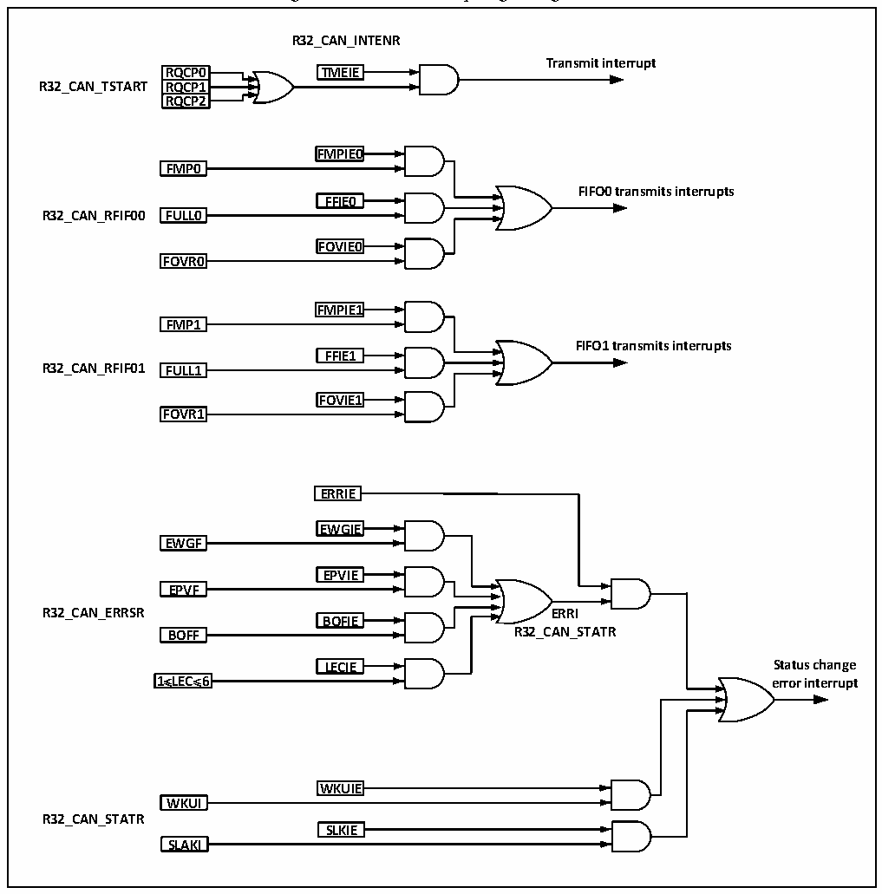

<!-- source-page: 300 -->

[← p.299](0299.md) · [index](../README.md) · [PDF p.300](https://ch32-riscv-ug.github.io/CH32V103/datasheet_en/CH32xRM.PDF#page=300) · [p.301 →](0301.md)

<!-- header: CH32x103 Reference Manual https://wch-ic.com -->
The FIFO0 interrupt is generated by receiving new messages, full receiving mailbox and overflow events. After  
the interrupt is generated, query the FMP0, FULL0 and FOVER0 bits of the CAN_RFIFO0 register to  
determine which mailbox has become empty event.  
The FIFO1 interrupt is generated by receiving new messages, full receiving mailbox and overflow events. After  
the interrupt is generated, query the FMP1, FULL1 and FOVER1 bits of the CAN_RFIFO1 register to  
determine which mailbox has become empty event.  
Error and status change interrupts are generated by error, wake-up and sleep events.  

Figure 22-9 CAN interrupt logic diagram  
 <!-- rendered from the PDF; verify at https://ch32-riscv-ug.github.io/CH32V103/datasheet_en/CH32xRM.PDF#page=300 -->

🖼 Text parsed from the figure above

<strong>R32_CAN_INTENR</strong>  
<strong>Transmit interrupt</strong>  
RQCP0  RRQQCCPP01  RRQQCCPP12  
<strong>RQCP0 TMEIE</strong>  
<strong>R32_CAN_TSTART RQCP1</strong>  
<strong>RQCP2</strong>  
<strong>FMPIE0</strong>  
<strong>FMP0</strong>  
<strong>FIFO0 transmits interrupts</strong>  
<strong>FFIE0</strong>  
<strong>R32_CAN_RFIF00 FULL0</strong>  
<strong>FOVIE0</strong>  
<strong>FOVR0</strong>  
<strong>FMPIE1</strong>  
<strong>FMP1</strong>  
<strong>FIFO1 transmits interrupts</strong>  
<strong>FFIE1</strong>  
<strong>R32_CAN_RFIF01 FULL1</strong>  
<strong>FOVIE1</strong>  
<strong>FOVR1</strong>  
<strong>ERRIE</strong>  
<strong>EWGIE</strong>  
<strong>EWGF</strong>  
<!-- image: p300-draw-image-00003 inside the figure -->
<strong>EPVIE</strong>  
<strong>EPVF</strong>  
<!-- image: p300-draw-image-00002 inside the figure -->
<strong>R32_CAN_ERRSR ERRI</strong>  
<!-- image: p300-draw-image-00004 inside the figure -->
<strong>BOFIE</strong>  
<!-- image: p300-draw-image-00005 inside the figure -->
<strong>BOFF R32_CAN_STATR</strong>  
<strong>LECIE Status change</strong>  
LECIE  
<strong>1≤LEC≤6 error interrupt</strong>  
<strong>WKUIE</strong>  
<strong>WKUI</strong>  
<strong>R32_CAN_STATR</strong>  
<strong>SLKIE</strong>  
<strong>SLAKI</strong>  

## 22.6 Register Description

Registers related to the CAN controller must be operated in 32-bit word mode, and the CAN peripheral clock  
<!-- image: p300-draw-image-00001 bbox=[518.88, 779.16, 538.32, 789.84] -->
<!-- footer: V1.9 298 -->
