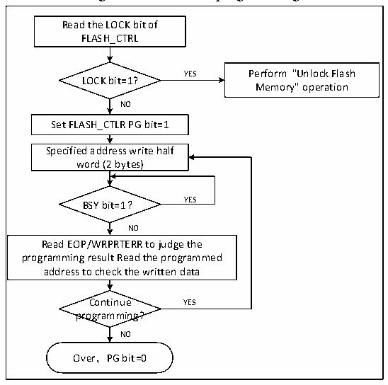

<!-- source-page: 330 -->

[← p.329](0329.md) · [index](../README.md) · [PDF p.330](https://ch32-riscv-ug.github.io/CH32V103/datasheet_en/CH32xRM.PDF#page=330) · [p.331 →](0331.md)

<!-- header: CH32x103 Reference Manual https://wch-ic.com -->
process, the BSY bit is ‘1’. After the programming is completed, the BSY bit is ‘0’ and the EOP bit is ‘1’.  
<em>Note: When the BSY bit is ‘1’, writing to any register will be disabled.</em>  

Figure 24-1 FLASH programming  
 <!-- rendered from the PDF; verify at https://ch32-riscv-ug.github.io/CH32V103/datasheet_en/CH32xRM.PDF#page=330 -->

🖼 Text parsed from the figure above

Read the LOCK bit of  
FLASH_CTRL  
YES Perform &quot;Unlock Flash  
LOCK bit=1?  
Memory&quot; operation  
NO  
Set FLASH_CTLR PG bit=1  
Specified address write half  
word (2 bytes)  
BSY bit=1？ YES  
NO  
Read EOP/WRPRTERR to judge the  
programming result Read the programmed  
address to check the written data  
Continue YES  
programming?  
NO  
Over，PG bit=0  

1) Check the FLASH_CTLR register LOCK. If it is 1, you need to perform the &quot;Release Flash Memory Lock&quot;  
operation.  
2) Set the PG bit in the FLASH_CTLR register to ‘1’ to enable the standard programming mode.  
3) Write the half word to be programmed to the designated flash memory address (even address).  
4) When the BYS bit changes to &#x27;0&#x27; or the EOP bit in the FLASH_STATR register to be &#x27;1&#x27;, it indicates the end  
of programming. Clear the EOP bit to 0.  
5) Check the FLASH_STATR register to see if there is an error, or read the programming address data for  
verification.  
6) To continue programming, you can repeat steps 3-5, end programming and clear the PG bit to 0.  

### 24.4.4 Main Memory Standard Erase

The flash memory can be erased in the standard pages (1K bytes) or in whole chips.  
<!-- image: p330-draw-image-00001 bbox=[518.88, 779.16, 538.32, 789.84] -->
<!-- footer: V1.9 328 -->
