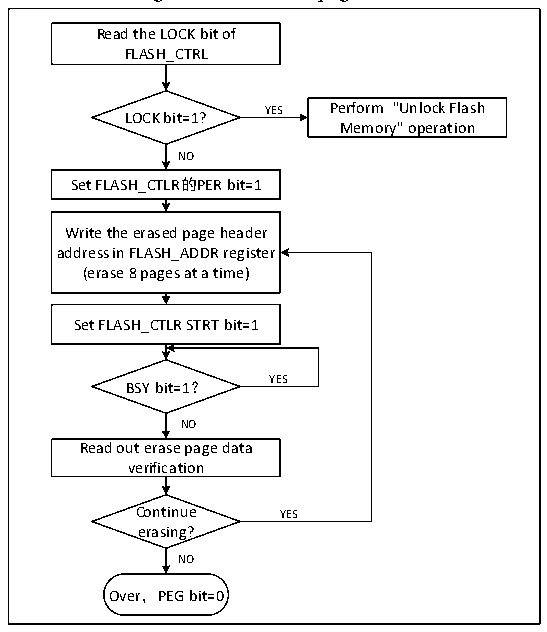

<!-- source-page: 331 -->

[← p.330](0330.md) · [index](../README.md) · [PDF p.331](https://ch32-riscv-ug.github.io/CH32V103/datasheet_en/CH32xRM.PDF#page=331) · [p.332 →](0332.md)

<!-- header: CH32x103 Reference Manual https://wch-ic.com -->

Figure 24-2 FLASH page erase  
 <!-- rendered from the PDF; verify at https://ch32-riscv-ug.github.io/CH32V103/datasheet_en/CH32xRM.PDF#page=331 -->

🖼 Text parsed from the figure above

Read the LOCK bit of  
FLASH_CTRL  
YES Perform &quot;Unlock Flash  
LOCK bit=1?  
Memory&quot; operation  
NO  
Set FLASH_CTLR的PER bit=1  
Write the erased page header  
address in FLASH_ADDR register  
(erase 8 pages at a time)  
Set FLASH_CTLR STRT bit=1  
BSY bit=1？ YES  
NO  
Read out erase page data  
verification  
Continue YES  
erasing?  
NO  
Over，PEG bit=0  

1) Check the FLASH_CTLR register LOCK bit. If it is 1, you need to perform the &quot;Release Flash Memory  
Lock&quot; operation.  
2) Set the PEG bit in the FLASH_CTLR register to ‘1’ to enable the standard page erasure mode.  
3) Write the page heading address of the page to be erased to the FLASH_ADDR register.  
4) Set the STAT bit in the FLASH_CTLR register to ‘1’ to start an erase action.  
5) When the BYS bit changes to &#x27;0&#x27; or the EOP bit in the FLASH_STATR register to be &#x27;1&#x27;, it indicates the end  
of erasure. Clear the EOP bit to 0.  
6) Read the page of erasure page for verification.  
7) To erase the standard page continuously, you can repeat steps 3-5 to end erasing and clear the PEG bit to 0.  
<!-- image: p331-draw-image-00001 bbox=[518.88, 779.16, 538.32, 789.84] -->
<!-- footer: V1.9 329 -->
