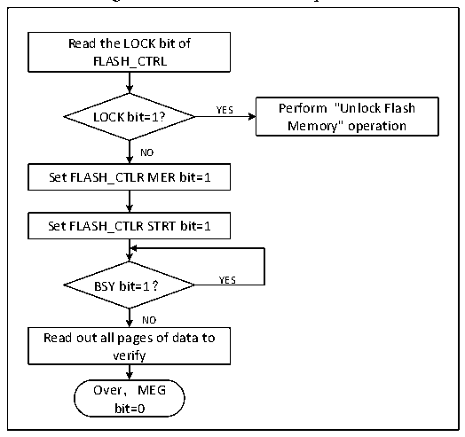

<!-- source-page: 332 -->

[← p.331](0331.md) · [index](../README.md) · [PDF p.332](https://ch32-riscv-ug.github.io/CH32V103/datasheet_en/CH32xRM.PDF#page=332) · [p.333 →](0333.md)

<!-- header: CH32x103 Reference Manual https://wch-ic.com -->

Figure 24-3 FLASH full chip erase  
 <!-- rendered from the PDF; verify at https://ch32-riscv-ug.github.io/CH32V103/datasheet_en/CH32xRM.PDF#page=332 -->

🖼 Text parsed from the figure above

Read the LOCK bit of  
FLASH_CTRL  
YES Perform &quot;Unlock Flash  
LOCK bit=1?  
Memory&quot; operation  
NO  
Set FLASH_CTLR MER bit=1  
Set FLASH_CTLR STRT bit=1  
BSY bit=1？ YES  
NO  
Read out all pages of data to  
verify  
Over，MEG  
bit=0  

1) Check the FLASH_CTLR register LOCK bit. If it is 1, you need to perform the &quot;Release Flash Memory  
Lock&quot; operation.  
2) Set the MEG bit in the FLASH_CTLR register to ‘1’ to enable the whole chip erasure mode.  
3) Set the STAT bit in the FLASH_CTLR register to ‘1’ to start an erasure action.  
4) When the BYS bit changes to &#x27;0&#x27; or the EOP bit in the FLASH_STATR register to be &#x27;1&#x27;, it indicates the end  
of erasure. Clear the EOP bit to 0.  
5) Read the data of the erasure page for verification.  
6) Clear the MEG bit to 0.  

### 24.4.5 Fast Programming Molde Unlock

The quick programming mode operation can be unlocked by writing the sequence to the FLASH_MODEKEYR  
register. After unlocking, the FLOCK bit in the FLASH_CTLR register will be cleared to 0, indicating that  
quick erasure and programming operations can be made. Set 1 by the software through the “FLOCK” bit in  
FLASH_CTLR register.  
Unlocking sequence:  
1) Write KEY1 = 0x45670123 to the FLASH_MODEKEYR register;  
2) Write KEY2 = 0xCDEF89AB to the FLASH_MODEKEYR register.  
The above operations must be continuously made in sequence. Otherwise, it will be locked in case of wrong  
operation, and will be re-unlocked until the next system reset.  
Note: For the quick programming operation, it needs to release the two layers of &quot;LOCK&quot; and &quot;FLOCK&quot;.  

### 24.4.6 Main Memory Fast Programming

The fast programming (128 bytes) is made according to the page. The system has a built-in 128-byte buffer. The  
data line to be programmed is saved in the buffer and a programming operation is performed, which is more  
efficient.  
1) Check the FLASH_CTLR register LOCK bit. If it is 1, you need to perform the &quot;Release Flash Memory  
Lock&quot; operation.  
2) Check the BSY bit in the FLASH_STATR register to ensure that there is no other programming operation in  
<!-- image: p332-draw-image-00001 bbox=[518.88, 779.16, 538.32, 789.84] -->
<!-- footer: V1.9 330 -->
