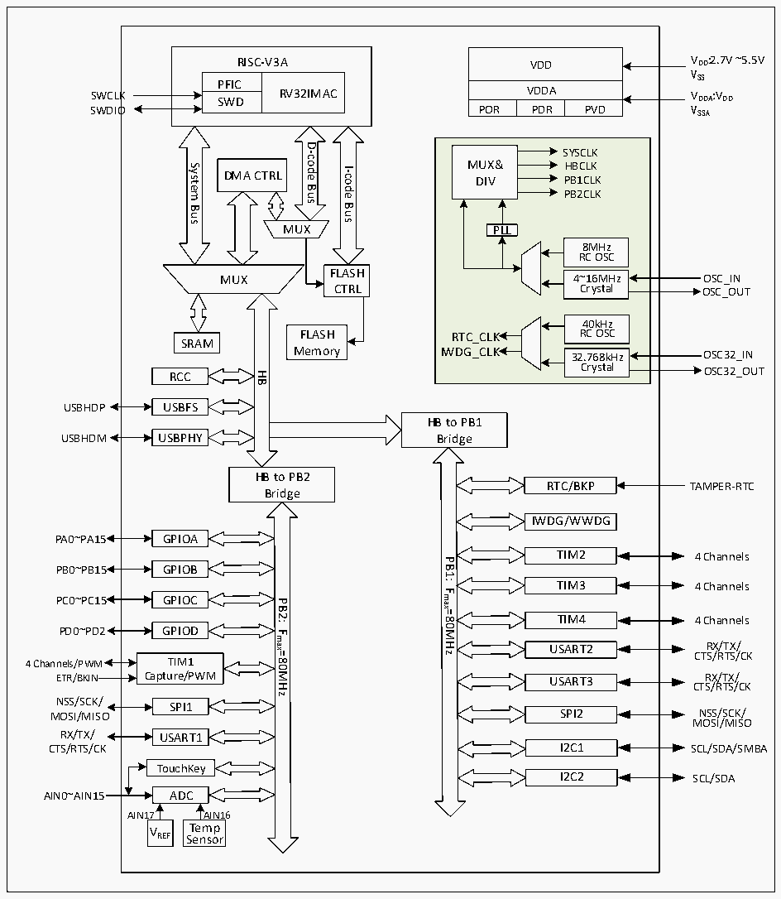

<!-- source-page: 4 -->

[← p.3](0003.md) · [index](../README.md) · [PDF p.4](https://ch32-riscv-ug.github.io/CH32V103/datasheet_zh/CH32xRM.PDF#page=4) · [p.5 →](0005.md)

<!-- header: CH32x103应用手册 https://wch.cn -->

图1-2 CH32V103系统框图  
 <!-- rendered from the PDF; verify at https://ch32-riscv-ug.github.io/CH32V103/datasheet_zh/CH32xRM.PDF#page=4 -->

🖼 Text parsed from the figure above

VDD VDD:2.7V ~5.5V  
RISC-V3A  
VSS  
PFICSWD  RV32IMAC  SWD  
VDDA VDDA:VDD  
POR  VDDAPDR  
POR PDR PVD V SSA  
SWDIO  
D-code  
SYSCLK MUX&amp; HBCLK DIV PB1CLKPB2CLKPLL8MHz RC OSC4~16MHz Crystal 40kHz RTC_CLK RC OSCIWDG_CLK32.768kHz Crystal  
System  
I-code  
DMA CTRL  
Bus  
Bus  
Bus  
MUX  
8MHz RC OSC  4~16MHz Crystal  
FLASH  
MUX  
Crystal OSC_OUT  
CTRL  
FLASH  
SRAM  
Memory  
Crystal OSC32_OUT  
HB  
RCC  
USBFS  
USBHDP  
HB to PB1  
USBPHY  
USBHDM  
Bridge  
HB to PB2  
RTC/BKP  
TAMPER-RTC  
Bridge  
IWDG/WWDG  
PA0~PA15 GPIOA  
TIM2  
4 Channels  
PB1:  
PB0~PB15 GPIOB  
TIM3  
4 Channels  
Fmax=80MHz  
PC0~PC15 GPIOC  
PB2:  
TIM4  
4 Channels  
PD0~PD2 GPIOD  
Fmax=80MHz  
RX/TX/  
USART2  
CTS/RTS/CK  
4 Channels/PWM TIM1  
ETR/BKIN Capture/PWM  
RX/TX/  
USART3  
CTS/RTS/CK  
NSS/SCK/ SPI1  
NSS/SCK/  
SPI2  
MOSI/MISO  
MOSI/MISO  
RX/TX/ USART1  
I2C1  
SCL/SDA/SMBA  
CTS/RTS/CK  
TouchKey  
I2C2  
SCL/SDA  
AIN0~AIN15 ADC  
AIN17 AIN16  
T  
e  
m  
p  
VREF  
S  
e  
n  
so  
r  

系统中设有：Flash访问预取机制用以加快代码执行速度；通用DMA控制器用以减轻CPU负  
担、提高效率；时钟树分级管理用以降低了外设总的运行功耗，同时还兼有数据保护机制，时钟安  
全系统保护机制等措施来增加系统稳定性。  
● 指令总线(I-Code)将内核和FLASH指令接口相连，预取指在此总线上完成。  
● 数据总线(D-Code)将内核和FLASH数据接口相连，用于常量加载和调试。  
● 系统总线将内核和总线矩阵相连，用于协调内核、DMA、SRAM和外设的访问。  
● DMA总线负责DMA的HB主控接口与总线矩阵相连，该总线访问对象是FLASH数据、SRAM和外  
设。  
● 总线矩阵负责的是系统总线、数据总线、DMA总线、SRAM和HB/PB桥之间的访问协调。  
● HB/PB桥，为HB总线和两个PB总线提供同步连接。不同的外设挂在不同的PB总线下，可以按  
实际需求配置不同总线时钟，优化性能。  
<!-- image: p4-draw-image-00001 bbox=[507.84, 786.48, 527.52, 797.04] -->
<!-- footer: V2.0 2 -->
