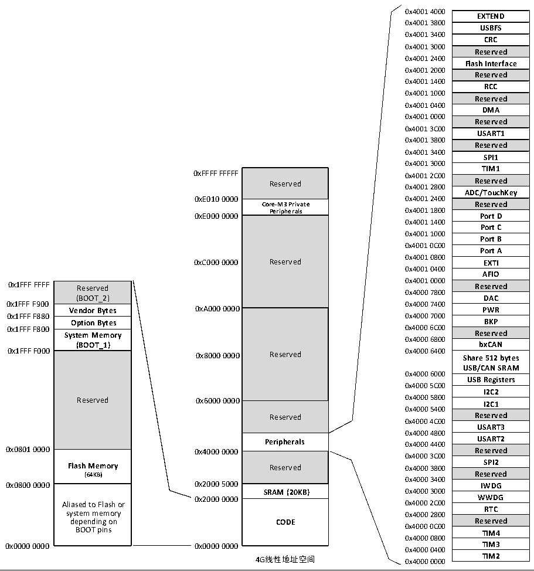

<!-- source-page: 5 -->

[← p.4](0004.md) · [index](../README.md) · [PDF p.5](https://ch32-riscv-ug.github.io/CH32V103/datasheet_zh/CH32xRM.PDF#page=5) · [p.6 →](0006.md)

<!-- header: CH32x103应用手册 https://wch.cn -->

## 1.2 存储器映像

CH32F103和CH32V103系列产品都包含了程序存储器、数据存储器、内核寄存器、外设寄存器等  
等，它们都在一个4GB的线性空间寻址。  
系统存储以小端格式存放数据，即低字节存放在低地址，高字节存放在高地址里。  

图1-3 CH32F103存储映像  
 <!-- rendered from the PDF; verify at https://ch32-riscv-ug.github.io/CH32V103/datasheet_zh/CH32xRM.PDF#page=5 -->

🖼 Text parsed from the figure above

0x4001 4000  
EXTEND  USBFS  CRC  Reserved  Flash Interface  Reserved  RCC  Reserved  DMA  Reserved  USART1  Reserved  SPI1  TIM1  Reserved  ADC/TouchKey  Reserved  Port D  Port C  Port B  Port A  EXTI  AFIO  Reserved  DAC  PWR  BKP  Reserved  bxCAN  Share 512 bytes USB/CAN SRAM  USB Registers  I2C2  I2C1  Reserved  USART3  USART2  Reserved  SPI2  Reserved  IWDG  WWDG  RTC  Reserved  TIM4  TIM3  TIM2  
0x4001 3800  
0x4001 3400  
0x4001 3000  
0x4001 2400  
0x4001 2000  
0x4001 1400  
0x4001 1000  
0x4001 0400  
0x4001 0000  
0x4001 3C00  
0x4001 3800  
0x4001 3400  
0x4001 3000  
Reserved  Core-M3 Private Peripherals  Reserved  Reserved  Reserved  Peripherals  Reserved  SRAM (20KB)  CODE  
Reserved Reserved  
0x4001 2800  
<strong>Core-M3 Private Reserved</strong>  
<strong>Peripherals 0x4001 1800</strong>  
0xE000 0000 Port D  
0x4001 1400  
0x4001 1000  
0x4001 0C00  
0x4001 0800  
0xC000 0000 Reserved EXTI  
0x4001 0400  
0x4001 0000  
Reserved (BOOT_2)  Vendor Bytes  Option Bytes  System Memory (BOOT_1)  Reserved  Flash Memory (64KB)  Aliased to Flash or system memory depending on BOOT pins  
0x4000 7800  
0x1FFF F900 0x4000 7400  
0x1FFF F880 0x4000 7000  
<strong>0x1FFF F800 0x4000 6C00</strong>  
0x4000 6800  
0x4000 6000  
0x4000 5C00  
0x4000 5400  
Reserved Reserved  
0x4000 4C00  
0x4000 4800  
<strong>Peripherals 0x4000 4400 USART2</strong>  
0x4000 3C00  
0x4000 3400  
<strong>SRAM (20KB) 0x4000 3000</strong>  
0x2000 0000 WWDG  
0x4000 0800  
0x0000 0000 0x0000 0000 TIM3  
0x4000 0400  
4G线性地址空间 0x4000 0000 TIM2  

<!-- image: p5-draw-image-00001 bbox=[507.84, 786.48, 527.52, 797.04] -->
<!-- footer: V2.0 3 -->
