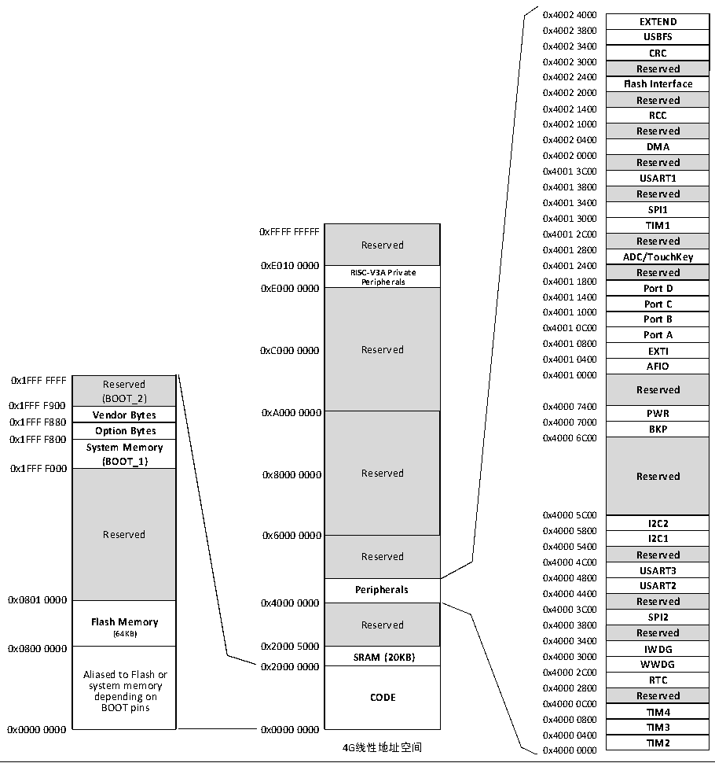

<!-- source-page: 6 -->

[← p.5](0005.md) · [index](../README.md) · [PDF p.6](https://ch32-riscv-ug.github.io/CH32V103/datasheet_zh/CH32xRM.PDF#page=6) · [p.7 →](0007.md)

<!-- header: CH32x103应用手册 https://wch.cn -->

图1-4 CH32V103存储映像  
 <!-- rendered from the PDF; verify at https://ch32-riscv-ug.github.io/CH32V103/datasheet_zh/CH32xRM.PDF#page=6 -->

🖼 Text parsed from the figure above

0x4002 4000  
EXTEND  USBFS  CRC  Reserved  Flash Interface  Reserved  RCC  Reserved  DMA  Reserved  USART1  Reserved  SPI1  TIM1  Reserved  ADC/TouchKey  Reserved  Port D  Port C  Port B  Port A  EXTI  AFIO  Reserved  PWR  BKP  Reserved  I2C2I2C1  I2C1  Reserved  USART3  USART2  Reserved  SPI2  Reserved  IWDG  WWDG  RTC  Reserved  TIM4  TIM3  TIM2  
0x4002 3800  
0x4002 3400  
0x4002 3000  
0x4002 2400  
0x4002 2000  
0x4002 1400  
0x4002 1000  
0x4002 0400  
0x4002 0000  
0x4001 3C00  
0x4001 3800  
0x4001 3400  
0x4001 3000  
Reserved  RISC-V3A Private Peripherals  Reserved  Reserved  Reserved  Peripherals  Reserved  SRAM (20KB)  CODE  
Reserved Reserved  
0x4001 2800  
<strong>RISC-V3A Private Reserved</strong>  
<strong>Peripherals 0x4001 1800</strong>  
0xE000 0000 Port D  
0x4001 1400  
0x4001 1000  
0x4001 0C00  
0x4001 0800  
0xC000 0000 Reserved EXTI  
0x4001 0400  
0x4001 0000  
Reserved (BOOT_2)  Vendor Bytes  Option Bytes  System Memory (BOOT_1)  Reserved  Flash Memory (64KB)  Aliased to Flash or system memory depending on BOOT pins  
0x1FFF F900 0x4000 7400  
0x1FFF F880 0x4000 7000  
<strong>0x1FFF F800 0x4000 6C00</strong>  
0x4000 5C00  
0x4000 5400  
Reserved Reserved  
0x4000 4C00  
0x4000 4800  
<strong>Peripherals 0x4000 4400 USART2</strong>  
0x4000 3C00  
0x4000 3400  
<strong>SRAM (20KB) 0x4000 3000</strong>  
0x2000 0000 WWDG  
0x4000 0800  
0x4000 0400  
4G线性地址空间 0x4000 0000 TIM2  

### 1.2.1 位段访问

位操作就是单独读写一个比特位的操作。CH32F103 产品中通过映射的处理方式提供了对外设寄  
存器和SRAM区内容的位操作读写。具体方法：  
1）通过对映射地址区域32位的数据进行读操作，读出的值为0或非0，获取目标位域值是0或1；  
2）通过对映射地址区域32位的数据进行写操作，写入0或1，修改目标位域值为0或1。  
地址映射：  
目标位域：基地址(BEaddr) +偏移地址(Ofaddr) + 位号(BitN)  
映射地址：Mapaddr  
Mapaddr = BEaddr +0x2000000 + (Ofaddr×32) + (BitN×4)  
举例1：对SRAM区的0x20000100地址字节中的bit3目标位域进行操作：  
Mapaddr= 0x20000000+0x2000000+(0x100*32)+(3*4)= 0x2200200C  
则读取 0x2200200C 地址的 4 字节数据内容可知 0x20000100 地址字节中的 bit3 是 0 还是 1；对  
<!-- image: p6-draw-image-00001 bbox=[507.84, 786.48, 527.52, 797.04] -->
<!-- footer: V2.0 4 -->
