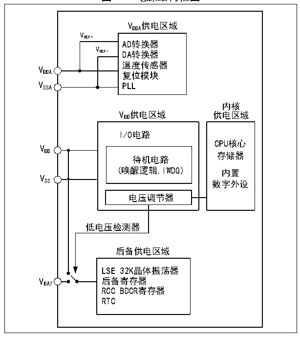

<!-- source-page: 8 -->

[← p.7](0007.md) · [index](../README.md) · [PDF p.8](https://ch32-riscv-ug.github.io/CH32V103/datasheet_zh/CH32xRM.PDF#page=8) · [p.9 →](0009.md)

<!-- header: CH32x103应用手册 https://wch.cn -->

# 第 2 章 电源控制（PWR）

本章模块描述适用于CH32F103和CH32V103微控制器全系列产品。  

## 2.1 概述

系统工作电压 VDD 范围为 2.7～5.5V，内置电压调节器提供内核所需的工作电源。当主电源 VDD 掉  
电后，电池等后备电源可通过 VBAT 引脚为实时时钟(RTC)和后备寄存器提供电源，如果无需后备电源，  
建议将VDD 直接连接到VBAT 引脚上。  
VDDA 和VSSA 引脚专门为系统中模拟相关电路供电，包括ADC、DAC、温度传感器等。VREF+ 和VREF- 作为  
一些模拟电路的参考点，在芯片内部等于VDDA 及VSSA。实际应用中VDDA 和VSSA 必须连接到VDD 和VSS 端。  

图2-1 电源结构框图  
 <!-- rendered from the PDF; verify at https://ch32-riscv-ug.github.io/CH32V103/datasheet_zh/CH32xRM.PDF#page=8 -->

🖼 Text parsed from the figure above

VDDA 供电区域  
VREF+  
AD转换器  
VREF-  
REF- DA转换器  
温度传感器  
V  
内核  
VDD 供电区域 供电区域  
I/O电路  
CPU核心  
VDD  
存储器  
待机电路  
(唤醒逻辑,IWDG) 内置  
V  
SS 数字外设  
电压调节器  
低电压检测器  
后备供电区域  
LSE 32K晶体振荡器  
VBAT 后备寄存器  
RCC BDCR寄存器  
RTC  

在主电源 VDD 掉电后，模拟开关切换至 VBAT，后备区域由 VBAT 引脚供电，此时 PC13～15 无法作为  
GPIO，仅可使用如下功能：  
● PC13可以作为TAMPER引脚、RTC闹钟或秒输出。  
● PC14和PC15只能用作LSE引脚。  
当主电源VDD 上电稳定后，系统自动切换后备区域由VDD 供电，PC13～15可以用作GPIO功能。  
当PC13～15引脚作为GPIO输出时，速度必须限制在2MHz以下，最大负载电容为30pF，并且禁  
止用在持续输出和吸入电流的场合，比如LED驱动。  
注：在主电源VDD 恢复供电过程中，内部VBAT 电源仍然通过对应的VBAT 引脚连在外部备用电源上，若VDD  
在小于复位滞后时间tRSTTEMPO 内就达到稳定，并且高于VBAT 的值0.6V以上，则有可能存在较短瞬间，电  
流通过VDD 与VBAT 之间的二极管灌入VBAT，进而通过VBAT 引脚注入电池等后备电源，如果后备电源无法  
承受这样瞬时注入电流，建议在后备电源和VBAT 引脚之间加一只正向导通低压降二极管。  
<!-- image: p8-draw-image-00001 bbox=[507.84, 786.48, 527.52, 797.04] -->
<!-- footer: V2.0 6 -->
